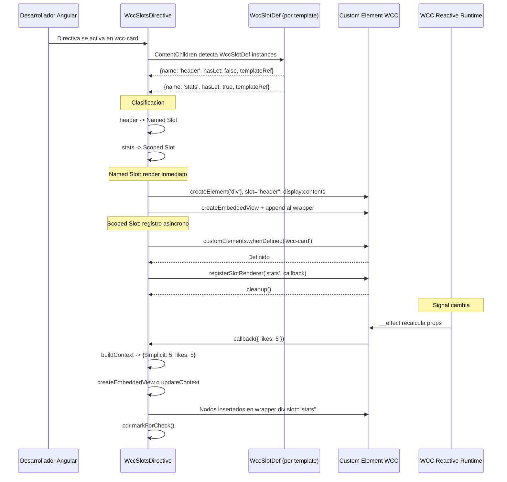
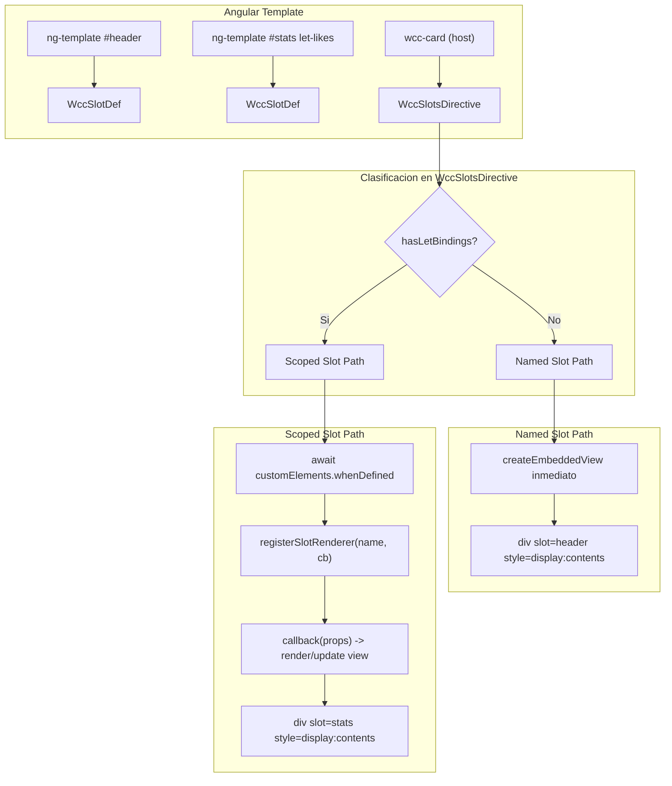

# Documento de Diseno — Angular Scoped Slots Nativos

## Vision General

Directiva Angular `WccSlotsDirective` que permite usar **named slots** y **scoped slots** con sintaxis idiomatica (`ng-template`, `#name`, `let-*`). Solucion runtime porque Angular no expone hooks de pre-transformacion del compilador.

**Sintaxis del desarrollador:**

```html
<wcc-card>
  <!-- Named slot (estatico) -->
  <ng-template #header><strong>Custom Header</strong></ng-template>

  <!-- Default slot -->
  <p>Body content</p>

  <!-- Scoped slot (reactivo) -->
  <ng-template #stats let-likes>Likes: {{likes}}</ng-template>

  <!-- Scoped slot con multiples props -->
  <ng-template #details let-likes let-total="total">{{likes}}/{{total}}</ng-template>
</wcc-card>
```

**Clasificacion automatica:**

| Sintaxis | Tipo | Comportamiento |
|----------|------|----------------|
| `ng-template #name` sin `let-*` | Named Slot | Render estatico inmediato en wrapper `<div slot="name" style="display:contents">` |
| `ng-template #name` con `let-*` | Scoped Slot | Registro de renderer, render reactivo con contexto |
| Children sin ng-template | Default Slot | No gestionado por la directiva |

**Capas:**

1. **`WccSlotsDirective`** — Directiva principal. Activacion automatica en custom elements (tags con guion). Clasifica templates y gestiona el ciclo de vida.
2. **`WccSlotDef`** — Directiva auxiliar ligera. Captura `TemplateRef` y nombre del slot. Detecta presencia de `let-*`.
3. **Codegen** — Emite `registerSlotRenderer` + `wcc:slot-update` en custom elements con scoped slots. Sin cambios para named slots.

**Decisiones clave:**
- **Sin atributo `[wccSlots]`** — activacion automatica via selector de exclusion + runtime guard.
- **Nombre del slot desde `#name`** — resuelto via directiva auxiliar con `exportAs` (ver seccion de deteccion).
- **Sin directiva auxiliar con input `wccSlot="name"`** — el nombre viene de la template reference variable.
- **Clasificacion via `let-*`** — la directiva auxiliar detecta bindings de contexto.
- **Named Slots no requieren codegen** — son puramente gestionados por la directiva Angular.
- Compatible con OnPush via `markForCheck()`.


## Arquitectura






### Flujo de Datos

1. **Inicializacion:**
   - Angular renderiza el componente. `WccSlotsDirective` se activa en el custom element host (tag con guion).
   - `AfterContentInit`: consulta `@ContentChildren(WccSlotDef)` para obtener templates con nombres y metadata.
   - Clasifica cada template segun `hasLetBindings`.
   - Named Slots: `createEmbeddedView` inmediato, inserta en wrapper `<div slot="name" style="display:contents">`.
   - Scoped Slots: espera `customElements.whenDefined`, registra renderer.

2. **Actualizacion reactiva (solo Scoped Slots):**
   - WCC runtime ejecuta `__effect`, recalcula props.
   - Renderer registrado: invoca `callback(props)`, omite token replacement.
   - Emite `wcc:slot-update` (fallback).
   - Directiva construye contexto, crea/actualiza `EmbeddedView`, llama `markForCheck()`.

3. **Destruccion:**
   - Invoca cleanup functions de scoped slots.
   - Destruye todas las `EmbeddedView` (named y scoped).
   - Remueve wrapper elements del DOM.
   - Remueve event listeners.

## Componentes e Interfaces

### 1. Selector para Custom Elements

**Problema:** Angular no soporta selectores regex. Necesitamos activar la directiva en todos los elementos con guion en el tag name.

**Solucion: Selector de exclusion + runtime guard**

```typescript
// Excluye todos los elementos HTML estandar conocidos.
// Custom elements (que DEBEN tener guion) no estan excluidos.
const STANDARD_ELEMENTS = 'div,span,p,a,button,input,form,section,article,header,footer,nav,main,ul,ol,li,table,tr,td,th,thead,tbody,tfoot,img,h1,h2,h3,h4,h5,h6,label,select,textarea,option,fieldset,legend,details,summary,dialog,slot,template,canvas,video,audio,source,iframe,pre,code,blockquote,hr,br,strong,em,small,sub,sup,mark,del,ins,figure,figcaption,picture,svg,math,body,html,head,script,style,link,meta,title,base,col,colgroup,caption,abbr,address,area,aside,b,bdi,bdo,cite,data,dd,dfn,dl,dt,i,kbd,map,meter,noscript,output,progress,q,rp,rt,ruby,s,samp,time,u,var,wbr';

@Directive({
  selector: STANDARD_ELEMENTS.split(',').map(t => `:not(${t})`).join(''),
  standalone: true,
})
export class WccSlotsDirective {
  private el = inject(ElementRef<HTMLElement>);

  ngAfterContentInit(): void {
    // Runtime guard: solo proceder si el tag tiene guion
    if (!this.el.nativeElement.tagName.toLowerCase().includes('-')) return;
    // ... inicializacion
  }
}
```

**Rationale:** Angular instancia la directiva en elementos no excluidos, pero el early return hace que sea un no-op para elementos sin guion. El overhead es minimo (una comparacion de string por elemento no-estandar).

### 2. Deteccion del Nombre de Slot desde #name

**Problema:** Angular no expone programaticamente el nombre de una template reference variable (`#name`) en el `TemplateRef`. Necesitamos un mecanismo para que la directiva principal conozca el nombre de cada slot.

**Opciones evaluadas:**

| Opcion | Mecanismo | Pros | Contras |
|--------|-----------|------|---------|
| A. `@ContentChildren` + correlacion DOM | Query TemplateRef, buscar comentarios Angular en DOM | Sin directiva auxiliar | Fragil, depende de internals |
| B. Directiva estructural | `*wccSlot="'name'"` | Nombre explicito | Cambia la sintaxis del desarrollador |
| C. `exportAs` pattern | Directiva con `exportAs`, dev escribe `#name="exportName"` | Robusto | Requiere `="exportName"` extra |
| D. Directiva auxiliar con `@Attribute` | Lee atributo estatico del ng-template | Robusto, simple | Requiere atributo en ng-template |
| E. Inspeccion de Angular internals | Leer `_declarationTContainer.localNames` | Transparente al dev | Puede romperse entre versiones |

**Solucion adoptada: Opcion D con atributo `slot`**

Usamos el atributo HTML estandar `slot` en el `ng-template`. Este atributo:
- Es parte de la spec de Web Components / Shadow DOM.
- Es semanticamente correcto (indica en que slot va el contenido).
- Angular lo preserva como atributo estatico accesible via `@Attribute('slot')`.
- No requiere una directiva auxiliar con `@Input` custom.

```html
<!-- El desarrollador escribe: -->
<wcc-card>
  <ng-template #header slot="header"><strong>Header</strong></ng-template>
  <ng-template #stats slot="stats" let-likes>{{likes}}</ng-template>
</wcc-card>
```

**Nota:** El `#name` sigue siendo util como referencia local en el template Angular (para `@ViewChild`, etc.), pero el nombre del slot se lee del atributo `slot`. En la practica, el desarrollador puede omitir `#name` si no necesita la referencia local:

```html
<wcc-card>
  <ng-template slot="header"><strong>Header</strong></ng-template>
  <ng-template slot="stats" let-likes>{{likes}}</ng-template>
</wcc-card>
```

**Mejora futura (Opcion E como optimizacion):** Un plugin de build (Vite/esbuild) podria transformar `<ng-template #name>` en `<ng-template #name slot="name">` automaticamente, eliminando la duplicacion. Esto es una mejora de DX que no afecta la arquitectura.

### 3. Deteccion de let-* Bindings

**Problema:** Necesitamos saber si un `ng-template` tiene `let-*` para clasificarlo como Named o Scoped.

**Solucion:** La directiva auxiliar `WccSlotDef` inspecciona las variables del template via la API interna de Angular `TemplateRef`. En Angular 16+, el `TemplateRef` tiene acceso al `TContainerNode` que contiene `localNames` — un array con las variables declaradas via `let-*`.

```typescript
get hasLetBindings(): boolean {
  // Angular almacena let-* variables en el template container node
  const tpl = this.templateRef as any;
  // _declarationTContainer.localNames contiene ['varName', referenceIndex, ...]
  // para template reference variables, y las let-* variables se almacenan
  // en el embedded view context
  try {
    const embeddedView = tpl._declarationTContainer;
    // Si el template declara variables de contexto, tiene let-*
    return embeddedView?.vars > 0;
  } catch {
    return false;
  }
}
```

**Alternativa robusta (sin internals):** La directiva principal puede intentar crear una vista con contexto `{}` y verificar si el template produce output con variables no resueltas. Pero esto es costoso.

**Solucion pragmatica adoptada:** El custom element WCC expone una propiedad `__scopedSlots: string[]` (emitida por codegen) que lista los nombres de slots que son scoped. La directiva usa esta lista para clasificar:

```typescript
private classifySlots(): void {
  const element = this.el.nativeElement as any;
  const scopedNames: string[] = element.__scopedSlots || [];

  for (const slotDef of this.slotDefs) {
    if (scopedNames.includes(slotDef.slotName)) {
      this.initScopedSlot(slotDef);
    } else {
      this.initNamedSlot(slotDef);
    }
  }
}
```

**Rationale:** El codegen ya sabe cuales slots son scoped (porque los declara con `:prop="expr"`). Exponer esta metadata como `__scopedSlots` es trivial y elimina la necesidad de detectar `let-*` en runtime.


### 4. WccSlotDef — Directiva Auxiliar

```typescript
import { Directive, TemplateRef, inject, Attribute } from '@angular/core';

/**
 * Directiva auxiliar que marca un ng-template como contenido de slot.
 * Captura el TemplateRef y el nombre del slot desde el atributo HTML 'slot'.
 *
 * Uso:
 *   <ng-template slot="header">...</ng-template>
 *   <ng-template slot="stats" let-likes>...</ng-template>
 */
@Directive({
  selector: 'ng-template[slot]',
  standalone: true,
})
export class WccSlotDef {
  public readonly templateRef = inject<TemplateRef<any>>(TemplateRef);
  public readonly slotName: string;

  constructor(@Attribute('slot') name: string | null) {
    this.slotName = name || '';
  }
}
```

### 5. WccSlotsDirective — Directiva Principal

```typescript
import {
  Directive, ElementRef, ContentChildren, QueryList,
  ViewContainerRef, ChangeDetectorRef, EmbeddedViewRef,
  AfterContentInit, OnDestroy, inject,
} from '@angular/core';
import { WccSlotDef } from './wcc-slot-def';

interface SlotContext {
  $implicit: any;
  [key: string]: any;
}

type SlotType = 'named' | 'scoped';

interface SlotState {
  type: SlotType;
  slotDef: WccSlotDef;
  viewRef: EmbeddedViewRef<SlotContext> | null;
  cleanup: (() => void) | null;
  wrapperEl: HTMLElement | null;
  context: SlotContext | null;
}

@Directive({
  // Selector de exclusion: se activa en elementos no-estandar
  // Runtime guard verifica que el tag tenga guion
  selector: ':not(div):not(span):not(p):not(a):not(button)' /* ... ver lista completa arriba */,
  standalone: true,
})
export class WccSlotsDirective implements AfterContentInit, OnDestroy {
  @ContentChildren(WccSlotDef) slotDefs!: QueryList<WccSlotDef>;

  private el = inject(ElementRef<HTMLElement>);
  private vcr = inject(ViewContainerRef);
  private cdr = inject(ChangeDetectorRef);

  private slots = new Map<string, SlotState>();
  private eventCleanups: (() => void)[] = [];
  private destroyed = false;

  ngAfterContentInit(): void {
    // Runtime guard: solo custom elements
    if (!this.el.nativeElement.tagName.toLowerCase().includes('-')) return;

    this.classifyAndInitSlots();
  }

  ngOnDestroy(): void {
    this.destroyed = true;
    this.cleanup();
  }

  /** Clasifica slots y los inicializa segun su tipo */
  private classifyAndInitSlots(): void {
    const element = this.el.nativeElement as any;
    const scopedNames: string[] = element.__scopedSlots || [];

    for (const slotDef of this.slotDefs) {
      if (scopedNames.includes(slotDef.slotName)) {
        this.initScopedSlot(slotDef);
      } else {
        this.initNamedSlot(slotDef);
      }
    }
  }

  /** Named Slot: render inmediato, estatico */
  private initNamedSlot(slotDef: WccSlotDef): void {
    const hostEl = this.el.nativeElement;
    const wrapper = document.createElement('div');
    wrapper.setAttribute('slot', slotDef.slotName);
    wrapper.style.display = 'contents';

    const viewRef = this.vcr.createEmbeddedView(slotDef.templateRef);
    for (const node of viewRef.rootNodes) {
      wrapper.appendChild(node);
    }
    hostEl.appendChild(wrapper);

    this.slots.set(slotDef.slotName, {
      type: 'named',
      slotDef,
      viewRef,
      cleanup: null,
      wrapperEl: wrapper,
      context: null,
    });
  }

  /** Scoped Slot: registro asincrono + render reactivo */
  private async initScopedSlot(slotDef: WccSlotDef): Promise<void> {
    const hostEl = this.el.nativeElement;
    const tagName = hostEl.tagName.toLowerCase();

    // Esperar a que el custom element este definido
    await customElements.whenDefined(tagName);
    if (this.destroyed) return;

    const state: SlotState = {
      type: 'scoped',
      slotDef,
      viewRef: null,
      cleanup: null,
      wrapperEl: null,
      context: null,
    };
    this.slots.set(slotDef.slotName, state);

    // Registrar renderer
    const element = hostEl as any;
    if (typeof element.registerSlotRenderer === 'function') {
      state.cleanup = element.registerSlotRenderer(
        slotDef.slotName,
        (props: Record<string, any>) => this.renderSlot(slotDef.slotName, props)
      );
    } else {
      // Fallback: escuchar evento
      const handler = (e: CustomEvent) => {
        if (e.detail?.slot === slotDef.slotName) {
          this.renderSlot(slotDef.slotName, e.detail.props);
        }
      };
      hostEl.addEventListener('wcc:slot-update', handler as EventListener);
      this.eventCleanups.push(() =>
        hostEl.removeEventListener('wcc:slot-update', handler as EventListener)
      );
    }
  }

  /** Construye el contexto Angular para createEmbeddedView */
  private buildContext(props: Record<string, any>): SlotContext {
    const keys = Object.keys(props);
    const firstValue = keys.length === 1 ? props[keys[0]] : props;
    return {
      $implicit: keys.length > 0 ? firstValue : undefined,
      ...props,
    };
  }

  /** Crea o actualiza la EmbeddedView de un scoped slot */
  private renderSlot(slotName: string, props: Record<string, any> | null): void {
    const state = this.slots.get(slotName);
    if (!state || this.destroyed) return;

    // Props null/undefined: limpiar vista
    if (props == null) {
      if (state.viewRef) {
        state.viewRef.destroy();
        state.viewRef = null;
      }
      return;
    }

    const context = this.buildContext(props);
    state.context = context;

    if (state.viewRef) {
      // Actualizar contexto existente
      Object.assign(state.viewRef.context, context);
      state.viewRef.markForCheck();
    } else {
      // Crear nueva vista
      state.viewRef = this.vcr.createEmbeddedView(state.slotDef.templateRef, context);
      this.insertView(slotName, state);
    }

    this.cdr.markForCheck();
  }

  /** Inserta los nodos de la vista en el DOM del custom element */
  private insertView(slotName: string, state: SlotState): void {
    if (!state.viewRef) return;
    const hostEl = this.el.nativeElement;

    if (!state.wrapperEl) {
      state.wrapperEl = document.createElement('div');
      state.wrapperEl.setAttribute('slot', slotName);
      state.wrapperEl.style.display = 'contents';
      hostEl.appendChild(state.wrapperEl);
    }

    // Limpiar contenido anterior del wrapper
    state.wrapperEl.innerHTML = '';
    for (const node of state.viewRef.rootNodes) {
      state.wrapperEl.appendChild(node);
    }
  }

  /** Limpieza completa en destroy */
  private cleanup(): void {
    // Destruir vistas y remover wrappers
    for (const [, state] of this.slots) {
      if (state.viewRef) {
        state.viewRef.destroy();
      }
      if (state.cleanup) {
        state.cleanup();
      }
      if (state.wrapperEl && state.wrapperEl.parentNode) {
        state.wrapperEl.parentNode.removeChild(state.wrapperEl);
      }
    }
    this.slots.clear();

    // Remover event listeners
    for (const fn of this.eventCleanups) {
      fn();
    }
    this.eventCleanups = [];
  }
}
```


### 6. API registerSlotRenderer (Codegen)

El codegen emite este metodo en la clase del custom element cuando tiene scoped slots:

```javascript
// Generado por codegen
registerSlotRenderer(slotName, callback) {
  if (!this.__slotRenderers) this.__slotRenderers = {};
  this.__slotRenderers[slotName] = callback;
  // Invocar inmediatamente si ya hay props disponibles
  if (this.__slotProps && this.__slotProps[slotName]) {
    callback(this.__slotProps[slotName]);
  }
  // Retornar cleanup
  return () => {
    if (this.__slotRenderers) {
      delete this.__slotRenderers[slotName];
    }
  };
}
```

### 7. Modificacion del Effect de Scoped Slots (Codegen)

```javascript
// Nuevo effect generado por codegen:
__effect(() => {
  const __props = { likes: this._likes() };

  // Almacenar props para invocacion inmediata en registerSlotRenderer
  if (!this.__slotProps) this.__slotProps = {};
  this.__slotProps['stats'] = __props;

  // Emitir evento (fallback path)
  this.dispatchEvent(new CustomEvent('wcc:slot-update', {
    detail: { slot: 'stats', props: __props },
    bubbles: false,
  }));

  // Si hay renderer registrado, delegar (omitir tokens)
  if (this.__slotRenderers && this.__slotRenderers['stats']) {
    this.__slotRenderers['stats'](__props);
  } else if (this.__slotTpl_stats) {
    // Fallback: renderizado basado en tokens (comportamiento existente)
    let __html = this.__slotTpl_stats;
    for (const [k, v] of Object.entries(__props)) {
      __html = __html.replace(
        new RegExp('(?:\\{\\{|\\{%)\\s*' + k + '(\\(\\))?\\s*(?:\\}\\}|%\\})', 'g'),
        v ?? ''
      );
    }
    this.__s2.innerHTML = __html;
  }
});
```

### 8. Metadata __scopedSlots (Codegen)

El codegen emite una propiedad estatica que lista los slots scoped del componente:

```javascript
// Generado por codegen en la clase del custom element
static __scopedSlots = ['stats', 'details'];

// Tambien accesible como propiedad de instancia:
get __scopedSlots() { return this.constructor.__scopedSlots || []; }
```

Esto permite a la directiva Angular clasificar slots sin necesidad de detectar `let-*` en runtime.

### 9. Construccion del Contexto

```typescript
buildContext(props: Record<string, any>): SlotContext {
  const keys = Object.keys(props);
  if (keys.length === 0) {
    return { $implicit: undefined };
  }
  if (keys.length === 1) {
    return { $implicit: props[keys[0]], ...props };
  }
  return { $implicit: props, ...props };
}
```

**Reglas:**
- 0 props: `$implicit = undefined`
- 1 prop: `$implicit = valor de esa prop`, prop tambien disponible por nombre
- N props: `$implicit = objeto completo`, cada prop disponible por nombre

Esto permite al desarrollador usar `let-likes` (accede a `$implicit`) o `let-x="likes"` (accede a prop nombrada).


## Modelos de Datos

### Interfaces TypeScript

```typescript
/** Props emitidas por el WCC runtime para un scoped slot */
interface SlotProps {
  [key: string]: any;
}

/** Detalle del evento wcc:slot-update */
interface SlotUpdateEventDetail {
  slot: string;
  props: SlotProps;
}

/** API expuesta por el custom element WCC (generada por codegen) */
interface WccSlotElement extends HTMLElement {
  registerSlotRenderer(
    slotName: string,
    callback: (props: SlotProps) => void
  ): () => void;
  __slotRenderers?: Record<string, (props: SlotProps) => void>;
  __slotProps?: Record<string, SlotProps>;
  __scopedSlots?: string[];
}

/** Contexto Angular para EmbeddedView */
interface SlotContext {
  $implicit: any;
  [key: string]: any;
}

/** Estado interno de un slot en la directiva */
interface SlotState {
  type: 'named' | 'scoped';
  slotDef: WccSlotDef;
  viewRef: EmbeddedViewRef<SlotContext> | null;
  cleanup: (() => void) | null;
  wrapperEl: HTMLElement | null;
  context: SlotContext | null;
}
```

### Estructura del Modulo Exportado

```
adapters/angular.ts
  WccSlotsDirective    (directiva principal, standalone)
  WccSlotDef           (directiva auxiliar ng-template[slot], standalone)
  SlotContext          (interface exportada para tipado)
```

### Cambios en el Codegen (lib/codegen.js)

| Seccion | Cambio |
|---------|--------|
| Clase del CE | Agregar metodo `registerSlotRenderer(slotName, callback)` |
| Clase del CE | Agregar propiedad estatica `__scopedSlots = [...]` |
| Constructor | Inicializar `this.__slotRenderers = {}` y `this.__slotProps = {}` |
| Scoped slot effect | Almacenar props en `this.__slotProps[slotName]` |
| Scoped slot effect | Emitir `wcc:slot-update` CustomEvent |
| Scoped slot effect | Verificar renderer antes de token replacement |

**Nota:** Los named slots NO requieren cambios en el codegen. Son gestionados enteramente por la directiva Angular.


## Propiedades de Correctitud

*Una propiedad es una caracteristica o comportamiento que debe mantenerse verdadero en todas las ejecuciones validas de un sistema — esencialmente, una declaracion formal sobre lo que el sistema debe hacer. Las propiedades sirven como puente entre especificaciones legibles por humanos y garantias de correctitud verificables por maquina.*

### Property 1: Clasificacion correcta de slots

*Para cualquier* custom element con N templates declarados via `WccSlotDef`, y dada la lista `__scopedSlots` del elemento, la directiva SHALL clasificar cada template como "scoped" si su nombre esta en `__scopedSlots`, y como "named" en caso contrario.

**Validates: Requirements 2.3, 2.4, 2.5**

### Property 2: Named slot produce wrapper correcto

*Para cualquier* slot clasificado como Named Slot con nombre `S`, la directiva SHALL crear un elemento `<div>` con atributo `slot` igual a `S` y `style` igual a `display:contents`, y el contenido renderizado del template SHALL estar dentro de ese wrapper.

**Validates: Requirements 3.1, 3.2, 3.3, 6.1**

### Property 3: Scoped slot invoca registerSlotRenderer

*Para cualquier* slot clasificado como Scoped Slot con nombre `S`, despues de que `customElements.whenDefined` resuelve, la directiva SHALL invocar `element.registerSlotRenderer(S, callback)` exactamente una vez.

**Validates: Requirements 4.1, 5.1**

### Property 4: Construccion de contexto — single prop

*Para cualquier* objeto de props con exactamente una clave `K` y valor `V`, `buildContext({K: V})` SHALL producir un objeto donde `$implicit === V` y `context[K] === V`.

**Validates: Requirements 11.1, 11.2, 11.3**

### Property 5: Construccion de contexto — multiple props

*Para cualquier* objeto de props con N claves (N > 1), `buildContext(props)` SHALL producir un objeto donde `$implicit` es el objeto completo de props, y cada clave del objeto original esta presente como propiedad del contexto con su valor correspondiente.

**Validates: Requirements 11.3, 11.5**

### Property 6: Actualizacion de contexto preserva la vista

*Para cualquier* secuencia de invocaciones del callback con props no-null, la directiva SHALL reutilizar la misma `EmbeddedViewRef` (no destruir y recrear), actualizando solo el contexto.

**Validates: Requirements 4.3, 11.4**

### Property 7: Wrapper no se duplica en actualizaciones

*Para cualquier* secuencia de N actualizaciones de props para un mismo slot, el DOM del host element SHALL contener exactamente UN wrapper element para ese slot (no N wrappers).

**Validates: Requirements 6.2, 6.3**

### Property 8: Evento wcc:slot-update tiene estructura correcta

*Para cualquier* cambio de props en un scoped slot con nombre `S` y props `P`, el evento emitido SHALL tener `detail.slot === S`, `detail.props` conteniendo todas las claves de `P`, y `bubbles === false`.

**Validates: Requirements 8.1, 8.2, 8.3**

### Property 9: Renderer registrado omite token replacement

*Para cualquier* scoped slot con un renderer registrado, cuando las props cambian, el WCC runtime SHALL invocar el callback Y SHALL NOT ejecutar el reemplazo de tokens para ese slot.

**Validates: Requirements 7.5**

### Property 10: Cleanup completo en destroy

*Para cualquier* directiva con N slots (named + scoped), despues de `ngOnDestroy`, SHALL haber 0 wrapper elements en el DOM del host, 0 event listeners activos, y todas las cleanup functions invocadas.

**Validates: Requirements 9.1, 9.2, 9.3, 9.4**


## Manejo de Errores

### Custom Element no definido

Cuando `customElements.whenDefined(tagName)` no resuelve (elemento nunca registrado):
- La directiva espera indefinidamente (la promesa queda pendiente).
- Si el componente Angular se destruye antes de que resuelva, el flag `destroyed` previene cualquier accion posterior.
- No se emiten warnings — es un escenario valido (lazy loading).

### Custom Element sin registerSlotRenderer

Cuando el custom element no expone `registerSlotRenderer` (version antigua del codegen o componente de terceros):
- La directiva cae al fallback: escucha `wcc:slot-update` en el elemento.
- Funciona correctamente pero sin la optimizacion de omitir token replacement.

### Custom Element removido del DOM prematuramente

Cuando el custom element es removido del DOM antes de que Angular destruya el componente:
- La directiva verifica `wrapperEl.parentNode` antes de intentar remover.
- Invoca cleanup sin errores.

### Props null/undefined

Cuando el callback recibe `props: null` o `props: undefined`:
- La directiva destruye la `EmbeddedView` existente para ese slot.
- Limpia el contenido del wrapper (pero no remueve el wrapper).
- El slot vuelve a mostrar su contenido fallback del custom element.

### Slot name vacio

Cuando `WccSlotDef` tiene `slotName === ''` (atributo `slot` vacio o ausente):
- La directiva ignora ese template (no lo registra como slot).
- Log de warning en desarrollo.

### Multiples templates con el mismo slot name

Si dos `ng-template` declaran el mismo `slot="stats"`:
- El ultimo en el QueryList gana (sobreescribe al anterior).
- Log de warning en desarrollo.

## Estrategia de Testing

### Property-Based Testing

Esta feature es adecuada para PBT en las capas de logica pura:
- **`buildContext`** — funcion pura: props -> SlotContext
- **Clasificacion de slots** — determinista: nombre + lista __scopedSlots -> tipo
- **Codegen de registerSlotRenderer** — transformacion determinista
- **Logica de prioridad** — ng-template vs slot-template-*

**Libreria:** `fast-check` (ya es devDependency del proyecto)

**Configuracion:**
- Minimo 100 iteraciones por property test
- Tag: `Feature: angular-scoped-slots, Property {N}: {titulo}`

**Generadores necesarios:**
- Nombres de slot validos (strings alfanumericos, camelCase, kebab-case)
- Objetos de props (`Record<string, any>` con 0-5 keys, valores primitivos)
- Listas de __scopedSlots (subconjuntos de nombres de slot)
- Secuencias de actualizaciones de props

### Unit Tests (Example-Based)

1. Directiva se activa en elementos con guion, no en elementos estandar
2. WccSlotDef captura nombre desde atributo `slot`
3. Named slot crea wrapper con atributos correctos inmediatamente
4. Scoped slot espera whenDefined antes de registrar
5. Fallback a `wcc:slot-update` cuando registerSlotRenderer no existe
6. Shadow DOM insertion: wrapper con `slot="name"` y `display:contents`
7. Light DOM insertion: busca marcador `[data-slot="name"]`
8. Cleanup destruye vistas y remueve wrappers en ngOnDestroy
9. No errores cuando host element removido antes de destroy
10. Props null limpia la vista embebida
11. markForCheck se llama en cada actualizacion (OnPush compatible)
12. Invocacion inmediata cuando props ya existen al registrar
13. Coexistencia con CUSTOM_ELEMENTS_SCHEMA
14. Backward compatibility: sin directiva, slot-template-* sigue funcionando
15. Slots mixtos: ng-template y slot-template-* en el mismo elemento

### Integration Tests

1. Flujo completo: componente Angular con named + scoped slots
2. Multiples scoped slots independientes en un componente
3. Actualizacion reactiva: props cambian, UI se actualiza
4. Destruccion y recreacion del componente

### Organizacion de Tests

```
lib/
  codegen.scoped-slots.test.js          # Codegen: registerSlotRenderer + effect
  adapters/angular-slots.test.ts        # Directiva: unit + property tests
```

### Dependencias

- `@angular/core` >= 16.0.0 como peerDependency
- `fast-check` para property tests (ya existente)
- No se agregan dependencias adicionales al runtime

El archivo `adapters/angular.ts` reemplaza al actual `adapters/angular.js` y exporta las directivas reales.
