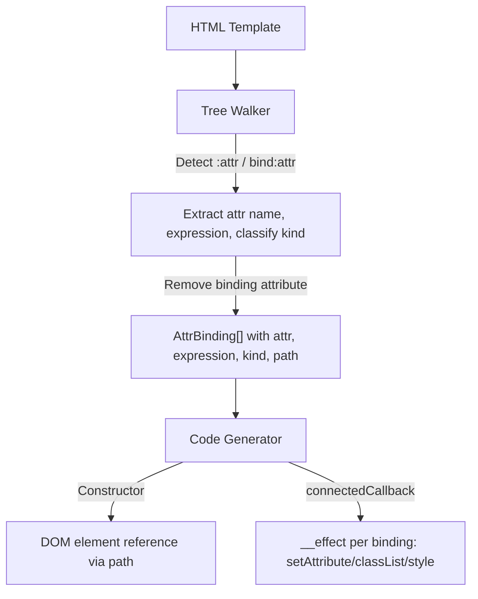

# Design Document — wcCompiler v2: attr-bindings

## Overview

Attribute bindings (`:attr`, `:class`, `:style`) extend the core compiler pipeline with dynamic attribute, class, and style binding. Elements with `:attr="expression"` or `bind:attr="expression"` are detected by the Tree Walker, the binding attribute is removed from the processed template, and an AttrBinding is recorded with the element's DOM path, attribute name, expression, and binding kind. The Code Generator produces an `__effect` per AttrBinding in `connectedCallback` that reactively updates the element's attributes, classes, or styles based on the binding kind.

Unlike `if` which requires anchors and templates, or `each` which requires iteration, attribute bindings are self-contained — no anchors, no templates. Each binding maps directly to a DOM element reference and a reactive effect, similar to `show`.

This feature reuses the v1 attribute binding detection logic from `lib/tree-walker.js` and the attr codegen sections from `lib/codegen.js`.

### Key Design Decisions

1. **No anchor/template needed** — The element stays in the DOM at all times. Only its attributes/classes/styles change. This is fundamentally simpler than `if`/`each`.
2. **One effect per AttrBinding** — Each attribute binding gets its own `__effect` in `connectedCallback`. This keeps reactivity granular — only the relevant attribute updates when its expression changes.
3. **Binding kind classification** — The tree walker classifies each binding into one of four kinds (`attr`, `class`, `style`, `bool`) based on the attribute name. This determines the code generation strategy.
4. **Object vs string expression detection** — For `:class` and `:style`, the code generator checks if the expression starts with `{` to determine whether to use object iteration or direct assignment.
5. **Boolean attribute property assignment** — Known boolean attributes (disabled, checked, hidden, etc.) use direct property assignment (`element.disabled = !!value`) instead of `setAttribute`/`removeAttribute` for correct DOM behavior.
6. **Sequential naming** — AttrBindings are named `__attr0`, `__attr1`, ... in document order, matching the v1 convention.
7. **Attribute removal** — The `:attr` or `bind:attr` attribute is removed from the processed template after extraction, so it doesn't appear in the rendered output.
8. **Shared DOM references** — When multiple bindings target the same element, the code generator reuses the same DOM reference variable to avoid redundant path navigation.

## Architecture

### Integration with Core Pipeline



### Data Flow

```
Template:
  <a :href="link" :class="{ active: isActive }">Click</a>
  <button :disabled="isLoading">Submit</button>
  <div :style="{ color: textColor }">Content</div>

Tree Walker:
  1. Detect <a :href="link"> → AttrBinding { varName: '__attr0', attr: 'href', expression: 'link', kind: 'attr', path: ['childNodes[0]'] }
  2. Detect <a :class="{ active: isActive }"> → AttrBinding { varName: '__attr1', attr: 'class', expression: '{ active: isActive }', kind: 'class', path: ['childNodes[0]'] }
  3. Detect <button :disabled="isLoading"> → AttrBinding { varName: '__attr2', attr: 'disabled', expression: 'isLoading', kind: 'bool', path: ['childNodes[1]'] }
  4. Detect <div :style="{ color: textColor }"> → AttrBinding { varName: '__attr3', attr: 'style', expression: '{ color: textColor }', kind: 'style', path: ['childNodes[2]'] }
  5. Remove all binding attributes from processed template

Code Generator:
  Constructor:
    const __root = __t_MyComponent.content.cloneNode(true);
    this.__attr0 = __root.childNodes[0];       // <a> (shared for __attr0 and __attr1)
    this.__attr1 = this.__attr0;               // same element, reuse reference
    this.__attr2 = __root.childNodes[1];       // <button>
    this.__attr3 = __root.childNodes[2];       // <div>
    // ... other bindings ...
    this.appendChild(__root);

  connectedCallback:
    // Regular attribute: href
    __effect(() => {
      const __v = this._link();
      if (__v || __v === '') { this.__attr0.setAttribute('href', __v); }
      else { this.__attr0.removeAttribute('href'); }
    });

    // Class binding (object): { active: isActive }
    __effect(() => {
      const __obj = { active: this._isActive() };
      for (const [__k, __val] of Object.entries(__obj)) {
        __val ? this.__attr1.classList.add(__k) : this.__attr1.classList.remove(__k);
      }
    });

    // Boolean attribute: disabled
    __effect(() => {
      this.__attr2.disabled = !!(this._isLoading());
    });

    // Style binding (object): { color: textColor }
    __effect(() => {
      const __obj = { color: this._textColor() };
      for (const [__k, __val] of Object.entries(__obj)) {
        this.__attr3.style[__k] = __val;
      }
    });
```

## Components and Interfaces

### 1. Tree Walker Extensions (`lib/tree-walker.js`)

The tree walker adds attribute binding detection during the main DOM walk. This is integrated into the existing `walkTree()` function.

**Attribute binding detection within `walkTree`:**

```js
/**
 * During element node traversal, detect and process attribute bindings.
 *
 * For each element with attributes starting with ':' or 'bind:':
 * 1. Extract the attribute name (remove ':' or 'bind:' prefix)
 * 2. Extract the expression value
 * 3. Classify the binding kind (attr, class, style, bool)
 * 4. Remove the binding attribute from the element
 * 5. Record an AttrBinding with the current DOM path
 * 6. Assign sequential variable name (__attr0, __attr1, ...)
 */
```

**Detection algorithm (inside `walkTree` element processing):**

1. Iterate all attributes of the element
2. For each attribute:
   - If name starts with `:` → extract attr name as `name.slice(1)`
   - If name starts with `bind:` → extract attr name as `name.slice(5)`
   - Otherwise → skip
3. Classify binding kind:
   - `attr === 'class'` → kind `'class'`
   - `attr === 'style'` → kind `'style'`
   - `attr` in `BOOLEAN_ATTRIBUTES` set → kind `'bool'`
   - Otherwise → kind `'attr'`
4. Remove the binding attribute from the element
5. Record AttrBinding with current path, attr, expression, kind, and sequential varName

**Boolean attributes set:**

```js
const BOOLEAN_ATTRIBUTES = new Set([
  'disabled', 'checked', 'hidden', 'readonly', 'required',
  'selected', 'multiple', 'autofocus', 'autoplay', 'controls',
  'loop', 'muted', 'open', 'novalidate'
]);
```

### 2. Code Generator Extensions (`lib/codegen.js`)

The code generator receives `attrBindings` from the ParseResult and generates two output sections.

**Constructor section** (per AttrBinding):

```js
// DOM element reference via path navigation
this.__attr0 = __root.childNodes[0];
this.__attr1 = __root.childNodes[0].childNodes[1];
```

The path is joined with `.` to navigate from `__root` to the target element. This reference is assigned before `this.appendChild(__root)` moves the nodes.

When multiple AttrBindings share the same path, the code generator detects this and reuses the first reference:

```js
this.__attr0 = __root.childNodes[0];
// __attr1 shares same path as __attr0, reuse
this.__attr1 = this.__attr0;
```

**connectedCallback section** (per AttrBinding, based on kind):

**Kind `'attr'` (regular attribute):**
```js
__effect(() => {
  const __v = transformedExpr;
  if (__v || __v === '') { this.__attr0.setAttribute('href', __v); }
  else { this.__attr0.removeAttribute('href'); }
});
```

**Kind `'bool'` (boolean attribute):**
```js
__effect(() => {
  this.__attr2.disabled = !!(transformedExpr);
});
```

**Kind `'class'` with object expression (starts with `{`):**
```js
__effect(() => {
  const __obj = { active: transformedExpr1, 'text-bold': transformedExpr2 };
  for (const [__k, __val] of Object.entries(__obj)) {
    __val ? this.__attr1.classList.add(__k) : this.__attr1.classList.remove(__k);
  }
});
```

**Kind `'class'` with string expression (does not start with `{`):**
```js
__effect(() => {
  this.__attr1.className = transformedExpr;
});
```

**Kind `'style'` with object expression (starts with `{`):**
```js
__effect(() => {
  const __obj = { color: transformedExpr1, fontSize: transformedExpr2 };
  for (const [__k, __val] of Object.entries(__obj)) {
    this.__attr3.style[__k] = __val;
  }
});
```

**Kind `'style'` with string expression (does not start with `{`):**
```js
__effect(() => {
  this.__attr3.style.cssText = transformedExpr;
});
```

**Expression transformation:**

Binding expressions are transformed via `transformExpr()`:
- Signal `url` → `this._url()`
- Computed `isActive` → `this._c_isActive()`
- Prop `label` → `this._s_label()`
- Complex expressions: `size + 'px'` → `this._size() + 'px'`

For object expressions, `transformExpr` is applied to the entire object literal string. The object keys are preserved as-is (they are class names or style property names), while the values are transformed.

### 3. Compiler Pipeline Update (`lib/compiler.js`)

Attr bindings are already discovered during `walkTree()` — no separate processing step is needed. The `walkTree()` function populates `attrBindings` in the result alongside `bindings`, `events`, and `showBindings`.

```js
// walkTree already returns attrBindings:
const { bindings, events, showBindings, attrBindings } = walkTree(rootEl, signalNames, computedNames);

// Merge into ParseResult:
parseResult.attrBindings = attrBindings;
```

## Data Models

### AttrBinding

```js
/**
 * @typedef {Object} AttrBinding
 * @property {string} varName       — Internal name: '__attr0', '__attr1', ...
 * @property {string} attr          — Attribute name (e.g., 'href', 'class', 'style', 'disabled')
 * @property {string} expression    — JS expression from attribute value
 * @property {'attr'|'class'|'style'|'bool'} kind — Binding kind for codegen
 * @property {string[]} path        — DOM path from root to the element
 */
```

### Extended ParseResult

```js
/**
 * @property {AttrBinding[]} attrBindings — Attribute bindings (empty array if none)
 */
```

### Boolean Attributes Constant

```js
/**
 * Set of HTML attributes that use property assignment instead of setAttribute.
 * @type {Set<string>}
 */
const BOOLEAN_ATTRIBUTES = new Set([
  'disabled', 'checked', 'hidden', 'readonly', 'required',
  'selected', 'multiple', 'autofocus', 'autoplay', 'controls',
  'loop', 'muted', 'open', 'novalidate'
]);
```

## Correctness Properties

*A property is a characteristic or behavior that should hold true across all valid executions of a system — essentially, a formal statement about what the system should do. Properties serve as the bridge between human-readable specifications and machine-verifiable correctness guarantees.*

### Property 1: Attribute Binding Detection and AttrBinding Structure

*For any* valid HTML template containing one or more elements with `:attr` or `bind:attr` attributes at various nesting depths, the Tree Walker SHALL produce one AttrBinding per binding attribute, each with a sequential variable name (`__attr0`, `__attr1`, ...), the correct attribute name (prefix removed), the correct expression string, the correct Binding_Kind classification, and a valid DOM path from the template root to the target element.

**Validates: Requirements 1.1, 1.2, 1.3, 1.4, 1.6, 1.7, 2.1, 2.2, 2.3, 2.4, 3.1, 3.2, 3.3, 12.1**

### Property 2: Binding Attribute Removal

*For any* HTML template containing elements with `:attr` or `bind:attr` attributes, the processed template returned by the Tree Walker SHALL NOT contain any attributes starting with `:` or `bind:`.

**Validates: Requirements 1.5**

### Property 3: Binding Kind Classification

*For any* attribute binding, the Tree Walker SHALL classify it as `'class'` when the attribute name is `class`, `'style'` when the attribute name is `style`, `'bool'` when the attribute name is in the Boolean_Attributes set, and `'attr'` for all other attribute names.

**Validates: Requirements 2.1, 2.2, 2.3, 2.4**

### Property 4: Codegen Regular Attribute Effect

*For any* ParseResult containing AttrBindings with Binding_Kind `'attr'`, the generated JavaScript SHALL contain an `__effect` per binding in `connectedCallback` that calls `setAttribute(name, value)` for truthy values or empty string, and `removeAttribute(name)` for other falsy values, with the expression transformed via `transformExpr`.

**Validates: Requirements 4.1, 4.2, 4.3, 10.1, 10.2, 10.3, 11.1, 11.2, 11.3**

### Property 5: Codegen Boolean Attribute Effect

*For any* ParseResult containing AttrBindings with Binding_Kind `'bool'`, the generated JavaScript SHALL contain an `__effect` per binding in `connectedCallback` that sets the element property directly using `!!` coercion (e.g., `element.disabled = !!value`), with the expression transformed via `transformExpr`.

**Validates: Requirements 5.1, 5.2, 5.3**

### Property 6: Codegen Class Binding Effect

*For any* ParseResult containing AttrBindings with Binding_Kind `'class'`, the generated JavaScript SHALL contain an `__effect` that either iterates object entries calling `classList.add`/`classList.remove` (when expression starts with `{`) or sets `element.className` directly (when expression does not start with `{`), with the expression transformed via `transformExpr`.

**Validates: Requirements 6.1, 6.2, 6.3, 6.4, 7.1, 7.2**

### Property 7: Codegen Style Binding Effect

*For any* ParseResult containing AttrBindings with Binding_Kind `'style'`, the generated JavaScript SHALL contain an `__effect` that either iterates object entries setting `element.style[key] = value` (when expression starts with `{`) or sets `element.style.cssText` directly (when expression does not start with `{`), with the expression transformed via `transformExpr`.

**Validates: Requirements 8.1, 8.2, 8.3, 9.1, 9.2**

## Error Handling

### Tree Walker Errors

Attribute bindings do not introduce new error codes. The feature relies on existing validation:

| Error Code | Condition | Source |
|---|---|---|
| `CONFLICTING_DIRECTIVES` | `:attr` combined with conflicting directives (if applicable) | Shared with if-directive validation |

### Error Propagation

Errors follow the same pattern as core: thrown with a `.code` property during tree-walk phase, propagated through the compiler pipeline, and formatted by the CLI for human-readable output.

### Edge Cases (non-error)

- Empty expression (`:href=""`) — treated as empty string, `setAttribute` is called with empty string value
- Missing expression (`:href` without value) — attribute value defaults to empty string per HTML spec, treated as empty string expression

## Testing Strategy

### Property-Based Testing (PBT)

The attr-bindings feature is well-suited for PBT because the tree-walker detection and codegen are pure functions with clear input/output behavior, and the properties hold across a wide input space (arbitrary template structures, nesting depths, attribute names, expression strings, binding kind combinations).

**Library**: `fast-check`
**Configuration**: Minimum 100 iterations per property test
**Tag format**: `Feature: attr-bindings, Property {number}: {property_text}`

### Test Organization

| Module | Property Tests | Unit Tests |
|---|---|---|
| `lib/tree-walker.js` | Detection + structure (Property 1), Attribute removal (Property 2), Kind classification (Property 3) | Multiple bindings on same element, deeply nested bindings, `bind:` prefix form |
| `lib/codegen.js` | Regular attr effect (Property 4), Boolean attr effect (Property 5), Class binding effect (Property 6), Style binding effect (Property 7) | Object vs string expression detection, shared DOM references, complex expressions |
| `lib/compiler.js` | — | End-to-end: template with attr bindings → compiled output with correct reactive effects |

### Dual Testing Approach

- **Property tests** verify universal correctness across generated inputs (template structures, nesting depths, attribute names, expression strings, binding kind combinations)
- **Unit tests** cover specific examples, edge cases, and integration verification (complex object expressions, multiple bindings on same element, interaction with other bindings)
