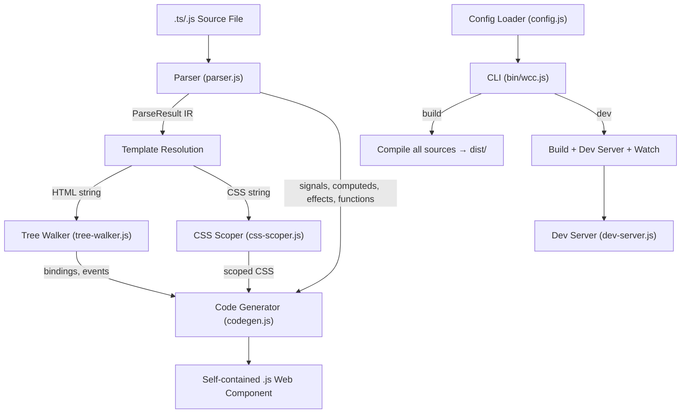
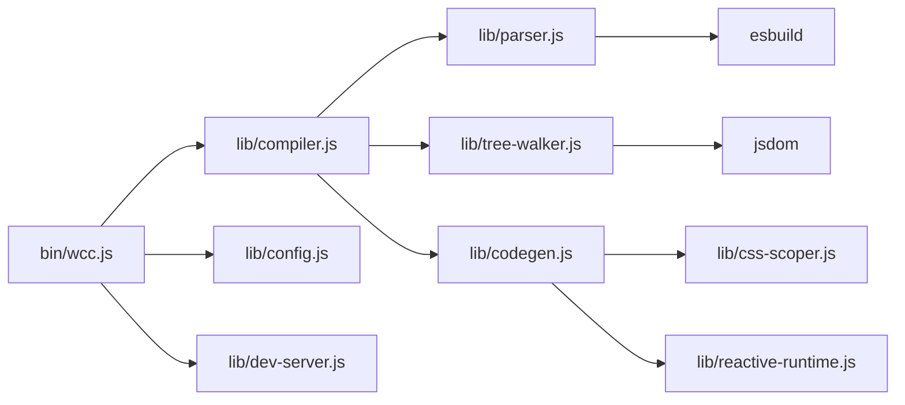

# Design Document — wcCompiler v2 Core

## Overview

wcCompiler v2 is a zero-runtime compiler that transforms `.ts`/`.js` component source files into self-contained native Web Components. The core spec covers the complete compilation pipeline: parsing component sources with `defineComponent()`, `signal()`, `computed()`, and `effect()` declarations; walking HTML templates for `{{interpolation}}` and `@event` bindings; scoping CSS selectors; generating HTMLElement classes with an inlined reactive runtime; CLI commands (`build`, `dev`); configuration loading; and type declarations.

The v2 architecture shifts the entry point from `.html` (v1) to `.ts`/`.js` files. Components are authored as standard TypeScript/JavaScript modules where `defineComponent()` declares metadata (tag name, external template path, external styles path) and reactive primitives define the component logic. The compiler reads the source, resolves external files, analyzes the template DOM, scopes CSS, and produces a single `.js` output file with zero runtime dependencies.

### Key Design Decisions

1. **Regex-based parsing** — The parser uses targeted regex patterns (not a full AST) to extract `defineComponent()`, `signal()`, `computed()`, `effect()`, and `function` declarations. This keeps the parser simple and fast, matching the v1 approach.
2. **esbuild for TypeScript** — TypeScript type annotations are stripped via `esbuild.transform()` before regex extraction, avoiding the need for a full TypeScript compiler.
3. **jsdom for template walking** — Templates are parsed into a DOM tree using jsdom, then walked to discover bindings and events with path-based metadata.
4. **Inlined reactive runtime** — The ~40-line reactive runtime (`__signal`, `__computed`, `__effect`) is inlined as a string literal at the top of each compiled output, making each component fully self-contained.
5. **Round-trip testability** — A pretty-printer serializes the parsed IR back to source format, enabling round-trip property testing (`parse → print → parse ≡ parse`).

## Architecture

### Compiler Pipeline



### Module Dependency Graph



## Components and Interfaces

### 1. Parser (`lib/parser.js`)

Reads a `.ts`/`.js` source file, detects `defineComponent()`, reactive declarations, and function definitions. Resolves external template and styles paths.

```js
/**
 * @typedef {Object} ParseResult
 * @property {string} tagName          — Custom element tag (e.g., 'wcc-counter')
 * @property {string} className        — PascalCase class name (e.g., 'WccCounter')
 * @property {string} template         — Raw HTML template content
 * @property {string} style            — Raw CSS content (empty string if none)
 * @property {ReactiveVar[]} signals   — signal() declarations
 * @property {ComputedDef[]} computeds — computed() declarations
 * @property {EffectDef[]} effects     — effect() declarations
 * @property {MethodDef[]} methods     — function declarations
 * @property {Binding[]} bindings      — (populated by tree-walker)
 * @property {EventBinding[]} events   — (populated by tree-walker)
 * @property {string|null} processedTemplate — (populated by tree-walker)
 */

/**
 * Parse a .ts/.js component source file into a ParseResult IR.
 *
 * @param {string} filePath — Absolute path to the source file
 * @returns {Promise<ParseResult>}
 * @throws {Error} with code MISSING_DEFINE_COMPONENT, TEMPLATE_NOT_FOUND, STYLES_NOT_FOUND
 */
export async function parse(filePath) { ... }
```

**Internal functions:**

| Function | Signature | Purpose |
|---|---|---|
| `extractDefineComponent(source)` | `(string) → { tag, template, styles }` | Extract `defineComponent({...})` object literal via regex |
| `extractSignals(source)` | `(string) → ReactiveVar[]` | Extract `const x = signal(value)` declarations |
| `extractComputeds(source)` | `(string) → ComputedDef[]` | Extract `const x = computed(() => expr)` declarations |
| `extractEffects(source)` | `(string) → EffectDef[]` | Extract `effect(() => { body })` declarations |
| `extractFunctions(source)` | `(string) → MethodDef[]` | Extract top-level `function name(params) { body }` |
| `stripMacroImport(source)` | `(string) → string` | Remove `import { ... } from 'wcc'` statements |
| `stripTypes(tsCode)` | `(string) → Promise<string>` | Strip TS annotations via `esbuild.transform()` |
| `toClassName(tagName)` | `(string) → string` | Convert kebab-case to PascalCase |

**Regex patterns:**

```js
// defineComponent extraction
/defineComponent\(\s*\{([^}]*)\}\s*\)/

// Tag name from defineComponent
/tag\s*:\s*['"]([^'"]+)['"]/

// Template path from defineComponent
/template\s*:\s*['"]([^'"]+)['"]/

// Styles path from defineComponent
/styles\s*:\s*['"]([^'"]+)['"]/

// signal declarations: const name = signal(value)
/(?:const|let|var)\s+([$\w]+)\s*=\s*signal\(/

// computed declarations: const name = computed(() => expr)
/(?:const|let|var)\s+(\w+)\s*=\s*computed\(\s*\(\)\s*=>\s*([\s\S]*?)\)/g

// effect declarations: effect(() => { body })
/effect\(\s*\(\)\s*=>\s*\{/

// function declarations: function name(params) {
/^\s*function\s+(\w+)\s*\(([^)]*)\)\s*\{/

// macro import stripping
/import\s*\{[^}]*\}\s*from\s*['"]wcc['"]\s*;?/g
```

**Signal value extraction** uses parenthesis depth counting (same as v1 `extractRefArgument`) to handle nested expressions like `signal([1, 2, 3])` or `signal((a + b) * c)`.

**Effect body extraction** uses brace depth tracking to capture multi-line bodies, same pattern as v1 lifecycle hook extraction.

### 2. Tree Walker (`lib/tree-walker.js`)

Traverses a jsdom DOM tree to discover `{{interpolation}}` bindings and `@event="handler"` bindings. Produces path-based metadata for code generation.

Reused from v1 with scope limited to core features only: `{{interpolation}}` and `@event`. Directives (`if`, `each`, `show`, `model`, `:attr`, `ref`, `<slot>`) are handled by separate feature specs.

```js
/**
 * @typedef {Object} Binding
 * @property {string} varName  — Internal name (e.g., '__b0')
 * @property {string} name     — Variable name from {{name}}
 * @property {'signal'|'computed'|'method'} type — Binding source type
 * @property {string[]} path   — DOM path from root (e.g., ['childNodes[0]', 'childNodes[1]'])
 */

/**
 * @typedef {Object} EventBinding
 * @property {string} varName  — Internal name (e.g., '__e0')
 * @property {string} event    — Event name (e.g., 'click')
 * @property {string} handler  — Handler function name (e.g., 'increment')
 * @property {string[]} path   — DOM path from root
 */

/**
 * Walk a DOM tree rooted at rootEl, discovering bindings and events.
 *
 * @param {Element} rootEl — jsdom DOM element (parsed template root)
 * @param {Set<string>} signalNames — Set of signal variable names
 * @param {Set<string>} computedNames — Set of computed variable names
 * @returns {{ bindings: Binding[], events: EventBinding[] }}
 */
export function walkTree(rootEl, signalNames, computedNames) { ... }
```

**Walking algorithm:**

1. Recursively visit each node in the DOM tree
2. For element nodes: scan attributes for `@event="handler"` patterns, record event binding, remove attribute
3. For text nodes: test against `/\{\{[\w.]+\}\}/` regex
   - If `{{name}}` is sole content of parent → bind to parent element (path excludes text node)
   - If mixed text/interpolations → split into `<span>` elements per binding
4. Build path as array of `childNodes[n]` segments from root

### 3. Code Generator (`lib/codegen.js`)

Generates a self-contained JavaScript file from the ParseResult IR. Partial rewrite from v1 to support the new signals API (`x()` for read, `x.set()` for write).

```js
/**
 * Generate a fully self-contained JS component from a ParseResult.
 *
 * @param {ParseResult} parseResult — Complete IR with bindings/events
 * @returns {string} JavaScript source code
 */
export function generateComponent(parseResult) { ... }
```

**Output structure:**

```js
// 1. Inlined reactive runtime (~40 lines)
let __currentEffect = null;
function __signal(initial) { ... }
function __computed(fn) { ... }
function __effect(fn) { ... }

// 2. Scoped CSS injection (if styles provided)
const __css_WccCounter = document.createElement('style');
__css_WccCounter.textContent = `wcc-counter .counter { ... }`;
document.head.appendChild(__css_WccCounter);

// 3. Template element
const __t_WccCounter = document.createElement('template');
__t_WccCounter.innerHTML = `<div class="counter">...</div>`;

// 4. HTMLElement class
class WccCounter extends HTMLElement {
  constructor() {
    super();
    // Clone template, assign DOM refs
    const __root = __t_WccCounter.content.cloneNode(true);
    this.__b0 = __root.childNodes[0].childNodes[0]; // {{count}} span
    this.__e0 = __root.childNodes[0].childNodes[1]; // button
    // Signal initialization
    this._count = __signal(0);
    // Computed initialization
    this._c_doubled = __computed(() => this._count() * 2);
    // Append DOM
    this.innerHTML = '';
    this.appendChild(__root);
  }

  connectedCallback() {
    // Binding effects
    __effect(() => {
      this.__b0.textContent = this._count() ?? '';
    });
    // User effects
    __effect(() => {
      console.log('count changed:', this._count());
    });
    // Event listeners
    this.__e0.addEventListener('click', this._increment.bind(this));
  }

  // User methods (prefixed with _)
  _increment() {
    this._count(this._count() + 1);
  }
}

// 5. Custom element registration
customElements.define('wcc-counter', WccCounter);
```

**Transformation rules (core):**

| Source Pattern | Output Pattern | Location |
|---|---|---|
| `signal(value)` | `this._x = __signal(value)` | constructor |
| `x()` (read in method/effect) | `this._x()` | method/effect body |
| `x.set(value)` (write in method) | `this._x(value)` | method body |
| `computed(() => expr)` | `this._c_x = __computed(() => transformedExpr)` | constructor |
| `effect(() => { body })` | `__effect(() => { transformedBody })` | connectedCallback |
| `function name(params) { body }` | `_name(params) { transformedBody }` | class method |
| Template `{{x}}` | `__effect(() => { el.textContent = this._x() })` | connectedCallback |
| Template `@click="handler"` | `el.addEventListener('click', this._handler.bind(this))` | connectedCallback |

**Expression transformation** (`transformExpr`):

Rewrites variable references in expressions to use `this._` prefix and signal read syntax:
- Signal `x` → `this._x()` (auto-unwrap via function call)
- Computed `x` → `this._c_x()` (auto-unwrap via function call)
- Uses word-boundary regex: `/\b(varName)\b/g` for each known signal/computed name

**Method body transformation** (`transformMethodBody`):

Rewrites signal writes and reads in function bodies:
- `x.set(value)` → `this._x(value)` (signal write via setter)
- `x()` → `this._x()` (signal read)
- Computed `x()` → `this._c_x()` (computed read)

### 4. CSS Scoper (`lib/css-scoper.js`)

Reused from v1 without changes. Prefixes CSS selectors with the component tag name.

```js
/**
 * @param {string} css — Raw CSS string
 * @param {string} tagName — Component tag name (e.g., 'wcc-counter')
 * @returns {string} Scoped CSS string
 */
export function scopeCSS(css, tagName) { ... }
```

### 5. Reactive Runtime (`lib/reactive-runtime.js`)

Reused from v1 without changes. Exported as a string literal for inlining.

```js
/** @type {string} */
export const reactiveRuntime = `
let __currentEffect = null;
function __signal(initial) { ... }   // ~15 lines
function __computed(fn) { ... }      // ~15 lines
function __effect(fn) { ... }        // ~8 lines
`;
```

**Runtime behavior:**
- `__signal(initial)`: Returns a function. Call with 0 args to read, 1 arg to write. Tracks subscribers via `__currentEffect` global stack. Notifies on value change (strict inequality `!==`).
- `__computed(fn)`: Returns a read-only function. Caches result, marks dirty when dependencies change. Recomputes lazily on next read.
- `__effect(fn)`: Runs `fn` immediately, sets `__currentEffect` to a re-run function so that any signal/computed reads during execution register the effect as a subscriber.

### 6. Compiler (`lib/compiler.js`)

Orchestrates the full pipeline. Partial rewrite from v1 to handle `.ts`/`.js` entry points instead of `.html`.

```js
/**
 * Compile a single .ts/.js source file into a self-contained JS component.
 *
 * @param {string} filePath — Absolute or relative path to the source file
 * @param {object} [config] — Optional config (reserved for future options)
 * @returns {Promise<string>} The generated JavaScript component code
 */
export async function compile(filePath, config) { ... }
```

**Pipeline steps:**
1. Call `parse(filePath)` → get ParseResult with template, styles, signals, computeds, effects, methods
2. Parse template HTML into jsdom DOM: `new JSDOM(template)`
3. Call `walkTree(rootEl, signalNames, computedNames)` → get bindings, events
4. Merge tree-walker results into ParseResult
5. Call `generateComponent(parseResult)` → get output JavaScript string (codegen internally calls `scopeCSS` and inlines `reactiveRuntime`)
6. Return the output string

### 7. Config Loader (`lib/config.js`)

Reused from v1 with minor change: glob pattern uses `*.ts` and `*.js` instead of `*.html`.

```js
/**
 * @typedef {Object} WccConfig
 * @property {number} port    — Dev server port (default: 4100)
 * @property {string} input   — Source directory (default: 'src')
 * @property {string} output  — Output directory (default: 'dist')
 */

/**
 * @param {string} projectRoot — Absolute path to the project root
 * @returns {Promise<WccConfig>}
 */
export async function loadConfig(projectRoot) { ... }
```

### 8. Dev Server (`lib/dev-server.js`)

Reused from v1 without changes. HTTP server with polling-based live-reload.

### 9. CLI (`bin/wcc.js`)

Entry point for `wcc build` and `wcc dev` commands.

```js
#!/usr/bin/env node

/**
 * CLI entry point.
 * Usage:
 *   wcc build   — Compile all components to output directory
 *   wcc dev     — Build + dev server + file watching
 */
```

**Build flow:**
1. Load config via `loadConfig(cwd)`
2. Glob `input/**/*.{ts,js}` excluding `*.test.*` and `*.d.ts`
3. For each file: `compile(filePath)` → write to `output/` directory
4. On error: print to stderr, exit with code 1

**Dev flow:**
1. Load config, perform initial build (same as above, but errors don't exit)
2. Start dev server via `startDevServer({ port, root, outputDir })`
3. Watch `input/` directory for changes
4. On change: recompile changed file, errors print to stderr but don't stop watching

### 10. Pretty Printer (`lib/printer.js`)

Serializes a ParseResult IR back to valid `.ts`/`.js` source format. Used for round-trip testing.

```js
/**
 * Pretty-print a ParseResult IR back to component source format.
 *
 * @param {ParseResult} ir — The intermediate representation
 * @returns {string} Reconstructed source code
 */
export function prettyPrint(ir) { ... }
```

**Output format:**
```js
import { defineComponent, signal, computed, effect } from 'wcc'

export default defineComponent({
  tag: 'wcc-counter',
  template: './wcc-counter.html',
  styles: './wcc-counter.css',
})

const count = signal(0)
const doubled = computed(() => count() * 2)

effect(() => {
  console.log('count changed:', count())
})

function increment() {
  count.set(count() + 1)
}
```

### 11. Type Declarations (`types/wcc.d.ts`)

```ts
declare module 'wcc' {
  interface Signal<T> {
    (): T;
    set(value: T): void;
  }

  export function signal<T>(value: T): Signal<T>;
  export function computed<T>(fn: () => T): () => T;
  export function effect(fn: () => void): void;
  export function defineComponent(options: {
    tag: string;
    template: string;
    styles?: string;
  }): void;
}
```

## Data Models

### ParseResult (Intermediate Representation)

The central data structure passed through the pipeline:

```js
/**
 * @typedef {Object} ParseResult
 * @property {string} tagName            — 'wcc-counter'
 * @property {string} className          — 'WccCounter'
 * @property {string} template           — Raw HTML template content
 * @property {string} style              — Raw CSS content ('' if none)
 * @property {ReactiveVar[]} signals     — signal() declarations
 * @property {ComputedDef[]} computeds   — computed() declarations
 * @property {EffectDef[]} effects       — effect() declarations
 * @property {MethodDef[]} methods       — function declarations
 * @property {Binding[]} bindings        — (populated by tree-walker)
 * @property {EventBinding[]} events     — (populated by tree-walker)
 * @property {string|null} processedTemplate — (populated by tree-walker)
 */
```

### Supporting Types

```js
/** @typedef {{ name: string, value: string }} ReactiveVar */
/** @typedef {{ name: string, body: string }} ComputedDef */
/** @typedef {{ body: string }} EffectDef */
/** @typedef {{ name: string, params: string, body: string }} MethodDef */

/** @typedef {{ varName: string, name: string, type: 'signal'|'computed'|'method', path: string[] }} Binding */
/** @typedef {{ varName: string, event: string, handler: string, path: string[] }} EventBinding */
```

### Configuration

```js
/** @typedef {{ port: number, input: string, output: string }} WccConfig */
```

## Correctness Properties

*A property is a characteristic or behavior that should hold true across all valid executions of a system — essentially, a formal statement about what the system should do. Properties serve as the bridge between human-readable specifications and machine-verifiable correctness guarantees.*

### Property 1: Parser Round-Trip

*For any* valid component source containing `defineComponent()`, `signal()`, `computed()`, `effect()`, and `function` declarations, parsing the source into an IR, printing the IR back to source, and parsing again SHALL produce an equivalent IR.

**Validates: Requirements 1.1, 1.4, 1.5, 1.6, 1.7, 11.1, 11.2**

### Property 2: Interpolation Discovery Completeness

*For any* HTML template containing `{{variableName}}` expressions at various positions (sole content, mixed with text, multiple per text node), the Tree Walker SHALL discover every interpolation and record a valid DOM path, the correct variable name, and the correct binding type.

**Validates: Requirements 2.1, 2.3, 2.4**

### Property 3: Event Discovery and Cleanup

*For any* HTML template containing `@event="handler"` attributes, the Tree Walker SHALL discover every event binding with the correct event name and handler, AND the processed template SHALL contain zero `@event` attributes.

**Validates: Requirements 2.2, 2.5**

### Property 4: Signal Read/Write Consistency

*For any* initial value and any sequence of distinct new values, a `__signal` created with the initial value SHALL return the initial value on first read, and after each `set(newValue)` call, SHALL return the new value and SHALL have notified all subscribed effects exactly once per change.

**Validates: Requirements 3.1, 3.4, 3.5**

### Property 5: Computed Derived Value Correctness

*For any* signal with an initial value and any pure transformation function, a `__computed` wrapping that function SHALL return the correct derived value, and when the source signal changes, the computed SHALL return the updated derived value on next read.

**Validates: Requirements 3.2, 3.4**

### Property 6: Effect Execution on Dependency Change

*For any* signal with an initial value, an `__effect` that reads the signal SHALL execute immediately with the initial value, and SHALL re-execute exactly once each time the signal is set to a different value.

**Validates: Requirements 3.3, 3.4, 3.5**

### Property 7: Signal Same-Value Notification Skip

*For any* value, setting a signal to its current value SHALL NOT trigger re-execution of subscribed effects (idempotence).

**Validates: Requirements 3.6**

### Property 8: CSS Selector Prefixing

*For any* non-empty CSS string containing simple selectors (class, id, element) and comma-separated selectors, and any valid tag name, the CSS Scoper SHALL prefix every selector with the tag name.

**Validates: Requirements 4.1, 4.2**

### Property 9: CSS @media Recursive Scoping

*For any* CSS string containing `@media` blocks with nested selectors, and any valid tag name, the CSS Scoper SHALL prefix every selector inside the `@media` block with the tag name while preserving the `@media` rule itself.

**Validates: Requirements 4.3**

### Property 10: Codegen Structural Completeness

*For any* valid ParseResult IR (with at least a tag name, class name, and template), the generated JavaScript output SHALL contain: the inline reactive runtime, an HTMLElement class definition, a `connectedCallback` method, and a `customElements.define` registration. When styles are provided, the output SHALL also contain a `<style>` injection into `document.head`.

**Validates: Requirements 5.1, 5.7, 5.8, 5.9**

### Property 11: Codegen Signal/Computed Initialization

*For any* ParseResult IR containing signal and computed declarations, the generated constructor SHALL contain a `__signal(initialValue)` call for each signal and a `__computed(() => expr)` call for each computed.

**Validates: Requirements 5.2, 5.3**

### Property 12: Codegen ConnectedCallback Setup

*For any* ParseResult IR containing effects, interpolation bindings, and event bindings, the generated `connectedCallback` SHALL contain `__effect` calls for each user effect and each binding, and `addEventListener` calls for each event binding.

**Validates: Requirements 5.4, 5.5, 5.6**

## Error Handling

### Parser Errors

| Error Code | Condition | Message Pattern |
|---|---|---|
| `MISSING_DEFINE_COMPONENT` | No `defineComponent()` found in source | `"Error en '{file}': defineComponent() es obligatorio"` |
| `TEMPLATE_NOT_FOUND` | Template path doesn't resolve to existing file | `"Error en '{file}': template no encontrado: '{path}'"` |
| `STYLES_NOT_FOUND` | Styles path doesn't resolve to existing file | `"Error en '{file}': styles no encontrado: '{path}'"` |

### Config Errors

| Error Code | Condition | Message Pattern |
|---|---|---|
| `INVALID_CONFIG` | Invalid port/input/output values | `"Error en wcc.config.js: {details}"` |

### CLI Error Handling

- **`wcc build`**: On compilation error, print error to stderr and exit with code 1. All errors are fatal.
- **`wcc dev`**: On compilation error, print error to stderr and continue watching. The dev server remains running so the developer can fix the error and see the result on next save.

### Error Propagation

The compiler pipeline propagates errors from any step with the original error code intact. Each module throws errors with a `.code` property for programmatic handling. The CLI catches these errors and formats them for human-readable output.

## Testing Strategy

### Property-Based Testing (PBT)

The core spec is well-suited for property-based testing because it involves pure functions with clear input/output behavior (parser, tree-walker, CSS scoper, codegen) and universal properties that hold across a wide input space.

**Library**: `fast-check` (already in devDependencies)
**Configuration**: Minimum 100 iterations per property test
**Tag format**: `Feature: core, Property {number}: {property_text}`

### Test Organization

| Module | Property Tests | Unit Tests |
|---|---|---|
| `lib/parser.js` | Round-trip (Property 1) | Error cases (1.9, 1.10, 1.11), TS stripping (1.8), macro import stripping (1.12) |
| `lib/tree-walker.js` | Interpolation discovery (Property 2), Event discovery (Property 3) | Undeclared binding warning (2.6) |
| `lib/reactive-runtime.js` | Signal read/write (Property 4), Computed (Property 5), Effect (Property 6), Same-value skip (Property 7) | — |
| `lib/css-scoper.js` | Selector prefixing (Property 8), @media scoping (Property 9) | @keyframes preservation (4.4), statement at-rules (4.5), empty input (4.6) |
| `lib/codegen.js` | Structural completeness (Property 10), Constructor init (Property 11), ConnectedCallback (Property 12) | — |
| `lib/compiler.js` | — | Pipeline integration (10.1, 10.2), error propagation (10.3) |
| `lib/config.js` | — | Config loading (7.1, 7.2), validation errors (7.3, 7.4, 7.5) |
| `lib/dev-server.js` | — | MIME types (8.1), poll endpoint (8.4), 404 (8.5), script injection (8.2) |
| `bin/wcc.js` | — | Build discovery (6.1), build output (6.2), error handling (6.5, 6.6) |
| `types/wcc.d.ts` | — | Smoke test: file exists with expected declarations (9.1–9.5) |

### Dual Testing Approach

- **Property tests** verify universal correctness across generated inputs (parsers, transformers, runtime behavior)
- **Unit tests** cover specific examples, edge cases, error conditions, and integration points
- Together they provide comprehensive coverage: property tests catch general bugs via randomization, unit tests pin down specific behaviors and error paths
