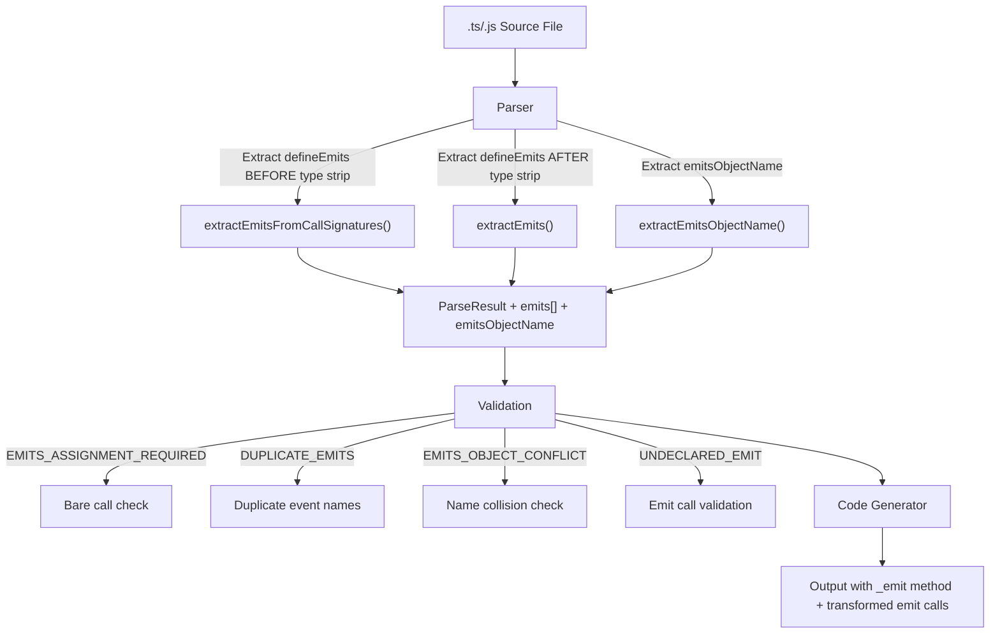

# Design Document — wcCompiler v2: defineEmits

## Overview

`defineEmits` extends the core compiler pipeline to support typed custom event dispatching on custom elements. Events are declared in the component source via `defineEmits(['event1', 'event2'])` (array form) or `defineEmits<{ (e: 'event1', value: type): void }>()` (TypeScript call signatures form). The compiler extracts emit metadata during parsing, generates an internal `_emit(name, detail)` method on the HTMLElement class, and transforms `emit('event', data)` calls in script to `this._emit('event', data)`. Events are dispatched as native `CustomEvent` instances with `bubbles: true` and `composed: true`.

This feature builds on the core spec's parser and code generator, and follows the same patterns established by defineProps (mandatory variable assignment, generic extraction before type stripping, conflict validation, exclusion from reactive transforms).

### Key Design Decisions

1. **Variable assignment is mandatory** — `const emit = defineEmits(...)` is required. Bare `defineEmits(...)` calls produce an error (`EMITS_ASSIGNMENT_REQUIRED`). This ensures the compiler always knows the Emits_Object_Name for call transformation.
2. **Generic extraction before type stripping** — TypeScript call signature event names are extracted BEFORE esbuild strips types, since esbuild removes generics entirely. Array form extraction happens AFTER type stripping.
3. **Dynamic regex for call transformation** — The codegen builds a regex from the captured `emitsObjectName` to transform `emitsObjectName(` → `this._emit(`. This ensures only the declared emit variable is transformed, not other functions with similar call patterns.
4. **Emits object name excluded from reactive transforms** — The emits variable is not a signal, computed, or constant. The codegen skips it during all reactive transformation passes to avoid incorrect rewrites like `this._emit()` or `this._c_emit()`.
5. **Native CustomEvent with bubbling** — The generated `_emit` method dispatches `new CustomEvent(name, { detail, bubbles: true, composed: true })`, following Web Component conventions for cross-shadow-DOM event propagation.

## Architecture

### Integration with Core Pipeline



### Data Flow

```
Source: const emit = defineEmits<{ (e: 'change', value: number): void; (e: 'reset'): void }>()

Parser extracts (BEFORE type strip):
  emitsObjectName: 'emit'
  emits: ['change', 'reset']

Validation:
  ✓ Assignment present (const emit = ...)
  ✓ No duplicate event names
  ✓ 'emit' does not collide with signals/computeds/props
  ✓ All emit('...') calls use declared event names

Code Generator produces:
  // In class body:
  _emit(name, detail) {
    this.dispatchEvent(new CustomEvent(name, { detail, bubbles: true, composed: true }));
  }

  // In method bodies:
  // Source: emit('change', count())
  // Output: this._emit('change', this._count())
```

## Components and Interfaces

### 1. Parser Extensions (`lib/parser.js`)

New types and functions added to the existing parser module.

**New fields on ParseResult:**

```js
/**
 * @property {string[]} emits              — Event names declared in defineEmits
 * @property {string|null} emitsObjectName — Variable name from `const X = defineEmits(...)`
 */
```

**New internal functions:**

| Function | Signature | Purpose |
|---|---|---|
| `extractEmits(source, fileName)` | `(string, string) → string[]` | Extract event names from `defineEmits(['e1', 'e2'])` array form (AFTER type strip) |
| `extractEmitsFromCallSignatures(source, fileName)` | `(string, string) → string[]` | Extract event names from `defineEmits<{ (e: 'e1', ...): void }>()` TS call signatures (BEFORE type strip) |
| `extractEmitsObjectName(source)` | `(string) → string \| null` | Extract variable name from `const/let/var X = defineEmits(...)` (AFTER type strip) |
| `extractEmitsObjectNameFromGeneric(source)` | `(string) → string \| null` | Extract variable name from `const/let/var X = defineEmits<{...}>()` (BEFORE type strip) |
| `validateEmitsAssignment(source)` | `(string) → void` | Throw `EMITS_ASSIGNMENT_REQUIRED` if bare `defineEmits()` call detected |
| `validateEmitsConflicts(emitsObjectName, signalNames, computedNames, constantNames, propNames, propsObjectName)` | `(...) → void` | Throw `EMITS_OBJECT_CONFLICT` if name collides |
| `validateUndeclaredEmits(source, emitsObjectName, emits, fileName)` | `(string, string, string[], string) → void` | Throw `UNDECLARED_EMIT` if emit call uses undeclared event name |

**Regex patterns:**

```js
// Array form detection (AFTER type strip):
// const emit = defineEmits(['change', 'reset'])
/defineEmits\(\[([^\]]*)\]\)/

// Event names from array:
/['"]([^'"]+)['"]/g

// TS call signatures form detection (BEFORE type strip):
// const emit = defineEmits<{ (e: 'change', value: number): void; (e: 'reset'): void }>()
/defineEmits\s*<\s*\{([\s\S]*?)\}\s*>\s*\(\s*\)/

// Event names from call signatures (first parameter of each signature):
/\(\s*\w+\s*:\s*['"]([^'"]+)['"]/g

// Variable assignment detection (AFTER type strip):
/(?:const|let|var)\s+([$\w]+)\s*=\s*defineEmits\s*\(/

// Variable assignment detection (BEFORE type strip, generic form):
/(?:const|let|var)\s+([$\w]+)\s*=\s*defineEmits\s*<\s*\{/

// Bare call detection (no assignment):
// defineEmits( or defineEmits< NOT preceded by = assignment
// Strategy: check if defineEmits appears in source AND no assignment pattern matches

// Undeclared emit detection (dynamic, built from emitsObjectName):
// Pattern: emitsObjectName('eventName'  — captures the event name
// new RegExp(`\\b${escapeRegex(emitsObjectName)}\\(\\s*['"]([^'"]+)['"]`, 'g')
```

**Parsing order within `parse()` function:**

1. Read source file, strip macro import
2. **BEFORE type strip**: Extract emits from call signatures form (`extractEmitsFromCallSignatures`), extract emitsObjectName from generic form (`extractEmitsObjectNameFromGeneric`)
3. Strip types via esbuild
4. **AFTER type strip**: Extract emits from array form (`extractEmits`), extract emitsObjectName from non-generic form (`extractEmitsObjectName`)
5. Merge results: use whichever form was found (call signatures or array)
6. Validate: assignment required, duplicate emits, object name conflicts, undeclared emits

### 2. Code Generator Extensions (`lib/codegen.js`)

The code generator receives `emits` and `emitsObjectName` from the ParseResult and generates additional output sections.

**New output section:**

The `_emit(name, detail)` method is generated on the HTMLElement class when emits are declared:

```js
_emit(name, detail) {
  this.dispatchEvent(new CustomEvent(name, { detail, bubbles: true, composed: true }));
}
```

**Emit call transformation in `transformMethodBody`:**

Before other reactive transforms, replace emit calls:

```js
// Replace emitsObjectName( → this._emit(
if (emitsObjectName) {
  const emitsEscaped = escapeRegex(emitsObjectName);
  r = r.replace(new RegExp(`\\b${emitsEscaped}\\(`, 'g'), 'this._emit(');
}
```

**Emits object name exclusion:**

In all reactive transformation loops (signal reads, computed reads, constant reads), skip the emitsObjectName:

```js
// In signal/computed/constant transform loops:
if (emitsObjectName && n === emitsObjectName) continue;
```

This follows the exact same pattern used for `propsObjectName` exclusion in defineProps.

**Updated `transformExpr` signature:**

```js
function transformExpr(expr, propsSet, rootVarNames, computedNames, 
  constantNames, templateRefs, propsObjectName, scriptMode, emitsObjectName)
```

**Updated `transformMethodBody` signature:**

```js
function transformMethodBody(body, propsSet, rootVarNames, computedNames, 
  constantNames, templateRefs, propsObjectName, emitsObjectName)
```

### 3. Compiler Pipeline Update (`lib/compiler.js`)

The compiler passes `emitsObjectName` to the code generator:

```js
// After parsing:
const { emits, emitsObjectName } = parseResult;

// Pass to codegen (already part of ParseResult):
const output = generateComponent(parseResult);
```

### 4. Pretty Printer Extension (`lib/printer.js`)

The pretty printer serializes `emits` and `emitsObjectName` back to source:

```js
// If emits exist, output:
// const <emitsObjectName> = defineEmits(['event1', 'event2'])
// This is the canonical printed form (array form) since TS type info is lost after parsing.
```

The import statement is updated to include `defineEmits` when emits are present.

## Data Models

### Extended ParseResult

The ParseResult from core is extended with:

```js
/**
 * @property {string[]} emits              — Event names (empty array if no defineEmits)
 * @property {string|null} emitsObjectName — Variable name from assignment (null if no defineEmits)
 */
```

### Error Codes

```js
/** @type {'EMITS_ASSIGNMENT_REQUIRED'} */
/** @type {'DUPLICATE_EMITS'} */
/** @type {'EMITS_OBJECT_CONFLICT'} */
/** @type {'UNDECLARED_EMIT'} */
```

## Correctness Properties

*A property is a characteristic or behavior that should hold true across all valid executions of a system — essentially, a formal statement about what the system should do. Properties serve as the bridge between human-readable specifications and machine-verifiable correctness guarantees.*

### Property 1: Emits Parser Round-Trip

*For any* valid component source containing `defineEmits` (array form or TypeScript call signatures form) with arbitrary event names, parsing the source into an IR, printing the IR back to source, and parsing again SHALL produce an equivalent IR with the same `emits` (names and order) and `emitsObjectName`.

**Validates: Requirements 1.1, 1.2, 1.3, 2.1, 2.2, 2.3**

### Property 2: Bare Call Error Detection

*For any* component source containing a `defineEmits()` call (array form or generic form) that is NOT assigned to a variable, the Parser SHALL throw an error with code `EMITS_ASSIGNMENT_REQUIRED`.

**Validates: Requirements 3.1**

### Property 3: Duplicate Emits Detection

*For any* `defineEmits` declaration (array form or call signatures form) containing at least one duplicate event name, the Parser SHALL throw an error with code `DUPLICATE_EMITS` identifying the duplicated event name.

**Validates: Requirements 4.1**

### Property 4: Emits Object Conflict Detection

*For any* component source where the `emitsObjectName` matches a signal name, computed name, constant name, prop name, or `propsObjectName`, the Parser SHALL throw an error with code `EMITS_OBJECT_CONFLICT`.

**Validates: Requirements 4.2**

### Property 5: Undeclared Emit Detection

*For any* component source containing `emitsObjectName('eventName', ...)` calls where `eventName` is NOT in the declared emits array, the Parser SHALL throw an error with code `UNDECLARED_EMIT` identifying the undeclared event name.

**Validates: Requirements 5.1, 5.2, 5.3**

### Property 6: Emit Call Transformation

*For any* method or effect body containing `emitsObjectName('eventName', payload)` calls, the Code_Generator SHALL transform every occurrence to `this._emit('eventName', payload)`, and SHALL NOT transform other function calls that do not use the `emitsObjectName` as callee.

**Validates: Requirements 7.1, 7.2, 7.3, 7.4**

### Property 7: Emits Object Name Exclusion from Reactive Transforms

*For any* component source where the `emitsObjectName` appears in method bodies, the Code_Generator SHALL NOT apply signal read transformation (`this._name()`), computed read transformation (`this._c_name()`), or constant transformation (`this._const_name`) to the `emitsObjectName`.

**Validates: Requirements 7.5, 8.1, 8.2, 8.3**

## Error Handling

### Parser Errors

| Error Code | Condition | Message Pattern |
|---|---|---|
| `EMITS_ASSIGNMENT_REQUIRED` | `defineEmits()` called without variable assignment | `"Error en '{file}': defineEmits() debe asignarse a una variable (const emit = defineEmits(...))"` |
| `DUPLICATE_EMITS` | Same event name appears more than once | `"Error en '{file}': emits duplicados: {names}"` |
| `EMITS_OBJECT_CONFLICT` | Emits variable name collides with signal/computed/constant/prop | `"Error en '{file}': '{name}' colisiona con una declaración existente"` |
| `UNDECLARED_EMIT` | Emit call uses event name not in declaration | `"Error en '{file}': emit no declarado: '{eventName}'"` |

### Error Propagation

Errors follow the same pattern as core and defineProps: thrown with a `.code` property for programmatic handling, propagated through the compiler pipeline, and formatted by the CLI for human-readable output.

## Testing Strategy

### Property-Based Testing (PBT)

The defineEmits feature is well-suited for property-based testing because it involves pure functions with clear input/output behavior (parser extraction, codegen transformation) and universal properties that hold across a wide input space (arbitrary event names, variable names, method bodies).

**Library**: `fast-check`
**Configuration**: Minimum 100 iterations per property test
**Tag format**: `Feature: define-emits, Property {number}: {property_text}`

### Test Organization

| Module | Property Tests | Unit Tests |
|---|---|---|
| `lib/parser.js` | Round-trip (Property 1), Bare call detection (Property 2), Duplicate detection (Property 3), Conflict detection (Property 4), Undeclared emit detection (Property 5) | `const`/`let`/`var` keyword acceptance (3.2), call signatures vs array form specifics, quote style handling |
| `lib/codegen.js` | Emit call transformation (Property 6), Exclusion from reactive transforms (Property 7) | `_emit` method structure (6.1, 6.2), no-payload emit (6.3), full output integration |
| `lib/compiler.js` | — | End-to-end: source with defineEmits → output with _emit method + transformed calls |

### Dual Testing Approach

- **Property tests** verify universal correctness across generated inputs (event name arrays, variable names, method bodies with emit calls)
- **Unit tests** cover specific examples, error conditions, edge cases (no-payload emit, mixed emit/non-emit calls, _emit method body structure)
