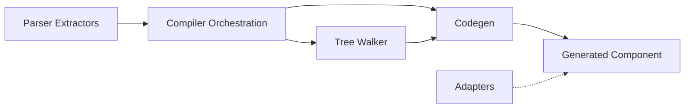

# Design Document — defineModel

## Overview

`defineModel` introduces two-way bindable props to wcCompiler. It bridges the gap between the existing one-way `defineProps` (parent → child) and the need for child → parent communication without manual event wiring.

A model prop is simultaneously:
1. An **observed attribute** (like `defineProps`) — settable from outside via attribute/property
2. A **writable signal** — usable inside the component with `.set()`
3. An **event emitter** — automatically dispatches `wcc:model` on internal writes

The feature spans the full compiler pipeline: parser extraction → validation → codegen, plus a new template directive (`model:propName`) for WCC-to-WCC binding, and lightweight adapters for Vue/Angular interop.

### Design Rationale

- **Single event type (`wcc:model`)**: One consistent contract simplifies adapter authoring and debugging. The event detail carries the prop name, so a single document-level listener handles all model props.
- **Internal vs external write distinction**: The compiler transforms `.set()` calls to a wrapper that emits events, while `attributeChangedCallback` writes directly to the signal. This prevents infinite loops (parent sets attr → child emits event → parent sets attr → ...).
- **Adapters as side-effect imports**: ~5 lines each, no build-time integration needed. They translate `wcc:model` to framework conventions at the document level.
- **`model:propName` directive**: Provides zero-boilerplate WCC-to-WCC binding without requiring adapters.

## Architecture

The feature touches these pipeline stages:



### Pipeline Integration Points

1. **Parser Extractors** (`lib/parser-extractors.js`) — New `extractModels()` function
2. **Compiler** (`lib/compiler.js`) — Calls `extractModels()`, validates conflicts, passes model defs to codegen
3. **Tree Walker** (`lib/tree-walker.js`) — Detects `model:propName="signal"` on custom elements
4. **Codegen** (`lib/codegen.js`) — Generates model signals, `_modelSet` methods, `attributeChangedCallback` entries, public accessors, and `model:propName` binding code
5. **Adapters** (`adapters/vue.js`, `adapters/angular.js`) — Document-level event translation

## Components and Interfaces

### 1. `extractModels(source)` — Parser Extractor

Extracts `defineModel(...)` calls from the component script (after type stripping).

```typescript
interface ModelDef {
  varName: string;    // Variable the result is assigned to (e.g., 'value')
  name: string;      // Prop name from options (e.g., 'value')
  default: string;   // Default value expression (e.g., "''", '0', 'undefined')
  required: boolean; // Whether required:true was specified
}

function extractModels(source: string): ModelDef[]
```

**Pattern matched:**
```js
const varName = defineModel({ name: 'propName', default: value })
const varName = defineModel({ name: 'propName', required: true })
```

**Implementation approach:** Regex-based extraction matching `(?:const|let|var)\s+(\w+)\s*=\s*defineModel\(\s*\{` then parsing the object literal for `name`, `default`, and `required` properties. Follows the same pattern as `extractSignals()` and `extractPropsDefaults()`.

### 2. Compiler Orchestration Changes

In `compileSFC()`:

1. Call `extractModels(sourceForExtraction)` after type stripping
2. Validate no name conflicts between model prop names and signals/computeds/constants/props
3. Validate each `defineModel()` is assigned to a variable
4. Validate each `defineModel()` has a `name` property
5. Add model var names to the set of known signal-like names (so `transformMethodBody` can handle `.set()`)
6. Pass `ModelDef[]` to `ParseResult` as a new `modelDefs` field
7. Strip `defineModel(...)` calls from the source (macro behavior)

### 3. Tree Walker Changes

In `walkTree()`:

1. Detect `model:propName="signalName"` attributes on elements
2. Validate the element is a custom element (tag contains a hyphen)
3. Return a new binding type: `ModelPropBinding`
4. Remove the `model:propName` attribute from the DOM

```typescript
interface ModelPropBinding {
  varName: string;      // Internal name: '__modelProp0', '__modelProp1', ...
  propName: string;     // The prop name after 'model:' (e.g., 'value')
  signal: string;       // Parent signal name (e.g., 'searchText')
  path: string[];       // DOM path to the child element
}
```

**Disambiguation:** The tree walker already handles `model="signal"` for form elements. The colon separator (`model:propName`) distinguishes the new directive. The existing code checks `el.hasAttribute('model')` — the new code checks for attributes starting with `model:`.

### 4. Codegen Changes

#### Model Signal Generation (in constructor)

For each `ModelDef`:
```js
this._m_value = __signal('');  // initialized with default
```

#### `_modelSet` Method Generation

For each model prop:
```js
_modelSet_value(newVal) {
  const oldVal = this._m_value();
  this._m_value(newVal);
  this.dispatchEvent(new CustomEvent('wcc:model', {
    detail: { prop: 'value', value: newVal, oldValue: oldVal },
    bubbles: true,
    composed: true
  }));
}
```

#### `.set()` Transformation

In `transformMethodBody()`, model signal writes `value.set(x)` are transformed to `this._modelSet_value(x)` (not `this._m_value(x)`). This ensures internal writes always emit the event.

In `transformExpr()`, model signal reads `value()` are transformed to `this._m_value()`.

#### `observedAttributes` Generation

Model prop names are added to the `observedAttributes` array alongside `defineProps` prop names.

#### `attributeChangedCallback` Generation

For each model prop:
```js
if (name === 'value') {
  this._m_value(newVal ?? '');  // Direct signal write — NO event
}
```

Type coercion follows the same rules as `defineProps`: if the default is a number, apply `Number()`.

#### Public Getter/Setter Generation

```js
get value() { return this._m_value(); }
set value(val) {
  this._m_value(val);
  this.setAttribute('value', String(val));
}
```

Note: The public setter does NOT emit `wcc:model` — it's equivalent to an external attribute change. Only internal `.set()` calls (transformed to `_modelSet`) emit the event.

#### `model:propName` Directive Codegen

For each `ModelPropBinding`:
```js
// Reactive parent → child sync
__effect(() => {
  this.__modelProp0.setAttribute('propName', this._parentSignal() ?? '');
});

// Child → parent sync
this.__modelProp0.addEventListener('wcc:model', (e) => {
  if (e.detail.prop === 'propName') {
    this._parentSignal(e.detail.value);
  }
});
```

### 5. Adapters

#### Vue Adapter (`adapters/vue.js`)

```js
document.addEventListener('wcc:model', (e) => {
  const { prop, value } = e.detail;
  e.target.dispatchEvent(new CustomEvent(`update:${prop}`, {
    detail: value,
    bubbles: true
  }));
});
```

#### Angular Adapter (`adapters/angular.js`)

```js
document.addEventListener('wcc:model', (e) => {
  const { prop, value } = e.detail;
  e.target.dispatchEvent(new CustomEvent(`${prop}Change`, {
    detail: value,
    bubbles: true
  }));
});
```

## Data Models

### New Types

```typescript
/** Model definition extracted from defineModel() calls */
interface ModelDef {
  varName: string;    // Variable name the result is assigned to
  name: string;      // Prop name from the options object
  default: string;   // Default value expression string
  required: boolean; // Whether required:true was specified
}

/** Model prop binding from model:propName="signal" directive */
interface ModelPropBinding {
  varName: string;   // Internal reference name (__modelProp0, etc.)
  propName: string;  // Prop name (after the colon)
  signal: string;    // Parent signal name
  path: string[];    // DOM path to the child element
}
```

### ParseResult Extension

```typescript
interface ParseResult {
  // ... existing fields ...
  modelDefs: ModelDef[];              // NEW: extracted defineModel declarations
  modelPropBindings: ModelPropBinding[]; // NEW: model:propName directives from template
}
```

### Naming Conventions

| Concept | Internal prefix | Example |
|---------|----------------|---------|
| Model signal | `_m_` | `this._m_value` |
| Model write method | `_modelSet_` | `this._modelSet_value(x)` |
| Model prop binding ref | `__modelProp` | `this.__modelProp0` |
| Existing form model ref | `__model` | `this.__model0` |

The `_m_` prefix distinguishes model signals from regular signals (`_`) and prop signals (`_s_`), avoiding collisions.

## Correctness Properties

*A property is a characteristic or behavior that should hold true across all valid executions of a system — essentially, a formal statement about what the system should do. Properties serve as the bridge between human-readable specifications and machine-verifiable correctness guarantees.*

### Property 1: Model signal generation preserves declaration semantics

*For any* valid set of `defineModel` declarations (1–5 props with unique names and valid defaults), the generated component code SHALL contain: (a) each prop name in `observedAttributes`, (b) a signal `this._m_{name}` initialized with the declared default, and (c) public `get`/`set` accessors for each prop name.

**Validates: Requirements 1.1, 1.2, 1.4, 3.1, 3.3**

### Property 2: Internal write emits wcc:model with correct detail

*For any* model prop name and any value, the generated `_modelSet_{name}` method SHALL dispatch a `CustomEvent('wcc:model')` with `detail: { prop: name, value: newVal, oldValue: previousVal }`, `bubbles: true`, and `composed: true`.

**Validates: Requirements 2.3, 2.4, 4.1, 4.2, 4.3, 4.4**

### Property 3: External attribute change does NOT emit event

*For any* model prop name, the generated `attributeChangedCallback` handler SHALL update the model signal directly (`this._m_{name}(newVal)`) without calling `_modelSet_{name}` or dispatching any event.

**Validates: Requirements 2.5, 4.5**

### Property 4: model:propName generates bidirectional binding

*For any* `model:propName="signalName"` directive on a child custom element, the generated code SHALL contain: (a) an `__effect` that sets the child's attribute from the parent signal, and (b) an event listener for `wcc:model` that updates the parent signal when `detail.prop` matches `propName`.

**Validates: Requirements 5.1, 5.2, 5.4**

### Property 5: Vue adapter translates wcc:model to update:propName

*For any* `wcc:model` event with `detail.prop` equal to some prop name, the Vue adapter SHALL dispatch a `CustomEvent('update:${prop}')` on the same element with the detail value.

**Validates: Requirements 6.2**

### Property 6: Angular adapter translates wcc:model to propNameChange

*For any* `wcc:model` event with `detail.prop` equal to some prop name, the Angular adapter SHALL dispatch a `CustomEvent('${prop}Change')` on the same element with the detail value.

**Validates: Requirements 7.2**

### Property 7: model:propName validation rejects invalid targets

*For any* `model:propName` directive that references an undeclared variable, a read-only prop, a computed, or a constant, the compiler SHALL throw a compile-time error with an appropriate error code.

**Validates: Requirements 5.5, 5.6**

### Property 8: defineModel name conflict detection

*For any* `defineModel` declaration whose prop name conflicts with an existing signal, computed, constant, or `defineProps` prop in the same component, the compiler SHALL throw a compile-time error.

**Validates: Requirements 9.2**

### Property 9: .set() transformation to _modelSet

*For any* model signal variable name, occurrences of `varName.set(expr)` in user code SHALL be transformed to `this._modelSet_{propName}(expr)` in the generated output (not to `this._m_{propName}(expr)`).

**Validates: Requirements 2.2**

### Property 10: Compiler distinguishes model= from model:propName=

*For any* template containing both `model="signal"` on a form element and `model:propName="signal"` on a custom element, the compiler SHALL produce form-binding code for the former and component-binding code for the latter, with no cross-contamination.

**Validates: Requirements 10.3**

## Error Handling

### Compile-Time Errors

| Error Code | Condition | Message |
|---|---|---|
| `MODEL_MISSING_NAME` | `defineModel()` called without `name` in options | `defineModel() requires a 'name' property in the options object` |
| `MODEL_NAME_CONFLICT` | Model prop name conflicts with signal/computed/constant/prop | `defineModel prop '{name}' conflicts with existing {type} '{name}'` |
| `MODEL_NO_ASSIGNMENT` | `defineModel()` not assigned to a variable | `defineModel() must be assigned to a variable` |
| `MODEL_PROP_INVALID_TARGET` | `model:propName` on non-custom-element | `model:propName is only valid on custom elements (tag must contain a hyphen)` |
| `MODEL_PROP_UNKNOWN_VAR` | `model:propName` references undeclared signal | `model:propName references undeclared variable '{name}'` |
| `MODEL_PROP_READONLY` | `model:propName` references prop/computed/constant | `model:propName cannot bind to {type} '{name}' (read-only)` |

### Runtime Behavior

- No runtime errors are expected from the generated code itself
- If a model signal's `.set()` is called with the same value, the event is still emitted (no equality check — keeps implementation simple and predictable)
- Adapters silently ignore events from non-WCC elements (defensive `e.target` check)

## Testing Strategy

### Property-Based Tests (fast-check)

Each correctness property maps to a property-based test with minimum 100 iterations:

| Property | Test Approach |
|---|---|
| P1: Signal generation | Generate random ModelDef arrays → run codegen → assert output structure |
| P2: Event emission | Generate random prop names/values → verify _modelSet method structure |
| P3: No event on external | Generate random prop names → verify attributeChangedCallback has no dispatchEvent |
| P4: Bidirectional binding | Generate random ModelPropBinding → verify effect + listener in output |
| P5: Vue adapter | Generate random prop names/values → dispatch wcc:model → verify update:prop |
| P6: Angular adapter | Generate random prop names/values → dispatch wcc:model → verify propChange |
| P7: Validation (invalid target) | Generate random invalid references → verify error thrown |
| P8: Name conflict | Generate conflicting names → verify error thrown |
| P9: .set() transform | Generate random model var names + .set() calls → verify _modelSet transform |
| P10: Disambiguation | Generate templates with both model= and model:prop= → verify distinct output |

**Library:** fast-check (already used in the project)
**Minimum iterations:** 100 per property
**Tag format:** `Feature: define-model, Property {N}: {title}`

### Unit Tests (example-based)

- `extractModels()` — specific parsing cases (single prop, multiple props, with/without defaults)
- Adapter registration — verify document listener is attached on import
- Graceful degradation — component works without adapter (no errors)
- `model:propName` on `<div>` — verify error
- `defineModel()` without name — verify error
- `defineModel()` without assignment — verify error

### Integration Tests

- Full compile pipeline: component with `defineModel` → verify complete generated output
- Component with both `defineModel` and `model="signal"` on form elements → no regression
- Parent-child WCC binding via `model:propName` → verify both directions work in jsdom

### Regression Tests

- All existing `lib/codegen.model.test.js` tests continue to pass (form element `model="signal"`)
- All existing `lib/compiler.model.test.js` tests continue to pass
