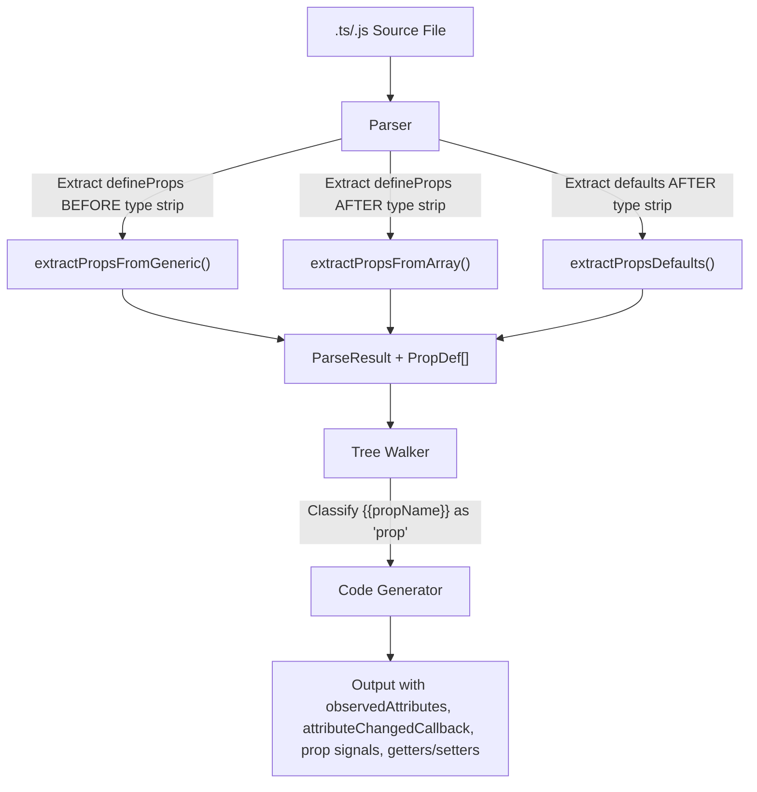

# Design Document — wcCompiler v2: defineProps

## Overview

`defineProps` extends the core compiler pipeline to support typed, reactive props on custom elements. Props are declared in the component source via `defineProps<{...}>({...})` (generic form with optional defaults) or `defineProps([...])` (array form). The compiler extracts prop metadata during parsing, generates `observedAttributes`, `attributeChangedCallback`, internal prop signals, and public getters/setters in the output class. Template bindings use bare prop names (`{{label}}`) classified as type `'prop'`, and script access via `props.name` is transformed to signal reads.

This feature builds on the core spec's parser, tree-walker, and code generator. It adds new extraction logic to the parser, a new binding type to the tree-walker, and new output sections to the code generator.

### Key Design Decisions

1. **Variable assignment is mandatory** — `const props = defineProps(...)` is required. Bare `defineProps(...)` calls produce an error. This ensures the compiler always knows the Props_Object_Name for transformation.
2. **Generic extraction before type stripping** — TypeScript generic type parameters (`<{ label: string, count: number }>`) are extracted BEFORE esbuild strips types, since esbuild removes generics entirely.
3. **Defaults extraction after type stripping** — The defaults object `({ label: 'Click', count: 0 })` is extracted AFTER type stripping to avoid dealing with type annotations in the argument.
4. **Prop signals use `_s_` prefix** — Internal signals for props use `this._s_propName` to distinguish from user signals (`this._name`) and computeds (`this._c_name`).
5. **camelCase to kebab-case for attributes** — Prop names like `itemCount` map to observed attribute `item-count`. This follows Web Component conventions.
6. **Type coercion based on default value type** — When an attribute changes, the string value is coerced to match the default's type (Number for numeric defaults, boolean for boolean defaults, string otherwise).

## Architecture

### Integration with Core Pipeline



### Data Flow

```
Source: const props = defineProps<{ label: string, count: number }>({ label: 'Click', count: 0 })

Parser extracts:
  propsObjectName: 'props'
  propDefs: [
    { name: 'label', default: "'Click'" },
    { name: 'count', default: '0' }
  ]

Tree Walker classifies:
  {{label}} → { type: 'prop', name: 'label' }
  {{count}} → { type: 'prop', name: 'count' }

Code Generator produces:
  static get observedAttributes() { return ['label', 'count']; }
  constructor() {
    ...
    this._s_label = __signal('Click');
    this._s_count = __signal(0);
  }
  attributeChangedCallback(name, oldVal, newVal) {
    if (name === 'label') this._s_label(newVal ?? 'Click');
    if (name === 'count') this._s_count(newVal != null ? Number(newVal) : 0);
  }
  get label() { return this._s_label(); }
  set label(val) { this._s_label(val); this.setAttribute('label', val); }
  get count() { return this._s_count(); }
  set count(val) { this._s_count(val); this.setAttribute('count', String(val)); }
```

## Components and Interfaces

### 1. Parser Extensions (`lib/parser.js`)

New types and functions added to the existing parser module.

```js
/**
 * @typedef {Object} PropDef
 * @property {string} name     — Prop name (e.g., 'label')
 * @property {string} default  — Default value expression as string (e.g., "'Click'"), or 'undefined'
 * @property {string} attrName — Kebab-case attribute name (e.g., 'label', 'item-count')
 */
```

**New fields on ParseResult:**

```js
/**
 * @property {PropDef[]} propDefs          — Prop definitions with names and defaults
 * @property {string|null} propsObjectName — Variable name from `const X = defineProps(...)`
 */
```

**New internal functions:**

| Function | Signature | Purpose |
|---|---|---|
| `extractPropsGeneric(source)` | `(string) → string[]` | Extract prop names from `defineProps<{ name: type, ... }>` generic (BEFORE type strip) |
| `extractPropsArray(source)` | `(string) → string[]` | Extract prop names from `defineProps(['name1', 'name2'])` array form (AFTER type strip) |
| `extractPropsDefaults(source)` | `(string) → Record<string, string>` | Extract defaults object from `defineProps<...>({...})` or `defineProps({...})` (AFTER type strip) |
| `extractPropsObjectName(source)` | `(string) → string \| null` | Extract variable name from `const/let/var X = defineProps(...)` |
| `validatePropsAssignment(source)` | `(string) → void` | Throw `PROPS_ASSIGNMENT_REQUIRED` if bare `defineProps()` call detected |
| `validatePropsConflicts(propsObjectName, signalNames, computedNames, constantNames)` | `(...) → void` | Throw `PROPS_OBJECT_CONFLICT` if name collides |
| `validateDuplicateProps(propNames, fileName)` | `(string[], string) → void` | Throw `DUPLICATE_PROPS` if duplicates found |
| `camelToKebab(name)` | `(string) → string` | Convert camelCase to kebab-case for attribute names |

**Regex patterns:**

```js
// Generic form detection (BEFORE type strip):
// const props = defineProps<{ label: string, count: number }>({...})
// const props = defineProps<{ label: string }>()
/defineProps\s*<\s*\{([^}]*)\}\s*>/

// Prop names from generic type body:
/(\w+)\s*[?]?\s*:/g

// Array form detection (AFTER type strip):
// const props = defineProps(['label', 'count'])
/defineProps\(\s*\[([^\]]*)\]\s*\)/

// Prop names from array:
/['"]([^'"]+)['"]/g

// Variable assignment detection:
/(?:const|let|var)\s+([$\w]+)\s*=\s*defineProps\s*[<(]/

// Bare call detection (no assignment):
// Matches defineProps( NOT preceded by = on the same logical line
/(?<![$\w]\s*=\s*)defineProps\s*[<(]/
// More precisely: check if defineProps appears without a preceding assignment
```

**Defaults extraction** uses parenthesis depth counting (same pattern as signal value extraction in core) to handle nested objects:

```js
// After type strip, the generic form becomes: defineProps({...})
// The array form is: defineProps([...])
// We need to extract the object argument when present

// Pattern: defineProps({ key: value, ... })
// Uses depth counting starting from the opening ( of defineProps(
```

**camelCase to kebab-case conversion:**

```js
function camelToKebab(name) {
  return name.replace(/([a-z0-9])([A-Z])/g, '$1-$2').toLowerCase();
}
```

### 2. Tree Walker Extensions (`lib/tree-walker.js`)

The tree walker receives a new `propNames` parameter (a `Set<string>`) and classifies `{{propName}}` bindings with type `'prop'`.

```js
/**
 * Walk a DOM tree rooted at rootEl, discovering bindings and events.
 *
 * @param {Element} rootEl — jsdom DOM element
 * @param {Set<string>} signalNames — signal variable names
 * @param {Set<string>} computedNames — computed variable names
 * @param {Set<string>} propNames — prop names from defineProps
 * @returns {{ bindings: Binding[], events: EventBinding[] }}
 */
export function walkTree(rootEl, signalNames, computedNames, propNames) { ... }
```

**Binding type classification (updated):**

1. If name is in `propNames` → type `'prop'`
2. If name is in `signalNames` → type `'signal'`
3. If name is in `computedNames` → type `'computed'`
4. Otherwise → type `'method'`

The `Binding` type definition is extended:

```js
/** @typedef {{ varName: string, name: string, type: 'signal'|'computed'|'method'|'prop', path: string[] }} Binding */
```

### 3. Code Generator Extensions (`lib/codegen.js`)

The code generator receives `propDefs` and `propsObjectName` from the ParseResult and generates additional output sections.

**New output sections (in order within the class):**

1. **`static get observedAttributes()`** — Returns array of kebab-case attribute names
2. **Prop signal initialization in constructor** — `this._s_propName = __signal(defaultValue)` for each prop
3. **`attributeChangedCallback(name, oldVal, newVal)`** — Maps attribute name to prop signal update with type coercion
4. **Public getters/setters** — `get propName()` / `set propName(val)` for programmatic access
5. **Props access transformation** — `props.name` → `this._s_name()` in method/computed/effect bodies

**Generated output structure (props-specific parts):**

```js
class WccButton extends HTMLElement {
  static get observedAttributes() {
    return ['label', 'item-count'];
  }

  constructor() {
    super();
    // ... template clone, DOM refs ...
    
    // Prop signals (before user signals)
    this._s_label = __signal('Click');
    this._s_itemCount = __signal(0);
    
    // User signals
    this._count = __signal(0);
    // ...
  }

  connectedCallback() {
    // Prop binding effects
    __effect(() => {
      this.__b0.textContent = this._s_label() ?? '';
    });
    // ... other effects, events ...
  }

  attributeChangedCallback(name, oldVal, newVal) {
    if (name === 'label') this._s_label(newVal ?? 'Click');
    if (name === 'item-count') this._s_itemCount(newVal != null ? Number(newVal) : 0);
  }

  get label() { return this._s_label(); }
  set label(val) { this._s_label(val); this.setAttribute('label', String(val)); }

  get itemCount() { return this._s_itemCount(); }
  set itemCount(val) { this._s_itemCount(val); this.setAttribute('item-count', String(val)); }

  // User methods with props.x → this._s_x() transformation
  _increment() {
    this._count(this._s_label() + ': ' + (this._count() + 1));
  }
}
```

**Expression transformation (updated `transformExpr`):**

The existing `transformExpr` function is extended to handle `propsObjectName.propName` patterns:

```js
// Before applying signal/computed transforms, replace props.x → this._s_x()
// Pattern: propsObjectName.propName where propName is a known prop
// Regex: /\bpropsObjectName\.(\w+)/g → check if $1 is in propNames → this._s_$1()
```

**Method body transformation (updated `transformMethodBody`):**

Same extension: `props.label` → `this._s_label()` applied before other transforms.

**Type coercion in attributeChangedCallback:**

```js
// For each prop, determine coercion based on default value:
// - Default is a number literal (matches /^-?\d+(\.\d+)?$/) → Number(newVal)
// - Default is 'true' or 'false' → newVal != null (attribute presence = true)
// - Default is 'undefined' or string → newVal (keep as string)
// - When newVal is null (attribute removed) → restore default value
```

### 4. Compiler Pipeline Update (`lib/compiler.js`)

The compiler passes `propNames` to the tree walker:

```js
// Step 3 (updated): Build name sets
const signalNames = new Set(signals.map(s => s.name));
const computedNames = new Set(computeds.map(c => c.name));
const propNames = new Set(propDefs.map(p => p.name));

// Step 4 (updated): Walk tree with prop names
const { bindings, events } = walkTree(rootEl, signalNames, computedNames, propNames);
```

### 5. Pretty Printer Extension (`lib/printer.js`)

The pretty printer serializes `propDefs` and `propsObjectName` back to source:

```js
// If propDefs exist, output:
// Generic form (when types were present):
//   const <propsObjectName> = defineProps<{ name: type, ... }>({ name: default, ... })
// Array form (when no types):
//   const <propsObjectName> = defineProps(['name1', 'name2'])

// For round-trip testing, the printer always uses the array form with defaults object
// since type information is lost after parsing:
//   const props = defineProps(['label', 'count'], { label: 'Click', count: 0 })
// Actually, for v2 the canonical printed form is:
//   const props = defineProps({ label: 'Click', count: 0 })
// This is a simplified form that preserves prop names and defaults without types.
```

## Data Models

### PropDef

```js
/**
 * @typedef {Object} PropDef
 * @property {string} name      — camelCase prop name (e.g., 'itemCount')
 * @property {string} default   — Default value as source string (e.g., '0', "'Click'", 'undefined')
 * @property {string} attrName  — kebab-case attribute name (e.g., 'item-count')
 */
```

### Extended ParseResult

The ParseResult from core is extended with:

```js
/**
 * @property {PropDef[]} propDefs          — Prop definitions (empty array if no defineProps)
 * @property {string|null} propsObjectName — Variable name from assignment (null if no defineProps)
 */
```

## Correctness Properties

### Property 1: Props Parser Round-Trip

*For any* valid component source containing `defineProps` (generic or array form) with arbitrary prop names and default values, parsing the source into an IR, printing the IR back to source, and parsing again SHALL produce an equivalent IR with the same `propDefs` (names and defaults) and `propsObjectName`.

**Validates: Requirements 1.1, 1.2, 1.3, 1.4, 2.1, 2.2, 2.3**

### Property 2: Props Extraction Completeness

*For any* set of distinct valid JavaScript identifier prop names declared in a `defineProps` call (generic or array form), the Parser SHALL extract every prop name exactly once, preserving order.

**Validates: Requirements 1.1, 1.4, 2.1**

### Property 3: Codegen observedAttributes Consistency

*For any* ParseResult containing `propDefs` with N props, the generated output SHALL contain a `static get observedAttributes()` returning an array of exactly N kebab-case attribute names, one per prop, in declaration order.

**Validates: Requirements 5.1**

### Property 4: Codegen Prop Signal Initialization

*For any* ParseResult containing `propDefs`, the generated constructor SHALL contain a `__signal(defaultValue)` call for each prop, using the declared default value (or `undefined` when no default is specified).

**Validates: Requirements 5.2**

### Property 5: Props Access Transformation Correctness

*For any* method body containing `propsObjectName.propName` references where `propName` is a declared prop, the Code_Generator SHALL transform every occurrence to `this._s_propName()`, and SHALL NOT transform `propsObjectName.unknownName` where `unknownName` is not a declared prop.

**Validates: Requirements 6.1, 6.2, 6.3, 6.4**

### Property 6: Attribute Change Propagation

*For any* prop with a default value, when the corresponding attribute changes on the custom element, the `attributeChangedCallback` SHALL update the prop signal. When the attribute is removed (null), the signal SHALL be reset to the default value.

**Validates: Requirements 8.1, 8.2, 8.3**

### Property 7: Duplicate Props Detection

*For any* `defineProps` declaration containing duplicate prop names, the Parser SHALL throw an error with code `DUPLICATE_PROPS`.

**Validates: Requirements 4.1**

## Error Handling

### Parser Errors

| Error Code | Condition | Message Pattern |
|---|---|---|
| `PROPS_ASSIGNMENT_REQUIRED` | `defineProps()` called without variable assignment | `"Error en '{file}': defineProps() debe asignarse a una variable (const props = defineProps(...))"` |
| `DUPLICATE_PROPS` | Same prop name appears more than once | `"Error en '{file}': props duplicados: {names}"` |
| `PROPS_OBJECT_CONFLICT` | Props variable name collides with signal/computed/constant | `"Error en '{file}': '{name}' colisiona con una declaración existente"` |

### Error Propagation

Errors follow the same pattern as core: thrown with a `.code` property for programmatic handling, propagated through the compiler pipeline, and formatted by the CLI for human-readable output.

## Testing Strategy

### Property-Based Testing (PBT)

**Library**: `fast-check`
**Configuration**: Minimum 100 iterations per property test
**Tag format**: `Feature: define-props, Property {number}: {property_text}`

### Test Organization

| Module | Property Tests | Unit Tests |
|---|---|---|
| `lib/parser.js` | Round-trip (Property 1), Extraction completeness (Property 2), Duplicate detection (Property 7) | Error cases (PROPS_ASSIGNMENT_REQUIRED, PROPS_OBJECT_CONFLICT), generic vs array form, defaults extraction, camelToKebab |
| `lib/tree-walker.js` | — | Prop binding classification (type 'prop') |
| `lib/codegen.js` | observedAttributes (Property 3), Signal init (Property 4), Access transform (Property 5) | Full output integration, attributeChangedCallback structure, getter/setter generation, type coercion |
| `lib/compiler.js` | — | End-to-end: source with defineProps → output with all prop infrastructure |
| Reactive runtime | Attribute change propagation (Property 6) | — |

### Dual Testing Approach

- **Property tests** verify universal correctness across generated inputs (prop name sets, default values, method bodies with prop references)
- **Unit tests** cover specific examples, error conditions, edge cases (empty defaults, boolean coercion, kebab-case conversion)

