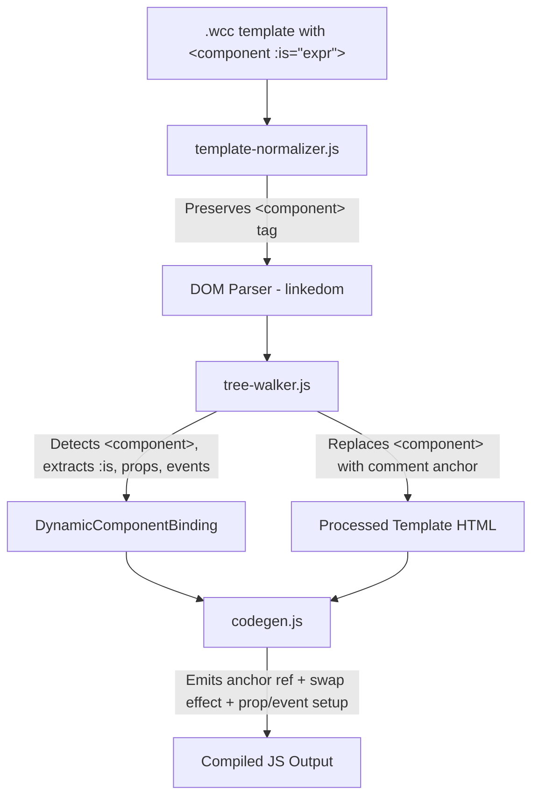

# Design Document: Dynamic Component (`<component :is="expr">`)

## Overview

This feature adds a `<component :is="expr">` directive to the WCC compiler, enabling dynamic component rendering where the tag name is determined at runtime by a reactive expression. When the expression value changes, the old element is destroyed and a new one is created via `document.createElement(newTag)`.

The implementation follows the same architectural pattern as `if` blocks: an anchor comment node marks the position in the DOM, and a reactive effect swaps elements in/out at that position. The key difference is that `if` blocks use pre-compiled template fragments (one per branch), while dynamic components call `document.createElement(tag)` at runtime with whatever tag name the expression evaluates to.

### Design Rationale

- **Anchor + Effect pattern**: Reuses the proven pattern from `if`/`each` directives. A comment node provides a stable positional reference, and a reactive effect handles DOM mutations.
- **Runtime createElement**: Unlike `if` blocks that clone pre-compiled templates, dynamic components must create elements at runtime since the tag name isn't known at compile time.
- **Prop/event re-attachment**: Props and events must be re-applied after each swap since the element instance changes. Props use nested reactive effects that are disposed and recreated on swap.

## Architecture



### Pipeline Flow

1. **template-normalizer.js**: Recognizes `<component>` as a reserved tag and preserves it (no PascalCase conversion, no self-closing expansion needed since it's not a custom element).
2. **DOM Parser**: Parses the normalized HTML. `<component>` becomes a DOM element with tag name `COMPONENT`.
3. **tree-walker.js**: Detects `<component>` elements, validates the `:is` attribute is present, extracts the `:is` expression along with any `:prop` and `@event` bindings, replaces the element with a comment anchor, and produces a `DynamicComponentBinding` record.
4. **codegen.js**: Consumes the binding record and emits: anchor reference setup, a reactive effect that compares the current tag to the previous tag and performs DOM swap, prop-setting code inside the swap, and event listener attachment/cleanup.

## Components and Interfaces

### Changes to `template-normalizer.js`

The normalizer must skip `<component>` tags — they are not PascalCase custom elements and should not be converted or expanded.

```javascript
// Inside normalizeTemplate's TAG_RE replace callback:
// Before PascalCase conversion, check for reserved directive tags
if (tagName.toLowerCase() === 'component') {
  // Preserve as-is — this is a compiler directive, not a custom element
  return match;
}
```

### Changes to `tree-walker.js`

A new function `processDynamicComponents` is added, following the same pattern as `processIfChains` and `processForBlocks`. It runs during the tree walk phase.

**Detection logic** (inside the `walk` function or as a separate pass):

```javascript
// Detect <component :is="expr"> elements
if (el.tagName === 'COMPONENT') {
  const isExpr = el.getAttribute(':is');
  if (!isExpr) {
    const error = new Error(':is attribute is required on <component> elements');
    error.code = 'MISSING_IS_ATTRIBUTE';
    throw error;
  }
  // Extract prop bindings (:attr="expr")
  // Extract event bindings (@event="handler")
  // Replace <component> with comment anchor
  // Record DynamicComponentBinding
}
```

**Processing steps:**
1. Validate `:is` attribute exists (throw `MISSING_IS_ATTRIBUTE` if not)
2. Extract `:is` expression value
3. Collect all `:attr="expr"` attributes as prop bindings (excluding `:is`)
4. Collect all `@event="handler"` attributes as event bindings
5. Replace the `<component>` element with a `<!-- dynamic -->` comment node
6. Compute the anchor path from root
7. Return a `DynamicComponentBinding` record

### Changes to `codegen.js`

The codegen emits three parts for each dynamic component:

1. **Initialization** (in `connectedCallback`, before `appendChild`):
   ```javascript
   this.__dyn0_anchor = __root.childNodes[N]; // comment node reference
   this.__dyn0_current = null;                // currently rendered element
   this.__dyn0_tag = null;                    // current tag name
   this.__dyn0_propDisposers = [];            // nested effect disposers for props
   ```

2. **Swap effect** (in `connectedCallback`, effects section):
   ```javascript
   this.__disposers.push(__effect(() => {
     const __tag = /* transformed :is expression */;
     if (__tag === this.__dyn0_tag) return;
     // Cleanup old element
     if (this.__dyn0_current) {
       // Dispose prop effects
       this.__dyn0_propDisposers.forEach(d => d());
       this.__dyn0_propDisposers = [];
       // Remove event listeners (if needed — element removal handles this)
       this.__dyn0_current.remove();
       this.__dyn0_current = null;
     }
     // Create new element
     if (__tag) {
       const el = document.createElement(__tag);
       // Set props
       // Attach events
       this.__dyn0_anchor.parentNode.insertBefore(el, this.__dyn0_anchor);
       customElements.upgrade(el);
       this.__dyn0_current = el;
     }
     this.__dyn0_tag = __tag;
   }));
   ```

3. **Prop reactive effects** (inside the swap, after element creation):
   ```javascript
   // For each :prop="expr" binding:
   this.__dyn0_propDisposers.push(__effect(() => {
     el.setAttribute('propName', /* transformed expr */);
   }));
   ```

4. **Event attachment** (inside the swap, after element creation):
   ```javascript
   // For each @event="handler" binding:
   el.addEventListener('eventName', (e) => this._handlerMethod(e));
   ```

## Data Models

### `DynamicComponentBinding` Type

```javascript
/**
 * @typedef {Object} DynamicComponentBinding
 * @property {string} varName         — Unique name: '__dyn0', '__dyn1', ...
 * @property {string} isExpression    — The :is attribute expression (e.g., "currentTag()")
 * @property {DynPropBinding[]} props — Prop bindings from :attr="expr" attributes
 * @property {DynEventBinding[]} events — Event bindings from @event="handler" attributes
 * @property {string[]} anchorPath    — DOM path to comment anchor from __root
 */

/**
 * @typedef {Object} DynPropBinding
 * @property {string} attr       — Attribute name (e.g., 'label', 'count')
 * @property {string} expression — Expression string (e.g., "name()", "props.title")
 */

/**
 * @typedef {Object} DynEventBinding
 * @property {string} event   — Event name (e.g., 'click', 'change')
 * @property {string} handler — Handler expression (e.g., "handleClick", "handleClick($event)")
 */
```

### Integration with `ParseResult`

The `ParseResult` type gains a new field:

```javascript
/**
 * @typedef {Object} ParseResult
 * ...existing fields...
 * @property {DynamicComponentBinding[]} dynamicComponents — Dynamic component bindings (empty array if none)
 */
```

## Compiled Output Examples

### Basic Usage

**Template:**
```html
<div class="container">
  <component :is="currentView()"></component>
</div>
```

**Compiled output (relevant sections):**
```javascript
// Template string (component replaced with comment)
const __t_WccApp = document.createElement('template');
__t_WccApp.innerHTML = `<div class="container"><!-- dynamic --></div>`;

// In connectedCallback:
connectedCallback() {
  const __root = __t_WccApp.content.cloneNode(true);

  // Dynamic component anchor + state
  this.__dyn0_anchor = __root.childNodes[0].childNodes[0];
  this.__dyn0_current = null;
  this.__dyn0_tag = null;
  this.__dyn0_propDisposers = [];

  this.innerHTML = '';
  this.appendChild(__root);

  // Swap effect
  this.__disposers.push(__effect(() => {
    const __tag = this._currentView();
    if (__tag === this.__dyn0_tag) return;
    if (this.__dyn0_current) {
      this.__dyn0_propDisposers.forEach(d => d());
      this.__dyn0_propDisposers = [];
      this.__dyn0_current.remove();
      this.__dyn0_current = null;
    }
    if (__tag) {
      const el = document.createElement(__tag);
      this.__dyn0_anchor.parentNode.insertBefore(el, this.__dyn0_anchor);
      customElements.upgrade(el);
      this.__dyn0_current = el;
    }
    this.__dyn0_tag = __tag;
  }));
}
```

### With Props and Events

**Template:**
```html
<component :is="routeComponent()" :title="pageTitle()" :data="items()" @navigate="onNavigate"></component>
```

**Compiled output (swap effect):**
```javascript
this.__disposers.push(__effect(() => {
  const __tag = this._routeComponent();
  if (__tag === this.__dyn0_tag) return;
  if (this.__dyn0_current) {
    this.__dyn0_propDisposers.forEach(d => d());
    this.__dyn0_propDisposers = [];
    this.__dyn0_current.remove();
    this.__dyn0_current = null;
  }
  if (__tag) {
    const el = document.createElement(__tag);
    // Prop effects (reactive — update when expression changes)
    this.__dyn0_propDisposers.push(__effect(() => {
      el.setAttribute('title', this._pageTitle());
    }));
    this.__dyn0_propDisposers.push(__effect(() => {
      el.setAttribute('data', this._items());
    }));
    // Event listeners
    el.addEventListener('navigate', (e) => this._onNavigate(e));
    this.__dyn0_anchor.parentNode.insertBefore(el, this.__dyn0_anchor);
    customElements.upgrade(el);
    this.__dyn0_current = el;
  }
  this.__dyn0_tag = __tag;
}));
```

### Ternary Expression

**Template:**
```html
<component :is="isAdmin() ? 'admin-panel' : 'user-panel'" :user="currentUser()"></component>
```

**Compiled output (swap effect expression):**
```javascript
const __tag = this._isAdmin() ? 'admin-panel' : 'user-panel';
```

## Correctness Properties

*A property is a characteristic or behavior that should hold true across all valid executions of a system — essentially, a formal statement about what the system should do. Properties serve as the bridge between human-readable specifications and machine-verifiable correctness guarantees.*

### Property 1: Template normalizer preserves `<component>` tags

*For any* template HTML string containing `<component` tags (with any combination of attributes), calling `normalizeTemplate` SHALL return a string where all `<component` tags remain unchanged — no kebab-case conversion, no self-closing expansion, no PascalCase import resolution.

**Validates: Requirements 1.2**

### Property 2: Missing `:is` attribute produces compilation error

*For any* `<component>` element that has zero or more attributes but does NOT have a `:is` attribute, the tree walker SHALL throw an error with code `MISSING_IS_ATTRIBUTE`.

**Validates: Requirements 1.3**

### Property 3: Binding extraction completeness

*For any* `<component :is="E">` element with N additional `:attr="expr"` bindings and M `@event="handler"` bindings, the tree walker SHALL produce a `DynamicComponentBinding` where: `isExpression` equals E exactly, `props` has exactly N entries with correct attribute names and expressions, `events` has exactly M entries with correct event names and handlers, and the processed template contains a `<!-- dynamic -->` comment in place of the `<component>` element.

**Validates: Requirements 1.1, 1.4, 4.4, 5.4, 10.1**

### Property 4: Swap effect structural correctness

*For any* `DynamicComponentBinding`, the codegen output SHALL contain a reactive `__effect` that: (a) evaluates the transformed `:is` expression, (b) compares it to the stored previous tag name, (c) returns early if unchanged (idempotence), (d) calls `.remove()` on the current element when it exists, (e) calls `document.createElement(__tag)` and `insertBefore` with the anchor when the new tag is truthy, and (f) stores the new element as the current element.

**Validates: Requirements 2.1, 2.2, 2.3, 2.4, 2.5, 10.2, 10.3**

### Property 5: Prop bindings emit nested reactive effects

*For any* `DynamicComponentBinding` with P prop bindings (P ≥ 1), the codegen output SHALL contain exactly P nested `__effect` calls inside the swap effect, each containing a `setAttribute` call with the corresponding attribute name.

**Validates: Requirements 4.1, 4.2, 4.3, 10.4**

### Property 6: Event bindings emit addEventListener calls

*For any* `DynamicComponentBinding` with E event bindings (E ≥ 1), the codegen output SHALL contain exactly E `addEventListener` calls inside the swap effect, each with the corresponding event name.

**Validates: Requirements 5.1, 5.3, 10.5**

### Property 7: Arbitrary expressions compile without error

*For any* valid JavaScript expression string used as the `:is` value (including ternaries, function calls, property access, and template literals), the compiler SHALL not throw an error and SHALL produce valid output.

**Validates: Requirements 9.1, 9.2, 9.4**

## Error Handling

| Condition | Error Code | Message | Phase |
|-----------|-----------|---------|-------|
| `<component>` without `:is` attribute | `MISSING_IS_ATTRIBUTE` | `:is attribute is required on <component> elements` | Tree Walker |
| `:is` expression evaluates to unregistered tag at runtime | N/A (no error) | Browser creates `HTMLUnknownElement` — standard behavior | Runtime |
| `:is` expression evaluates to empty string or falsy | N/A (no error) | Element is removed, no replacement inserted | Runtime |

### Error Handling Strategy

- **Compile-time**: The only compile-time error is a missing `:is` attribute. All other validation is deferred to runtime per Requirement 9 (the compiler does not statically resolve expressions).
- **Runtime graceful degradation**: If the expression evaluates to an unregistered custom element tag, `document.createElement` produces an `HTMLUnknownElement`. This is standard browser behavior and not an error condition.
- **Cleanup on falsy**: When the expression becomes falsy (empty string, `null`, `undefined`), the current element is removed cleanly — prop effect disposers are called, and no replacement is inserted.

## Testing Strategy

### Property-Based Tests (fast-check + vitest)

Property-based testing is appropriate for this feature because:
- The tree walker and codegen are pure transformations (template string → binding records → JS code)
- Input variation (different expressions, prop counts, event counts) reveals edge cases
- Universal properties hold across all valid inputs

**Configuration:**
- Library: `fast-check` with `vitest`
- Minimum 100 iterations per property test
- Each test tagged with: `Feature: dynamic-component, Property N: {property_text}`

**Properties to implement:**
1. Template normalizer preserves `<component>` tags (normalizer identity)
2. Missing `:is` error (error condition — generate random attribute sets without `:is`)
3. Binding extraction completeness (structural invariant — vary expression, prop count, event count)
4. Swap effect structural correctness (codegen output invariant)
5. Prop bindings emit nested reactive effects (codegen output — vary prop count)
6. Event bindings emit addEventListener calls (codegen output — vary event count)
7. Arbitrary expressions compile without error (no-crash property)

### Unit Tests (vitest)

- Specific compiled output examples for known templates (basic, with props, with events, ternary)
- Integration with `if` blocks (dynamic component inside conditional branch)
- Integration with `each` loops (dynamic component inside loop iteration)
- Bundle mode output validation (IIFE wrapping)
- Expression source compatibility (signal, computed, prop, inline ternary)
- Lifecycle ordering: codegen emits `.remove()` before `insertBefore` (verifies disconnectedCallback fires before connectedCallback)

### Integration Tests

- End-to-end compilation of a `.wcc` file with `<component :is="...">` and verification that the output runs in a browser environment
- Lifecycle callback ordering verification (disconnectedCallback before connectedCallback on swap)
- Composition with `if`/`each` directives — cleanup when parent directive deactivates
