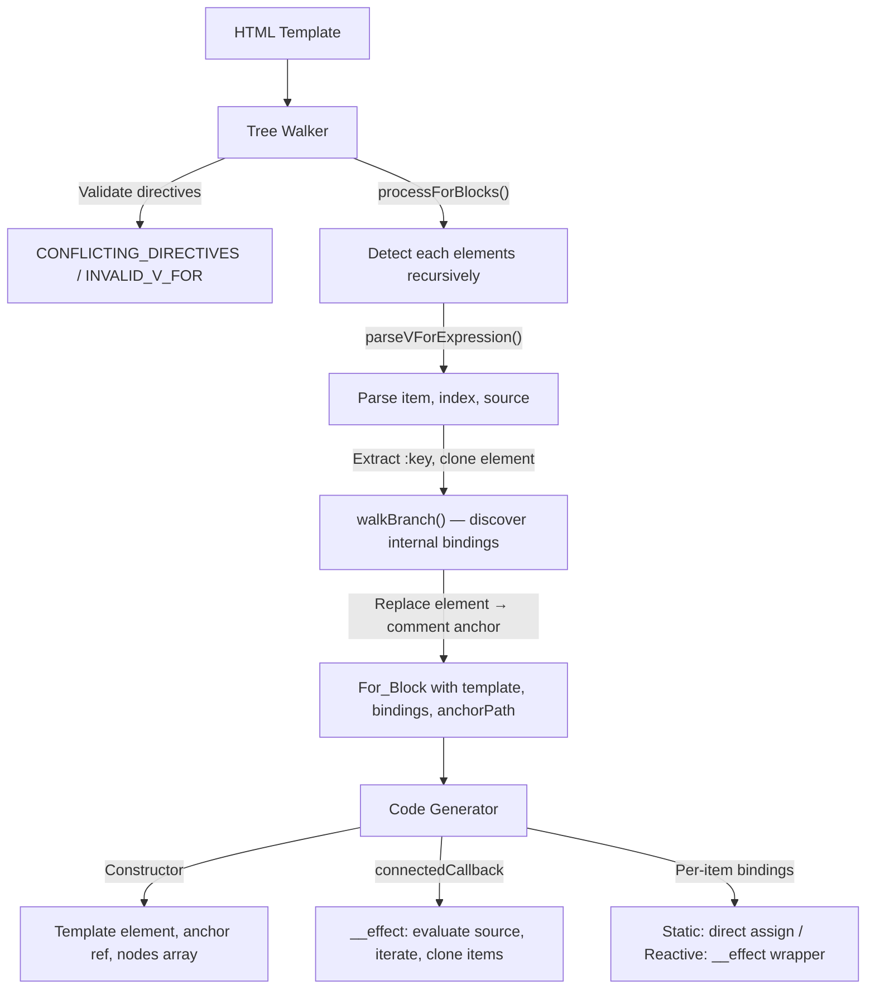

# Design Document — wcCompiler v2: each

## Overview

`each` extends the core compiler pipeline with list rendering. Elements with `each="item in items"` are detected by the Tree Walker, replaced with a comment anchor node (`<!-- each -->`), and their HTML extracted as an item template. The Code Generator produces a reactive `__effect` in `connectedCallback` that evaluates the source expression, iterates the result (array or numeric range), clones the item template per element, and sets up bindings/events per item — distinguishing between static bindings (item/index-only references, assigned once) and reactive bindings (component-level references, wrapped in `__effect`).

This feature reuses the v1 `processForBlocks`, `parseVForExpression`, `walkBranch`, `transformForExpr`, and `isStaticForBinding` logic from `lib/tree-walker.js` and `lib/codegen.js`, adapted for the v2 attribute naming convention (`each` instead of `v-for`, `show` instead of `v-show`, etc.).

### Key Design Decisions

1. **Comment anchor replacement** — The `each` element is replaced by a single `<!-- each -->` comment node. This provides a stable DOM position for inserting/removing rendered items at runtime, matching the `if` directive pattern.
2. **Full re-render on source change** — When the source signal changes, all previously rendered item nodes are removed and re-rendered from scratch. This is simpler than DOM diffing and sufficient for most use cases. The `:key` attribute is stored for potential future keyed reconciliation.
3. **Static vs reactive binding classification** — Bindings that reference only the item variable or index variable are assigned once per item (no `__effect` wrapper). Bindings that reference component-level reactive state are wrapped in `__effect` so they update when the state changes. This avoids unnecessary effect overhead for item-local data.
4. **walkBranch reuse** — The item template is processed via the same `walkBranch()` function used by the `if` directive. This ensures consistent handling of `{{interpolation}}`, `@event`, `show`, and `:attr` bindings with paths relative to the item root element.
5. **transformForExpr** — A specialized expression transformer that rewrites component-level signal/computed/prop references while leaving item variable and index variable references untouched. This is critical for correct scoping within the iteration.
6. **Numeric range support** — When the source expression evaluates to a number `N`, the iteration produces values `1` through `N` (inclusive), enabling `each="n in 5"` patterns.
7. **Sequential naming** — For_Blocks are named `__for0`, `__for1`, ... in document order, matching the v1 convention.

## Architecture

### Integration with Core Pipeline



### Data Flow

```
Template:
  <li each="item in items" :key="item.id">
    {{item.name}} — {{count}}
    <button @click="remove">×</button>
  </li>

Tree Walker:
  1. Detect <li each="item in items" :key="item.id">
  2. Validate: no conflicting if directive
  3. Parse expression: itemVar='item', indexVar=null, source='items'
  4. Extract :key='item.id'
  5. Clone element, remove each and :key attributes
  6. walkBranch(templateHtml) → bindings: [
       {name:'item.name', path:['childNodes[0]']},
       {name:'count', path:['childNodes[2]']}
     ], events: [{event:'click', handler:'remove', path:['childNodes[4]']}]
  7. Replace <li> with <!-- each --> comment
  8. Record anchorPath, build For_Block

Code Generator:
  Constructor:
    this.__for0_tpl = document.createElement('template');
    this.__for0_tpl.innerHTML = `<li><span>...</span> — <span>...</span>
      <button>×</button></li>`;
    this.__for0_anchor = __root.childNodes[0];
    this.__for0_nodes = [];

  connectedCallback:
    __effect(() => {
      const __source = this._items();

      for (const n of this.__for0_nodes) n.remove();
      this.__for0_nodes = [];

      const __iter = typeof __source === 'number'
        ? Array.from({ length: __source }, (_, i) => i + 1)
        : (__source || []);

      __iter.forEach((item, __idx) => {
        const clone = this.__for0_tpl.content.cloneNode(true);
        const node = clone.firstChild;

        // Static binding: item.name (references only itemVar)
        node.childNodes[0].textContent = item.name ?? '';

        // Reactive binding: count (references component signal)
        __effect(() => { node.childNodes[2].textContent = this._count() ?? ''; });

        // Event binding
        node.childNodes[4].addEventListener('click', this._remove.bind(this));

        this.__for0_anchor.parentNode.insertBefore(node, this.__for0_anchor);
        this.__for0_nodes.push(node);
      });
    });
```

## Components and Interfaces

### 1. Tree Walker Extensions (`lib/tree-walker.js`)

The tree walker adds `each` element processing. Reused from v1 with attribute name changes (`each` instead of `v-for`).

**New exported function:**

```js
/**
 * Parse an each expression.
 * Supports:
 *   "item in source"
 *   "(item, index) in source"
 *
 * @param {string} expr - The each attribute value
 * @returns {{ itemVar: string, indexVar: string | null, source: string }}
 * @throws {Error} with code INVALID_V_FOR if syntax is invalid
 */
export function parseEachExpression(expr) { ... }
```

**Internal functions:**

| Function | Signature | Purpose |
|---|---|---|
| `processForBlocks(parent, parentPath, ...)` | `(Element, string[], ...) → ForBlock[]` | Recursively detect and process `each` elements |
| `parseEachExpression(expr)` | `(string) → { itemVar, indexVar, source }` | Parse `each` attribute value into components |
| `walkBranch(html, ...)` | `(string, ...) → { bindings, events, showBindings, attrBindings, processedHtml }` | Parse item HTML into temp DOM, walk for internal bindings (shared with `if` directive) |
| `validateNoConflictingForIf(el)` | `(Element) → void` | Throw `CONFLICTING_DIRECTIVES` if element has both `each` and `if` |
| `recomputeAnchorPath(rootEl, targetNode)` | `(Element, Node) → string[]` | Recompute path after DOM normalization |

**`processForBlocks` algorithm:**

1. Recursively traverse all descendants of the parent element
2. For each element with an `each` attribute:
   a. Validate no conflicting `if` directive on the same element
   b. Parse the `each` expression via `parseEachExpression()`
   c. Extract `:key` attribute value (or `null`)
   d. Clone element, remove `each` and `:key` attributes, get `outerHTML`
   e. Call `walkBranch(html)` to discover internal bindings/events with relative paths
   f. Replace the original element with a `<!-- each -->` comment node
   g. Compute `anchorPath` from current path + comment node index
   h. Build `ForBlock` with all metadata
3. For elements without `each`: recurse into children
4. After all processing, normalize DOM and recompute anchor paths

**`parseEachExpression` algorithm:**

1. Check for `in` keyword — if missing, throw `INVALID_V_FOR`
2. Try destructured form regex: `^\s*\(\s*(\w+)\s*,\s*(\w+)\s*\)\s+in\s+(.+)\s*$`
3. Try simple form regex: `^\s*(\w+)\s+in\s+(.+)\s*$`
4. Validate non-empty item variable and source expression
5. Return `{ itemVar, indexVar, source }`

### 2. Code Generator Extensions (`lib/codegen.js`)

The code generator receives `forBlocks` from the ParseResult and generates constructor setup and a reactive effect per For_Block.

**New exported function:**

```js
/**
 * Transform an expression within the scope of an each block.
 * - References to itemVar and indexVar are left UNTRANSFORMED
 * - References to component variables (props, reactive, computed) ARE transformed
 *
 * @param {string} expr - The expression to transform
 * @param {string} itemVar - Name of the iteration variable
 * @param {string | null} indexVar - Name of the index variable
 * @param {Set<string>} propsSet
 * @param {Set<string>} rootVarNames
 * @param {Set<string>} computedNames
 * @returns {string}
 */
export function transformForExpr(expr, itemVar, indexVar, propsSet, rootVarNames, computedNames) { ... }
```

**Internal helper functions:**

| Function | Signature | Purpose |
|---|---|---|
| `isStaticForBinding(name, itemVar, indexVar)` | `(string, string, string\|null) → boolean` | Check if a text binding references only item/index |
| `isStaticForExpr(expr, itemVar, indexVar, ...)` | `(string, ...) → boolean` | Check if an expression references only item/index (no component vars) |

**Constructor section** (per For_Block):

```js
// Template element for item cloning
this.__for0_tpl = document.createElement('template');
this.__for0_tpl.innerHTML = `<li>...</li>`;

// Anchor reference (before appendChild moves nodes)
this.__for0_anchor = __root.childNodes[N];

// Nodes tracking array
this.__for0_nodes = [];
```

**connectedCallback section** (per For_Block):

```js
__effect(() => {
  const __source = transformForExpr(sourceExpr);  // e.g., this._items()

  // Remove all previously rendered items
  for (const n of this.__for0_nodes) n.remove();
  this.__for0_nodes = [];

  // Handle numeric range vs array vs falsy
  const __iter = typeof __source === 'number'
    ? Array.from({ length: __source }, (_, i) => i + 1)
    : (__source || []);

  __iter.forEach((item, index) => {
    const clone = this.__for0_tpl.content.cloneNode(true);
    const node = clone.firstChild;

    // Per-item bindings (static or reactive)
    // Per-item events
    // Per-item show bindings (static or reactive)
    // Per-item attr bindings (static or reactive)

    this.__for0_anchor.parentNode.insertBefore(node, this.__for0_anchor);
    this.__for0_nodes.push(node);
  });
});
```

**Static vs Reactive binding generation:**

For text bindings inside the item template:
- **Static** (references only `itemVar` or `indexVar`): `node.childNodes[N].textContent = item.name ?? '';`
- **Reactive** (references component signal/computed/prop): `__effect(() => { node.childNodes[N].textContent = this._count() ?? ''; });`

For show bindings:
- **Static**: `node.style.display = (item.visible) ? '' : 'none';`
- **Reactive**: `__effect(() => { node.style.display = (this._showAll()) ? '' : 'none'; });`

For attr bindings:
- **Static**: `node.setAttribute('href', item.url);`
- **Reactive**: `__effect(() => { node.setAttribute('href', this._baseUrl()); });`

For event bindings (always bound to component instance):
- `node.addEventListener('click', this._remove.bind(this));`

**Expression transformation** (`transformForExpr`):

Rewrites component-level references while preserving item/index scope:
- Signal `items` → `this._items()` (but `item` stays as `item`)
- Computed `filtered` → `this._c_filtered()` (but `item.name` stays as `item.name`)
- Prop `label` → `this._s_label()` (but `index` stays as `index`)

### 3. Compiler Pipeline Update (`lib/compiler.js`)

The `processForBlocks()` call is already integrated into `walkTree()` in the v1 pattern — it runs before `processIfChains()` and the main walk, so `each` elements are replaced by comment nodes before other processing. After all processing, the DOM is normalized and anchor paths are recomputed.

```js
// Inside walkTree():
// 1. Process each blocks (replaces each elements with comment anchors)
const forBlocks = processForBlocks(rootEl, [], propsSet, computedNames, rootVarNames);

// 2. Process if chains (replaces if chains with comment anchors)
const ifBlocks = processIfChains(rootEl, [], propsSet, computedNames, rootVarNames);

// 3. Normalize DOM (merge adjacent text nodes)
rootEl.normalize();

// 4. Recompute anchor paths after normalization
for (const fb of forBlocks) {
  fb.anchorPath = recomputeAnchorPath(rootEl, fb._anchorNode);
}
for (const ib of ifBlocks) {
  ib.anchorPath = recomputeAnchorPath(rootEl, ib._anchorNode);
}

// 5. Main walk for bindings/events
walk(rootEl, []);

return { bindings, events, ..., forBlocks, ifBlocks };
```

## Data Models

### ForBlock

```js
/**
 * @typedef {Object} ForBlock
 * @property {string} varName       — Unique name: '__for0', '__for1', ...
 * @property {string} itemVar       — Iteration variable name (e.g., 'item')
 * @property {string|null} indexVar — Index variable name or null
 * @property {string} source        — Source expression (e.g., 'items', '5')
 * @property {string|null} keyExpr  — :key expression or null
 * @property {string} templateHtml  — Processed item HTML (each/:key attrs removed)
 * @property {string[]} anchorPath  — DOM path to comment anchor from __root
 * @property {Binding[]} bindings   — Text interpolation bindings within item
 * @property {EventBinding[]} events — @event bindings within item
 * @property {ShowBinding[]} showBindings — show bindings within item
 * @property {AttrBinding[]} attrBindings — :attr bindings within item
 */
```

### Extended ParseResult

```js
/**
 * @property {ForBlock[]} forBlocks — For blocks (empty array if none)
 */
```

### Error Codes

```js
/** @type {'INVALID_V_FOR'} — each expression syntax error (missing 'in', empty item/source) */
/** @type {'CONFLICTING_DIRECTIVES'} — each + if on same element */
```

## Correctness Properties

*A property is a characteristic or behavior that should hold true across all valid executions of a system — essentially, a formal statement about what the system should do. Properties serve as the bridge between human-readable specifications and machine-verifiable correctness guarantees.*

### Property 1: each Expression Parsing Round-Trip

*For any* valid identifier pair `(itemVar, source)` and optional `indexVar`, constructing an `each` expression string in the form `"itemVar in source"` or `"(itemVar, indexVar) in source"` and parsing it SHALL produce the original `itemVar`, `indexVar` (or `null`), and `source`.

**Validates: Requirements 1.1, 1.2**

### Property 2: For_Block Structure and Anchor Replacement

*For any* valid HTML template containing one or more `each` elements at various nesting depths, the Tree Walker SHALL produce one For_Block per `each` element, each with a sequential variable name (`__for0`, `__for1`, ...), a valid anchor path, the correct `itemVar`, `indexVar`, `source`, and `keyExpr` (or `null`), and the processed template SHALL contain `<!-- each -->` comment nodes in place of the original elements.

**Validates: Requirements 2.1, 2.2, 2.3, 3.1, 3.2, 5.1, 5.2, 5.3**

### Property 3: Item Template Extraction and Internal Processing

*For any* `each` element containing `{{interpolation}}` bindings, `@event` bindings, `show` directives, and/or `:attr` bindings, the extracted `templateHtml` SHALL NOT contain `each` or `:key` attributes, and all internal bindings SHALL be discovered with paths relative to the item root element.

**Validates: Requirements 4.1, 4.2, 4.3, 4.4, 4.5**

### Property 4: Codegen Constructor and Effect Structure

*For any* ParseResult containing For_Blocks, the generated JavaScript SHALL contain: a `document.createElement('template')` and `innerHTML` assignment in the constructor, an anchor reference assignment, a `_nodes = []` initialization, and an `__effect` in `connectedCallback` that evaluates the source expression (with `transformForExpr`-applied transformation), removes previous nodes, handles both array iteration and numeric range, and clones the template per item with `insertBefore` the anchor.

**Validates: Requirements 6.1, 6.2, 6.3, 6.4, 7.1, 7.3, 7.4, 7.5, 10.1**

### Property 5: Static vs Reactive Binding Classification

*For any* text binding, show binding, or attribute binding inside a For_Block's item template, if the expression references only the `itemVar` or `indexVar`, the generated code SHALL assign the value directly without an `__effect` wrapper (static). If the expression references any component-level signal, computed, or prop, the generated code SHALL wrap the assignment in an `__effect` (reactive).

**Validates: Requirements 8.1, 8.2, 8.3, 9.1, 9.2, 11.1, 11.2, 11.3, 11.4**

### Property 6: transformForExpr Preserves Item/Index and Transforms Component Refs

*For any* expression containing a mix of item variable references, index variable references, and component-level signal/computed/prop references, `transformForExpr` SHALL transform signal `x` to `this._x()`, computed `y` to `this._c_y()`, and prop `z` to `this._s_z()`, while leaving all occurrences of the item variable and index variable untouched.

**Validates: Requirements 7.2, 9.3, 13.1, 13.2, 13.3, 13.4**

### Property 7: Conflicting Directives Error

*For any* element that has both `each` and `if` attributes, the Tree Walker SHALL throw an error with code `CONFLICTING_DIRECTIVES`.

**Validates: Requirements 12.1**

### Property 8: Invalid each Expression Error

*For any* string that does not contain the `in` keyword, or has an empty item variable, or has an empty source expression, parsing it as an `each` expression SHALL throw an error with code `INVALID_V_FOR`.

**Validates: Requirements 1.3, 1.4, 1.5**

## Error Handling

### Tree Walker Errors

| Error Code | Condition | Message Pattern |
|---|---|---|
| `INVALID_V_FOR` | `each` expression missing `in` keyword | `"each requiere la sintaxis 'item in source' o '(item, index) in source'"` |
| `INVALID_V_FOR` | `each` expression has empty item variable | `"each requiere una variable de iteración"` |
| `INVALID_V_FOR` | `each` expression has empty source expression | `"each requiere una expresión fuente"` |
| `CONFLICTING_DIRECTIVES` | `each` + `if` on same element | `"each y if no deben usarse en el mismo elemento"` |

### Error Propagation

Errors follow the same pattern as core and `if`: thrown with a `.code` property during tree-walk phase, propagated through the compiler pipeline, and formatted by the CLI for human-readable output. All validation errors are detected before code generation begins.

## Testing Strategy

### Property-Based Testing (PBT)

The `each` feature is well-suited for PBT because the tree-walker and codegen are pure functions with clear input/output behavior, and the properties hold across a wide input space (arbitrary template structures, nesting depths, expression strings, binding combinations, static/reactive classification).

**Library**: `fast-check`
**Configuration**: Minimum 100 iterations per property test
**Tag format**: `Feature: each-directive, Property {number}: {property_text}`

### Test Organization

| Module | Property Tests | Unit Tests |
|---|---|---|
| `lib/tree-walker.js` | Expression parsing round-trip (Property 1), For_Block structure + anchor (Property 2), Template extraction (Property 3), Conflicting directives (Property 7), Invalid expression (Property 8) | Anchor path after normalization (3.3), deeply nested `each` elements, multiple `each` in same parent |
| `lib/codegen.js` | Constructor + effect structure (Property 4), Static vs reactive classification (Property 5), transformForExpr (Property 6) | Numeric range handling (7.5), falsy source handling (7.6), no-binding items (no unnecessary effects) |
| `lib/compiler.js` | — | End-to-end: template with `each` → compiled output with correct runtime behavior |

### Dual Testing Approach

- **Property tests** verify universal correctness across generated inputs (expression formats, template structures, binding combinations, expression strings with mixed item/component references)
- **Unit tests** cover specific examples, edge cases, and runtime behavior verification (numeric ranges, falsy sources, normalization edge cases, deeply nested structures)
