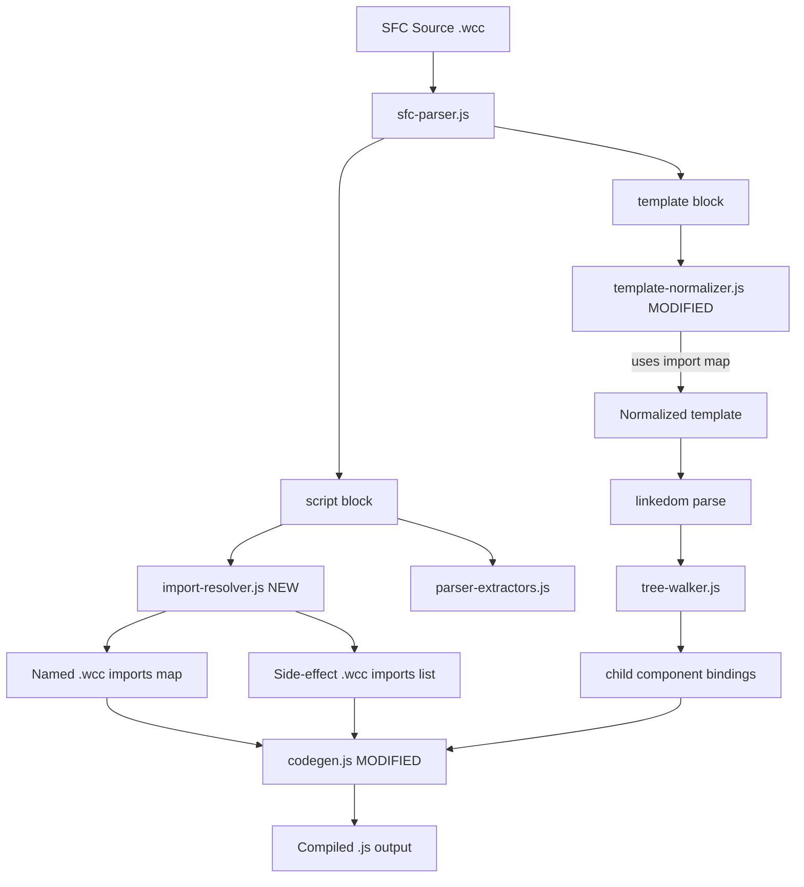

# Design Document: Explicit Component Imports

## Overview

This feature replaces the current auto-detection of child components (filesystem-based resolution of hyphenated tags) with an explicit import system. Developers declare child component dependencies via standard ES module `import` statements in the `<script>` block, using PascalCase identifiers as template tag aliases.

The compiler pipeline changes from:
```
template tags → detect hyphens → search filesystem → emit side-effect imports
```
to:
```
script imports → extract .wcc imports → match PascalCase template tags → emit named imports + guarded registration
```

This enables tree-shaking, eliminates filesystem coupling during compilation, and gives developers explicit control over component dependencies.

## Architecture



### Key Architectural Decisions

1. **New module `import-resolver.js`**: Extracts and validates `.wcc` imports from the script block. Keeps import parsing logic isolated and testable as pure functions.

2. **Template normalizer receives import map**: Instead of blindly converting all PascalCase tags to kebab-case, the normalizer now uses the import map to validate PascalCase tags and convert only those that match an import (or throw for unresolved ones).

3. **Named imports instead of side-effect imports in output**: The compiled output uses `import ChildName from './child.js'` (named) so that the parent can access `ChildName.__meta.tag` for guarded registration.

4. **Self-registration pattern**: Every compiled component ends with a guarded `customElements.define` call for itself, enabling direct `<script type="module">` usage in HTML.

## Components and Interfaces

### New Module: `lib/import-resolver.js`

Responsible for extracting `.wcc` import statements from the script block and producing a structured representation.

```javascript
/**
 * @typedef {Object} WccNamedImport
 * @property {string} identifier  — The import name (e.g., 'WccBadge', 'MyButton')
 * @property {string} sourcePath  — Original .wcc path (e.g., './wcc-badge.wcc')
 * @property {string} compiledPath — Rewritten .js path (e.g., './wcc-badge.js')
 */

/**
 * @typedef {Object} WccSideEffectImport
 * @property {string} sourcePath   — Original .wcc path (e.g., './child.wcc')
 * @property {string} compiledPath — Rewritten .js path (e.g., './child.js')
 */

/**
 * @typedef {Object} WccImportResult
 * @property {WccNamedImport[]} named       — Named default imports
 * @property {WccSideEffectImport[]} sideEffect — Side-effect imports
 * @property {string} strippedSource        — Script source with .wcc imports removed
 */

/**
 * Extract all .wcc imports from a script source string.
 * Validates import forms and rejects invalid patterns.
 *
 * @param {string} source — Script block content
 * @param {string} fileName — Source file name for error messages
 * @returns {WccImportResult}
 * @throws {Error} with code 'INVALID_WCC_IMPORT' for namespace/named exports
 */
export function extractWccImports(source, fileName) { ... }
```

### Modified: `lib/template-normalizer.js`

The `normalizeTemplate` function gains an optional `importMap` parameter (a `Map<string, string>` from PascalCase identifier → kebab-case tag). When provided:
- PascalCase tags matching an import key are converted to the kebab-case form derived from the import identifier
- PascalCase tags NOT matching any import key trigger an error
- Hyphenated tags pass through unchanged (treated as plain custom elements)

```javascript
/**
 * @param {string} html — Raw template HTML
 * @param {object} [options]
 * @param {Map<string, string>} [options.importMap] — PascalCase identifier → kebab-case tag
 * @param {string} [options.fileName] — Source file for error messages
 * @returns {string} — Normalized HTML
 * @throws {Error} with code 'UNRESOLVED_COMPONENT' if PascalCase tag has no matching import
 */
export function normalizeTemplate(html, options) { ... }
```

### Modified: `lib/compiler.js`

Changes to `compileSFC()`:
1. Call `extractWccImports()` early (after `stripMacroImport`) to get the import map and stripped source
2. Build the `importMap` (PascalCase → kebab-case) and pass it to `normalizeTemplate()`
3. Remove the `resolveChildComponent()` function and the filesystem-scanning loop (step 18)
4. Build `childImports` from the extracted named imports (using identifier + compiled path)
5. Pass the import identifiers to codegen for named import emission and guarded registration

### Modified: `lib/codegen.js`

Changes to `generateComponent()`:
1. **Child imports section**: Emit `import Identifier from './path.js'` (named default import) instead of `import './path.js'` (side-effect)
2. **Child registration section** (new): After imports, emit guarded `customElements.define` calls:
   ```javascript
   if (!customElements.get(WccBadge.__meta.tag)) customElements.define(WccBadge.__meta.tag, WccBadge);
   ```
3. **Side-effect imports**: Emit as `import './path.js'` with no registration (child self-registers)
4. **Self-registration**: Change the final `customElements.define(...)` to be guarded:
   ```javascript
   if (!customElements.get('wcc-counter')) customElements.define('wcc-counter', WccCounter);
   ```

### Modified: `lib/types.js`

Update `ChildComponentImport` typedef to include the identifier:

```javascript
/**
 * @typedef {Object} ChildComponentImport
 * @property {string} tag          — Child component tag name (kebab-case, used in template)
 * @property {string} identifier   — Import identifier (PascalCase, e.g., 'WccBadge')
 * @property {string} importPath   — Relative import path (e.g., './wcc-badge.js')
 * @property {boolean} sideEffect  — true if this is a side-effect import (no identifier)
 */
```

### Compiled Component `__meta` Static Property

Each compiled component class must expose a static `__meta` property:

```javascript
class WccBadge extends HTMLElement {
  static __meta = { tag: 'wcc-badge' };
  // ...
}
```

This is used by parent components to perform guarded registration without hardcoding tag names.

## Data Models

### Import Resolution Data Flow

```
Script block source
       │
       ▼
extractWccImports(source, fileName)
       │
       ├── named: [{ identifier: 'WccBadge', sourcePath: './wcc-badge.wcc', compiledPath: './wcc-badge.js' }]
       ├── sideEffect: [{ sourcePath: './utils.wcc', compiledPath: './utils.js' }]
       └── strippedSource: (script without .wcc import lines)
```

### Template Resolution Data Flow

```
importMap = new Map([
  ['WccBadge', 'wcc-badge'],    // PascalCase identifier → kebab-case tag
  ['MyButton', 'my-button'],
])

normalizeTemplate('<WccBadge label="hi" />', { importMap, fileName })
  → '<wcc-badge label="hi"></wcc-badge>'

normalizeTemplate('<UnknownThing />', { importMap, fileName })
  → throws UNRESOLVED_COMPONENT error
```

### Compiled Output Structure

```javascript
// Generated from: wcc-profile.wcc (wcCompiler)

// ── Runtime ──
import { __signal, __effect, __computed } from './_wcc-runtime.js';

// ── Child component imports ──
import WccBadge from './wcc-badge.js';
if (!customElements.get(WccBadge.__meta.tag)) customElements.define(WccBadge.__meta.tag, WccBadge);

import './wcc-utils.js';  // side-effect import (self-registers)

// ── Styles ──
// ...

// ── Template ──
// ...

// ── Component class ──
class WccProfile extends HTMLElement {
  static __meta = { tag: 'wcc-profile' };
  // ...
}

// ── Self-registration ──
if (!customElements.get('wcc-profile')) customElements.define('wcc-profile', WccProfile);
```

## Correctness Properties

*A property is a characteristic or behavior that should hold true across all valid executions of a system — essentially, a formal statement about what the system should do. Properties serve as the bridge between human-readable specifications and machine-verifiable correctness guarantees.*

### Property 1: Named import round-trip

*For any* valid named `.wcc` import statement (with any valid JavaScript identifier and any relative `.wcc` path), parsing the import and emitting the compiled form SHALL preserve the identifier name exactly and produce a path identical to the original except with `.wcc` replaced by `.js`.

**Validates: Requirements 1.1, 1.2, 1.3, 1.4, 1.5, 3.1, 9.1, 9.3, 9.4**

### Property 2: PascalCase tag exact-case resolution

*For any* set of named `.wcc` imports and any PascalCase tag in the template, the tag SHALL resolve to an import if and only if the tag name exactly matches (case-sensitive) one of the import identifiers.

**Validates: Requirements 2.1, 2.3**

### Property 3: Self-closing equivalence

*For any* valid component usage in a template, the compiled output produced from a self-closing tag (`<Badge />`) SHALL be identical to the compiled output produced from the equivalent open/close pair (`<Badge></Badge>`).

**Validates: Requirements 2.4**

### Property 4: Guarded child registration for matched imports

*For any* named `.wcc` import that is used as a PascalCase tag in the template, the compiled output SHALL contain both a named ES import statement (`import Identifier from './path.js'`) and a guarded `customElements.define` call using `Identifier.__meta.tag`.

**Validates: Requirements 2.2, 3.2, 3.3**

### Property 5: Guarded self-registration

*For any* compiled component, the output SHALL end with a guarded `customElements.define` call using the component's own tag name string literal, in the form `if (!customElements.get('tag-name')) customElements.define('tag-name', ClassName)`.

**Validates: Requirements 4.1, 4.2**

### Property 6: Hyphenated tags without imports are plain elements

*For any* hyphenated tag name in the template that does not correspond to a named `.wcc` import, the compiled output SHALL NOT contain any import statement or `customElements.define` call for that tag.

**Validates: Requirements 5.1, 5.3**

### Property 7: Unresolved PascalCase tag error

*For any* PascalCase tag in the template (including inside `if`/`else-if`/`else` branches and `each` blocks) that does not match any named `.wcc` import identifier, the compiler SHALL throw an error whose message contains both the unresolved tag name and the source file path.

**Validates: Requirements 6.1, 6.2, 6.3, 6.4**

### Property 8: Static imports only

*For all* compiled outputs, child component references SHALL use only static `import` declarations (no dynamic `import()` expressions).

**Validates: Requirements 7.1, 7.4**

### Property 9: Unused imports preserved

*For any* named `.wcc` import in the script block that is never referenced as a PascalCase tag in the template, the compiled output SHALL still contain the named import statement and guarded registration call.

**Validates: Requirements 7.2**

### Property 10: Side-effect import handling

*For any* side-effect `.wcc` import (`import './child.wcc'`), the compiled output SHALL contain `import './child.js'` (with `.wcc` → `.js` rewrite) and SHALL NOT contain any `customElements.define` call for that import, regardless of whether a named import or PascalCase tag also exists in the same file.

**Validates: Requirements 8.1, 8.2, 8.3, 8.4, 9.2**

### Property 11: Invalid import form rejection

*For any* `.wcc` import using named exports (`import { Foo } from './foo.wcc'`) or namespace imports (`import * as Foo from './foo.wcc'`), the compiler SHALL throw an error with a descriptive message.

**Validates: Requirements 9.5**

## Error Handling

| Error Code | Condition | Message Format |
|---|---|---|
| `UNRESOLVED_COMPONENT` | PascalCase tag in template with no matching import | `"Unresolved component '<TagName>' in '${fileName}'. Did you forget to import it?"` |
| `INVALID_WCC_IMPORT` | Named export or namespace import from .wcc file | `"Invalid import form in '${fileName}': .wcc files only support default imports (import Foo from './foo.wcc') or side-effect imports (import './foo.wcc')"` |

All errors follow the project convention of attaching a `.code` property for programmatic handling.

### Error Detection Points

1. **`extractWccImports()`** — Detects invalid import forms (namespace, named exports) during script parsing
2. **`normalizeTemplate()`** — Detects unresolved PascalCase tags during template normalization (before DOM parsing)

Detecting unresolved tags at the normalizer stage (before linkedom parsing) is intentional: linkedom lowercases all tag names, so PascalCase information would be lost after parsing. The normalizer is the last point where we have access to the original casing.

## Testing Strategy

### Property-Based Tests (fast-check)

The feature is well-suited for property-based testing because:
- Import parsing is a pure function with clear input/output behavior
- The input space (valid identifiers × valid paths) is large
- Round-trip properties naturally apply to parse/emit cycles
- Template resolution is deterministic given an import map

**Library**: `fast-check` (already in devDependencies)
**Minimum iterations**: 100 per property test
**Tag format**: `Feature: explicit-component-imports, Property {N}: {title}`

Each correctness property (1–11) maps to one property-based test. Tests will use custom arbitraries for:
- Valid JavaScript identifiers (PascalCase)
- Valid relative `.wcc` paths (with `./`, `../`, nested segments)
- Valid template HTML fragments with PascalCase tags

### Unit Tests (example-based)

- Compile a component with one named import used in template → verify full output structure
- Compile a component with multiple imports (named + side-effect) → verify all appear correctly
- Compile two components importing the same child → verify both contain independent guarded registration
- Verify `__meta` static property is present on compiled class
- Verify error messages contain expected details for each error code

### Integration Tests

- Compile a real multi-component example (parent + children) and verify the output loads correctly in a browser environment (jsdom)
- Verify that a compiled component loaded via `<script type="module">` self-registers
