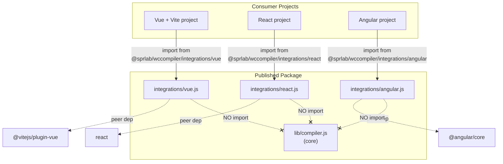

# Design Document: Framework Integrations

## Overview

This feature adds optional framework integration helpers to the `@sprlab/wccompiler` package. The integrations are shipped as plain ESM files under an `integrations/` directory and exposed via `package.json` subpath exports. Each integration is a thin wrapper that reduces configuration friction for consumers using WCC components inside Vue, React, or Angular projects.

The integrations are:
- **Vue** — A Vite plugin factory (`wccVuePlugin`) that wraps `@vitejs/plugin-vue` and pre-configures `isCustomElement` for tags matching a prefix.
- **React** — A hook (`useWccEvent`) that bridges DOM CustomEvents to React's ref-based event system.
- **Angular** — A schema constant (`WCC_SCHEMAS`) and an NgModule class (`WccModule`) that declare `CUSTOM_ELEMENTS_SCHEMA`.

Key design principles:
- Zero coupling to the core compiler — integration files never import from `lib/`.
- No build step — files are plain JavaScript (ESM) with JSDoc type annotations.
- Framework dependencies are optional peer deps — consumers only install what they use.

## Architecture



The architecture enforces strict decoupling: integration files form a separate layer that depends only on their respective framework peer dependencies. The core compiler is unaware of the integrations.

## Components and Interfaces

### 1. Vue Integration (`integrations/vue.js`)

**Exported API:**

```javascript
/**
 * @typedef {Object} WccVuePluginOptions
 * @property {string} [prefix='wcc-'] - Tag prefix for custom element detection
 */

/**
 * Creates a Vite plugin that configures Vue's template compiler
 * to recognize custom elements with the given prefix.
 *
 * @param {WccVuePluginOptions} [options]
 * @returns {import('vite').Plugin} Vite plugin object
 */
export function wccVuePlugin(options = {}) {}
```

**Behavior:**
- Imports `vue` from `@vitejs/plugin-vue`
- Returns the result of calling `vue()` with `template.compilerOptions.isCustomElement` set to a function that checks `tag.startsWith(prefix)`
- Default prefix is `'wcc-'`

### 2. React Integration (`integrations/react.js`)

**Exported API:**

```javascript
/**
 * React hook that attaches a CustomEvent listener to a DOM element via ref.
 *
 * @param {string} eventName - The event name to listen for
 * @param {(event: CustomEvent) => void} handler - Event handler callback
 * @returns {import('react').RefObject} Ref to attach to the target element
 */
export function useWccEvent(eventName, handler) {}
```

**Behavior:**
- Uses `useRef` to create a ref for the target element
- Uses a separate `useRef` to store the latest handler (avoids re-attaching listeners on handler change)
- Uses `useEffect` to attach/detach the event listener when `eventName` changes or on unmount
- Returns the element ref

### 3. Angular Integration (`integrations/angular.js`)

**Exported API:**

```javascript
import { CUSTOM_ELEMENTS_SCHEMA } from '@angular/core'

/**
 * Schema array for Angular components/modules that use WCC custom elements.
 * @type {Array<import('@angular/core').SchemaMetadata>}
 */
export const WCC_SCHEMAS = [CUSTOM_ELEMENTS_SCHEMA]

/**
 * NgModule that declares CUSTOM_ELEMENTS_SCHEMA.
 * Import this module to allow custom elements in templates.
 */
export class WccModule {
  static ɵmod = /* Angular module metadata */
}
```

**Note on Angular decorator limitation:** Since we ship plain JS without a TypeScript build step, we cannot use `@NgModule` decorators directly. The Angular integration will:
1. Export `WCC_SCHEMAS` as the primary API (works with both standalone components and NgModule-based apps).
2. Export `WccModule` as a class with Angular's compiled metadata format (`ɵmod`, `ɵinj`) for NgModule-based usage. Alternatively, document the NgModule pattern and only export the constant.

**Decision:** Given the complexity of manually constructing Angular compiled metadata without decorators, the Angular integration will export only `WCC_SCHEMAS` and document the NgModule usage pattern in JSDoc comments. The `WccModule` export will be a simple class with a static `schemas` property that consumers can reference in documentation, but the primary recommended usage is the `WCC_SCHEMAS` constant.

### 4. Package.json Configuration

Changes to `package.json`:

```json
{
  "exports": {
    ".": "./lib/compiler.js",
    "./integrations/vue": "./integrations/vue.js",
    "./integrations/react": "./integrations/react.js",
    "./integrations/angular": "./integrations/angular.js"
  },
  "peerDependencies": {
    "@vitejs/plugin-vue": ">=4.0.0",
    "vue": ">=3.0.0",
    "react": ">=18.0.0",
    "@angular/core": ">=14.0.0"
  },
  "peerDependenciesMeta": {
    "@vitejs/plugin-vue": { "optional": true },
    "vue": { "optional": true },
    "react": { "optional": true },
    "@angular/core": { "optional": true }
  },
  "files": [
    "bin/",
    "lib/*.js",
    "!lib/*.test.js",
    "integrations/",
    "types/",
    "README.md"
  ]
}
```

## Data Models

This feature introduces no persistent data models. The integrations are stateless utility functions/constants. The relevant data structures are:

### Vue Plugin Options

```javascript
/** @typedef {{ prefix?: string }} WccVuePluginOptions */
```

### React Hook Parameters

| Parameter | Type | Description |
|-----------|------|-------------|
| `eventName` | `string` | DOM event name to listen for |
| `handler` | `(event: CustomEvent) => void` | Callback invoked when event fires |

### Angular Schema Constant

```javascript
/** @type {Array<SchemaMetadata>} */
// Value: [CUSTOM_ELEMENTS_SCHEMA]
```

No database schemas, API payloads, or serialization formats are involved.


## Correctness Properties

*A property is a characteristic or behavior that should hold true across all valid executions of a system — essentially, a formal statement about what the system should do. Properties serve as the bridge between human-readable specifications and machine-verifiable correctness guarantees.*

### Property 1: isCustomElement prefix matching

*For any* prefix string and *for any* tag string, the `isCustomElement` function produced by `wccVuePlugin({ prefix })` SHALL return `true` if and only if `tag.startsWith(prefix)` is `true`.

**Validates: Requirements 2.1, 2.2, 2.3**

### Property 2: Event listener lifecycle (attach and cleanup)

*For any* event name string, when `useWccEvent(eventName, handler)` is used and the ref is attached to a DOM element, the hook SHALL call `addEventListener(eventName, ...)` on mount, and SHALL call `removeEventListener(eventName, ...)` on unmount, leaving zero leaked listeners.

**Validates: Requirements 3.2, 3.3**

### Property 3: Event dispatch invokes handler

*For any* event name and *for any* event detail value, when the referenced DOM element dispatches a `CustomEvent` with that name and detail, the provided handler SHALL be invoked with an event object whose `detail` matches the dispatched value.

**Validates: Requirements 3.4**

### Property 4: Integration-core decoupling

*For any* file in the `integrations/` directory and *for any* file in the `lib/` directory, there SHALL be no import or require statement in either file that references the other directory.

**Validates: Requirements 5.1, 5.2**

## Error Handling

This feature has minimal error surface since the integrations are thin wrappers:

| Scenario | Behavior |
|----------|----------|
| Missing peer dependency (e.g., `react` not installed) | Standard Node.js `ERR_MODULE_NOT_FOUND` error at import time. No custom error handling needed — the error message clearly identifies the missing package. |
| `wccVuePlugin()` called with invalid options | Graceful fallback — if `options.prefix` is not a string, default to `'wcc-'`. No throw. |
| `useWccEvent` ref never attached to DOM | The `useEffect` checks `ref.current` before attaching. If null, no listener is added and no error is thrown. |
| `useWccEvent` called with null/undefined handler | The handler ref pattern means we always wrap in a stable listener function. If handler is nullish, the wrapper invokes nothing (no-op). |
| Angular `CUSTOM_ELEMENTS_SCHEMA` not available | Import will fail with standard module resolution error. No custom handling needed. |

Design decision: We do NOT add try/catch wrappers or custom error messages around peer dependency imports. The standard Node.js error messages are clear and actionable (e.g., `Cannot find module 'react'`). Adding abstraction would obscure the root cause.

## Testing Strategy

### Test Framework

- **Unit/Example tests**: vitest (already configured in the project)
- **Property-based tests**: fast-check (already a devDependency)
- **Mocking**: vitest's built-in `vi.mock()` for framework peer dependencies

### Test File Organization

```
lib/
  integrations.vue.test.js
  integrations.react.test.js
  integrations.angular.test.js
  integrations.decoupling.test.js
```

Tests live in `lib/` alongside other test files (matching existing project convention of `lib/*.test.js`).

### Vue Integration Tests

**Property test (Property 1):**
- Generate random prefix strings and random tag strings using fast-check
- For each combination, verify `isCustomElement(tag) === tag.startsWith(prefix)`
- Minimum 100 iterations
- Tag: `Feature: framework-integrations, Property 1: isCustomElement prefix matching`

**Example tests:**
- `wccVuePlugin()` returns an object with a `name` property (Req 2.4)
- `wccVuePlugin()` returns correct nested structure with `template.compilerOptions.isCustomElement` (Req 2.4)
- Module exports `wccVuePlugin` as a named function (Req 2.6)

### React Integration Tests

**Property tests (Properties 2 & 3):**
- Mock `react` with minimal `useRef`/`useEffect`/`useCallback` implementations that track calls
- Generate random event name strings
- Verify addEventListener/removeEventListener lifecycle (Property 2)
- Generate random event names + detail objects, verify handler invocation (Property 3)
- Minimum 100 iterations each
- Tags: `Feature: framework-integrations, Property 2: Event listener lifecycle` and `Feature: framework-integrations, Property 3: Event dispatch invokes handler`

**Example tests:**
- Hook returns a ref object with `current` property (Req 3.1)
- Handler ref update does not re-attach listener (Req 3.5)
- Module exports `useWccEvent` as a named function (Req 3.6)

### Angular Integration Tests

**Example tests:**
- `WCC_SCHEMAS` equals `[CUSTOM_ELEMENTS_SCHEMA]` (Req 4.1)
- `WccModule` is exported as a class (Req 4.3)
- Module exports both `WCC_SCHEMAS` and `WccModule` (Req 4.5)

### Decoupling Tests

**Property test (Property 4):**
- Read all files in `integrations/` and `lib/`
- Parse import/require statements
- Verify no cross-references exist
- Tag: `Feature: framework-integrations, Property 4: Integration-core decoupling`

### Smoke Tests (package.json configuration)

- `exports` field contains all three subpath entries (Req 1.1)
- `peerDependencies` declares correct versions (Req 6.1, 6.2, 6.3)
- `peerDependenciesMeta` marks all as optional (Req 1.5)
- `files` field includes `integrations/` (Req 7.1)

### Property Test Configuration

- Library: fast-check
- Minimum iterations: 100 per property
- Each property test references its design document property number
- Tag format: `Feature: framework-integrations, Property {N}: {title}`
