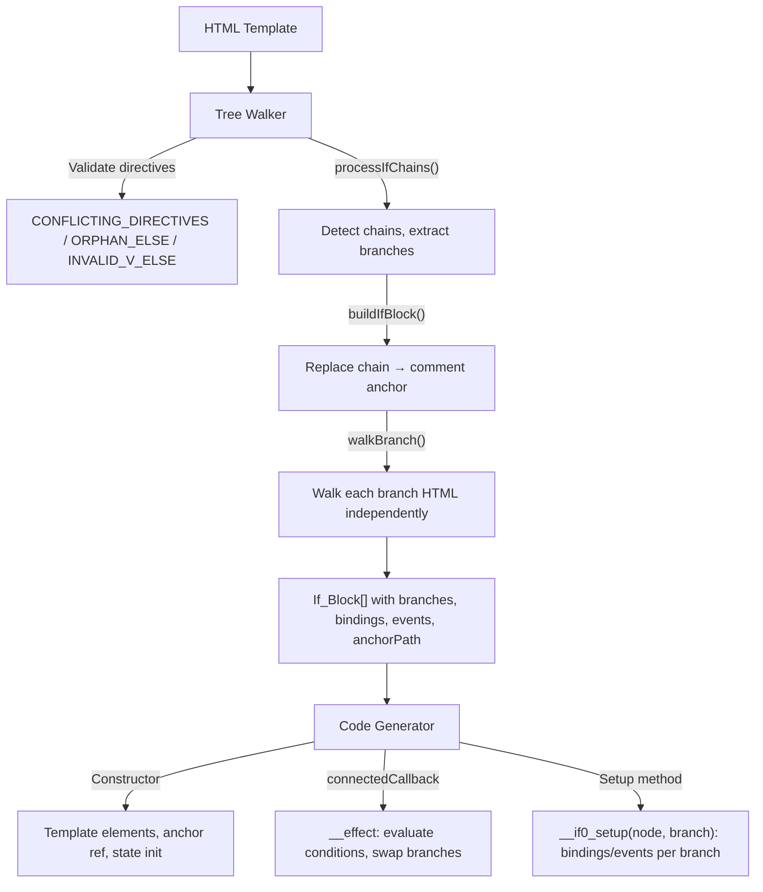

# Design Document — wcCompiler v2: if

## Overview

`if` / `else-if` / `else` extends the core compiler pipeline with conditional rendering. Elements with conditional directives are detected as chains by the Tree Walker, replaced with a comment anchor node (`<!-- if -->`), and their HTML extracted as branch templates. The Code Generator produces an `__effect` in `connectedCallback` that evaluates conditions in order, swaps branches in the DOM by cloning templates and inserting before the anchor, and sets up internal bindings/events per branch via a setup method.

This feature reuses the v1 `processIfChains`, `buildIfBlock`, and `walkBranch` logic from `lib/tree-walker.js`, and the if codegen sections from `lib/codegen.js`.

### Key Design Decisions

1. **Comment anchor replacement** — The entire conditional chain is replaced by a single `<!-- if -->` comment node. This provides a stable DOM position for inserting/removing the active branch at runtime.
2. **One branch at a time** — Only the active branch is present in the DOM. When the condition changes, the old branch is removed and the new one cloned from its template. This avoids hidden DOM bloat.
3. **Branch-local walkTree** — Each branch's HTML is parsed into a temporary jsdom DOM and walked independently via `walkBranch()`. Binding/event paths are relative to the branch root element, not the component root.
4. **Setup method per If_Block** — When any branch has bindings/events, a `__if0_setup(node, branch)` method is generated. This defers binding initialization to the moment a branch is rendered, avoiding stale references.
5. **Sequential naming** — If_Blocks are named `__if0`, `__if1`, ... in document order, matching the v1 convention.
6. **Validation-first** — Conflicting directives, orphan else, and invalid else are detected during the tree-walk phase before any code generation.

## Architecture

### Integration with Core Pipeline



### Data Flow

```
Template:
  <p if="status === 'active'">Active: {{count}}</p>
  <p else-if="status === 'pending'">Pending...</p>
  <p else>Inactive</p>

Tree Walker:
  1. Detect chain: [if, else-if, else]
  2. Validate: no conflicting directives, no orphan else
  3. Extract branches:
     Branch 0: type='if', expr="status === 'active'", html="<p>Active: {{count}}</p>"
       → walkBranch → bindings: [{name:'count', path:['childNodes[0]']}]
     Branch 1: type='else-if', expr="status === 'pending'", html="<p>Pending...</p>"
     Branch 2: type='else', expr=null, html="<p>Inactive</p>"
  4. Replace chain with <!-- if --> comment
  5. Record anchorPath, build If_Block

Code Generator:
  Constructor:
    this.__if0_t0 = document.createElement('template');
    this.__if0_t0.innerHTML = `<p><span>...</span></p>`;
    this.__if0_t1 = document.createElement('template');
    this.__if0_t1.innerHTML = `<p>Pending...</p>`;
    this.__if0_t2 = document.createElement('template');
    this.__if0_t2.innerHTML = `<p>Inactive</p>`;
    this.__if0_anchor = __root.childNodes[0];
    this.__if0_current = null;
    this.__if0_active = undefined;

  connectedCallback:
    __effect(() => {
      let __branch = null;
      if (this._status() === 'active') { __branch = 0; }
      else if (this._status() === 'pending') { __branch = 1; }
      else { __branch = 2; }
      if (__branch === this.__if0_active) return;
      if (this.__if0_current) { this.__if0_current.remove(); this.__if0_current = null; }
      if (__branch !== null) {
        const tpl = [this.__if0_t0, this.__if0_t1, this.__if0_t2][__branch];
        const clone = tpl.content.cloneNode(true);
        const node = clone.firstChild;
        this.__if0_anchor.parentNode.insertBefore(node, this.__if0_anchor);
        this.__if0_current = node;
        this.__if0_setup(node, __branch);
      }
      this.__if0_active = __branch;
    });

  Setup method:
    __if0_setup(node, branch) {
      if (branch === 0) {
        const __b0 = node.childNodes[0];
        __effect(() => { __b0.textContent = this._count() ?? ''; });
      }
    }
```

## Components and Interfaces

### 1. Tree Walker Extensions (`lib/tree-walker.js`)

The tree walker adds conditional chain processing. Reused from v1.

**New exported function:**

```js
/**
 * Process conditional chains (if/else-if/else) in a DOM tree.
 * Recursively searches all descendants for chains.
 *
 * @param {Element} parent - Root element to search
 * @param {string[]} parentPath - DOM path to parent from __root
 * @param {Set<string>} propsSet
 * @param {Set<string>} computedNames
 * @param {Set<string>} rootVarNames
 * @returns {IfBlock[]}
 */
function processIfChains(parent, parentPath, propsSet, computedNames, rootVarNames) { ... }
```

**Internal functions:**

| Function | Signature | Purpose |
|---|---|---|
| `processIfChains(parent, parentPath, ...)` | `(Element, string[], ...) → IfBlock[]` | Recursively detect and process conditional chains |
| `buildIfBlock(chain, parent, parentPath, idx, ...)` | `(...) → IfBlock` | Replace chain with comment anchor, extract branch metadata |
| `walkBranch(html, propsSet, computedNames, rootVarNames)` | `(string, ...) → { bindings, events, showBindings, attrBindings, processedHtml }` | Parse branch HTML into temp DOM, walk for internal bindings |
| `isChainPredecessor(el)` | `(Element) → boolean` | Check if element has `if` or `else-if` |
| `recomputeAnchorPath(rootEl, targetNode)` | `(Element, Node) → string[]` | Recompute path after DOM normalization |

**Chain detection algorithm (inside `findIfChains`):**

1. First pass: validate all element children for conflicting directives
   - `if` + `else` → `CONFLICTING_DIRECTIVES`
   - `if` + `else-if` → `CONFLICTING_DIRECTIVES`
   - `show` + `if` → `CONFLICTING_DIRECTIVES`
   - `else` with non-empty value → `INVALID_V_ELSE`
2. Second pass: iterate element children in order
   - `if` → close any open chain, start new chain
   - `else-if` → validate predecessor, add to current chain
   - `else` → validate predecessor, add to chain, close chain
   - Non-conditional → close any open chain, recurse into element
3. After iteration: close any remaining open chain

**`buildIfBlock` algorithm:**

1. For each branch: clone element, remove directive attribute, get `outerHTML`
2. Call `walkBranch(html)` to discover internal bindings/events with relative paths
3. Replace all chain elements with a single `<!-- if -->` comment node
4. Compute `anchorPath` from parent path + comment node index
5. Return `IfBlock` with `varName`, `anchorPath`, `branches`

**`walkBranch` algorithm:**

1. Parse HTML into temp jsdom DOM: `<div id="__branchRoot">${html}</div>`
2. Call `walkTree(branchRoot, ...)` to discover bindings/events
3. Strip first path segment from all paths (since at runtime `node = clone.firstChild` is the element itself)
4. Return bindings, events, showBindings, attrBindings, and processed HTML

### 2. Code Generator Extensions (`lib/codegen.js`)

The code generator receives `ifBlocks` from the ParseResult and generates three output sections.

**Constructor section** (per If_Block):

```js
// Template per branch
this.__if0_t0 = document.createElement('template');
this.__if0_t0.innerHTML = `<p>...</p>`;
// ... one per branch

// Anchor reference (before appendChild moves nodes)
this.__if0_anchor = __root.childNodes[N];

// Active branch tracking
this.__if0_current = null;
this.__if0_active = undefined;
```

**connectedCallback section** (per If_Block):

```js
__effect(() => {
  let __branch = null;
  if (transformedExpr0) { __branch = 0; }
  else if (transformedExpr1) { __branch = 1; }
  else { __branch = 2; }  // else branch
  if (__branch === this.__if0_active) return;  // early return optimization
  if (this.__if0_current) { this.__if0_current.remove(); this.__if0_current = null; }
  if (__branch !== null) {
    const tpl = [this.__if0_t0, this.__if0_t1, ...][__branch];
    const clone = tpl.content.cloneNode(true);
    const node = clone.firstChild;
    this.__if0_anchor.parentNode.insertBefore(node, this.__if0_anchor);
    this.__if0_current = node;
    this.__if0_setup(node, __branch);  // only if any branch has bindings
  }
  this.__if0_active = __branch;
});
```

**Setup method** (per If_Block, only when branches have bindings/events):

```js
__if0_setup(node, branch) {
  if (branch === 0) {
    // Text bindings → __effect(() => { el.textContent = ... })
    // Event bindings → el.addEventListener(...)
    // show bindings → __effect(() => { el.style.display = ... })
    // Attr bindings → __effect(() => { el.setAttribute(...) })
  }
  else if (branch === 1) { ... }
}
```

**Expression transformation:**

Branch expressions are transformed via `transformExpr()`:
- Signal `status` → `this._status()`
- Computed `isActive` → `this._c_isActive()`
- Props `props.label` → `this._s_label()`

### 3. Compiler Pipeline Update (`lib/compiler.js`)

After `walkTree()`, the compiler calls `processIfChains()`:

```js
// After walkTree:
const ifBlocks = processIfChains(rootEl, [], signalNames, computedNames, rootVarNames);

// Merge into ParseResult:
parseResult.ifBlocks = ifBlocks;

// Recompute processedTemplate after chain replacement:
parseResult.processedTemplate = rootEl.innerHTML;
```

## Data Models

### IfBlock

```js
/**
 * @typedef {Object} IfBlock
 * @property {string} varName       — Unique name: '__if0', '__if1', ...
 * @property {string[]} anchorPath  — DOM path to comment anchor from __root
 * @property {IfBranch[]} branches  — Array of branches in chain order
 */
```

### IfBranch

```js
/**
 * @typedef {Object} IfBranch
 * @property {'if'|'else-if'|'else'} type  — Branch type
 * @property {string|null} expression       — JS expression (null for else)
 * @property {string} templateHtml          — Processed HTML (directive attr removed)
 * @property {Binding[]} bindings           — Text interpolation bindings
 * @property {EventBinding[]} events        — @event bindings
 * @property {ShowBinding[]} showBindings   — show bindings
 * @property {AttrBinding[]} attrBindings   — :attr / bind bindings
 */
```

### Extended ParseResult

```js
/**
 * @property {IfBlock[]} ifBlocks — Conditional blocks (empty array if none)
 */
```

### Error Codes

```js
/** @type {'CONFLICTING_DIRECTIVES'} — if + else, if + else-if, show + if on same element */
/** @type {'ORPHAN_ELSE'} — else-if or else without preceding if */
/** @type {'INVALID_V_ELSE'} — else with a non-empty value */
```

## Correctness Properties

*A property is a characteristic or behavior that should hold true across all valid executions of a system — essentially, a formal statement about what the system should do. Properties serve as the bridge between human-readable specifications and machine-verifiable correctness guarantees.*

### Property 1: Chain Detection and If_Block Structure

*For any* valid HTML template containing one or more conditional chains (if optionally followed by else-if and/or else siblings), the Tree Walker SHALL produce one If_Block per chain, each with a sequential variable name (`__if0`, `__if1`, ...), a valid anchor path, and branches matching the chain elements in order with correct types and expressions. This SHALL hold at any nesting depth and for multiple independent chains within the same parent.

**Validates: Requirements 1.1, 1.2, 1.3, 1.4, 1.5, 2.1, 2.2, 4.1, 4.2, 4.3, 11.1, 11.2**

### Property 2: Branch Template Extraction and Internal Processing

*For any* branch in a conditional chain, the extracted `templateHtml` SHALL NOT contain `if`, `else-if`, or `else` attributes, and all `{{interpolation}}` bindings, `@event` bindings, `show` directives, and `:attr` bindings within the branch SHALL be discovered with paths relative to the branch root element.

**Validates: Requirements 3.1, 3.2, 3.3, 3.4, 3.5**

### Property 3: Codegen Constructor and Effect Structure

*For any* ParseResult containing If_Blocks, the generated JavaScript SHALL contain: a `document.createElement('template')` and `innerHTML` assignment for each branch in the constructor, an anchor reference assignment, `_current = null` and `_active = undefined` initialization, and an `__effect` in `connectedCallback` that evaluates branch conditions using `transformExpr` (signal → `this._name()`, computed → `this._c_name()`).

**Validates: Requirements 5.1, 5.2, 5.3, 5.4, 6.1, 6.2, 12.1, 12.2, 12.3**

### Property 4: Codegen Setup Method

*For any* If_Block where at least one branch contains bindings, events, show, or attribute bindings, the Code Generator SHALL produce a setup method that, for each such branch, generates `__effect` calls for text/show/attribute bindings and `addEventListener` calls for event bindings, keyed on the branch index.

**Validates: Requirements 7.1, 7.2, 7.3, 7.4, 7.5, 7.6**

### Property 5: Conflicting Directives Error

*For any* element that has both `if` and `else`, or both `if` and `else-if`, or both `show` and `if`, the Tree Walker SHALL throw an error with code `CONFLICTING_DIRECTIVES`.

**Validates: Requirements 8.1, 8.2, 8.3**

### Property 6: Orphan Else Error

*For any* element with `else-if` or `else` that does not immediately follow a sibling with `if` or `else-if`, the Tree Walker SHALL throw an error with code `ORPHAN_ELSE`.

**Validates: Requirements 9.1, 9.2**

### Property 7: Invalid else Error

*For any* element with a `else` attribute that has a non-empty value, the Tree Walker SHALL throw an error with code `INVALID_V_ELSE`.

**Validates: Requirements 10.1**

## Error Handling

### Tree Walker Errors

| Error Code | Condition | Message Pattern |
|---|---|---|
| `CONFLICTING_DIRECTIVES` | `if` + `else`, `if` + `else-if`, or `show` + `if` on same element | `"Las directivas condicionales son mutuamente excluyentes en un mismo elemento"` / `"show y if no deben usarse en el mismo elemento"` |
| `ORPHAN_ELSE` | `else-if` or `else` without preceding `if` at same sibling level | `"else-if/else requiere un if previo en el mismo nivel"` |
| `INVALID_V_ELSE` | `else` with a non-empty value | `"else no acepta expresión"` |

### Error Propagation

Errors follow the same pattern as core: thrown with a `.code` property during tree-walk phase, propagated through the compiler pipeline, and formatted by the CLI for human-readable output.

## Testing Strategy

### Property-Based Testing (PBT)

The if feature is well-suited for PBT because the tree-walker and codegen are pure functions with clear input/output behavior, and the properties hold across a wide input space (arbitrary template structures, chain lengths, nesting depths, expression strings, binding combinations).

**Library**: `fast-check`
**Configuration**: Minimum 100 iterations per property test
**Tag format**: `Feature: if, Property {number}: {property_text}`

### Test Organization

| Module | Property Tests | Unit Tests |
|---|---|---|
| `lib/tree-walker.js` | Chain detection + structure (Property 1), Branch extraction (Property 2), Conflicting directives (Property 5), Orphan else (Property 6), Invalid else (Property 7) | Anchor path after normalization (2.3), multiple chains in same parent, deeply nested chains |
| `lib/codegen.js` | Constructor + effect structure (Property 3), Setup method (Property 4) | Early return optimization (6.6), no-branch rendering (6.5), branch removal logic (6.3), clone/insert logic (6.4) |
| `lib/compiler.js` | — | End-to-end: template with if chain → compiled output with correct runtime behavior |

### Dual Testing Approach

- **Property tests** verify universal correctness across generated inputs (template structures, chain configurations, binding combinations, expression strings)
- **Unit tests** cover specific examples, edge cases, and runtime behavior verification (early return, branch swap, no-match rendering)
