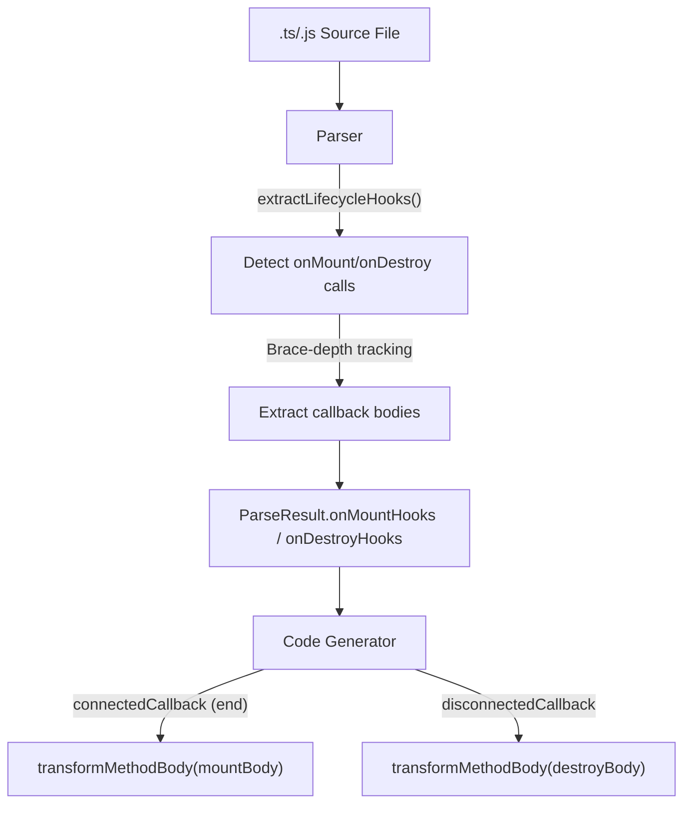

# Design Document — wcCompiler v2: lifecycle-hooks

## Overview

`onMount` / `onDestroy` lifecycle hooks extend the core compiler pipeline with component lifecycle management. Component authors call `onMount(() => { ... })` and `onDestroy(() => { ... })` at the top level of their component source to register code that runs when the element is connected to or disconnected from the DOM. The Parser extracts callback bodies using brace-depth tracking (same pattern as `effect()` extraction), and the Code Generator places the transformed bodies in `connectedCallback` (at the end, after all effects and event listeners) and `disconnectedCallback` respectively.

This feature reuses the v1 `extractLifecycleHooks` logic from `lib/parser.js` (renamed from `onMounted`/`onUnmounted` to `onMount`/`onDestroy`) and the lifecycle codegen sections from `lib/codegen.js`.

### Key Design Decisions

1. **Script-only feature** — Lifecycle hooks are purely script-level constructs. The tree walker is not involved at all. No template attributes or DOM manipulation is needed.
2. **Brace-depth extraction** — The parser uses the same brace-depth tracking pattern as `effect()` extraction to capture multi-line callback bodies with nested braces.
3. **End-of-connectedCallback placement** — `onMount` bodies are placed at the END of `connectedCallback`, after all effects and event listeners. This ensures the component DOM is fully initialized when mount code runs.
4. **Conditional disconnectedCallback** — The `disconnectedCallback` method is only generated when at least one `onDestroy` hook exists, avoiding empty method generation.
5. **transformMethodBody reuse** — Hook bodies are transformed using the same `transformMethodBody` function used for user methods, ensuring consistent signal/computed/prop rewriting.
6. **Multiple hooks in source order** — Multiple `onMount` or `onDestroy` calls are all collected and emitted in source order, allowing modular setup/teardown patterns.

## Architecture

### Integration with Core Pipeline



### Data Flow

```
Source:
  import { defineComponent, onMount, onDestroy, signal } from 'wcc'

  export default defineComponent({
    tag: 'wcc-timer',
    template: './wcc-timer.html',
  })

  const count = signal(0)
  let intervalId

  onMount(() => {
    console.log('mounted, count is', count())
    intervalId = setInterval(() => {
      count.set(count() + 1)
    }, 1000)
  })

  onDestroy(() => {
    clearInterval(intervalId)
  })

Parser:
  onMountHooks: [
    { body: "console.log('mounted, count is', count())\nintervalId = setInterval(() => {\n  count.set(count() + 1)\n}, 1000)" }
  ]
  onDestroyHooks: [
    { body: "clearInterval(intervalId)" }
  ]

Code Generator:
  connectedCallback() {
    // ... effects, event listeners ...
    // onMount hooks (at the end)
    console.log('mounted, count is', this._count())
    intervalId = setInterval(() => {
      this._count(this._count() + 1)
    }, 1000)
  }

  disconnectedCallback() {
    clearInterval(intervalId)
  }
```

## Components and Interfaces

### 1. Parser Extensions (`lib/parser.js`)

The parser adds lifecycle hook extraction. Adapted from v1 `extractLifecycleHooks` with renamed API (`onMount`/`onDestroy` instead of `onMounted`/`onUnmounted`).

**New/modified exported function:**

```js
/**
 * Extract lifecycle hooks from the script.
 * Patterns: onMount(() => { body }) and onDestroy(() => { body })
 * Supports multiple calls of each type.
 * Uses brace depth tracking to capture multi-line bodies.
 * Only extracts top-level calls (depth === 0).
 *
 * @param {string} script - The script content (after type stripping)
 * @returns {{ onMountHooks: LifecycleHook[], onDestroyHooks: LifecycleHook[] }}
 */
export function extractLifecycleHooks(script) { ... }
```

**Extraction algorithm:**

1. Split script into lines
2. Track brace depth to identify top-level scope
3. For each line at depth 0, test against `/\bonMount\s*\(\s*\(\s*\)\s*=>\s*\{/` and `/\bonDestroy\s*\(\s*\(\s*\)\s*=>\s*\{/`
4. When a match is found, collect body lines using brace-depth tracking:
   - Start counting from the opening `{` of the arrow function
   - Continue until depth returns to 0 (closing `}` of the arrow function)
   - Capture all lines between opening and closing braces
5. Dedent captured body lines by removing common leading whitespace
6. Push `{ body }` to the appropriate array (`onMountHooks` or `onDestroyHooks`)

**Root-level variable extraction update:**

The `extractRootVars` function must skip lines containing `onMount(` or `onDestroy(` to avoid treating them as variable declarations (same pattern as existing `onMounted`/`onUnmounted` skipping in v1).

### 2. Code Generator Extensions (`lib/codegen.js`)

The code generator receives `onMountHooks` and `onDestroyHooks` from the ParseResult and generates two output sections.

**connectedCallback section** (mount hooks at the end):

```js
connectedCallback() {
  // ... binding effects ...
  // ... show effects ...
  // ... attr binding effects ...
  // ... watcher effects ...
  // ... model effects ...
  // ... event listeners ...
  // ... if effects ...
  // ... for effects ...

  // Lifecycle: onMount hooks (at the very end)
  console.log('mounted, count is', this._count())
  intervalId = setInterval(() => {
    this._count(this._count() + 1)
  }, 1000)
}
```

**disconnectedCallback section** (only generated when hooks exist):

```js
disconnectedCallback() {
  clearInterval(intervalId)
}
```

**Transformation rules:**

Hook bodies are transformed via `transformMethodBody()`:
- Signal read `x()` → `this._x()`
- Signal write `x.set(value)` → `this._x(value)`
- Computed read `x()` → `this._c_x()`
- Prop read `props.name` → `this._s_name()`
- Emit call `emit('event', data)` → `this._emit('event', data)`

### 3. Pretty Printer Extensions (`lib/printer.js`)

The pretty printer serializes lifecycle hooks back to source format.

**Output format:**

```js
onMount(() => {
  console.log('mounted')
})

onDestroy(() => {
  clearInterval(intervalId)
})
```

**Serialization rules:**
- Emit `onMount(() => {\n` + indented body + `\n})` for each mount hook
- Emit `onDestroy(() => {\n` + indented body + `\n})` for each destroy hook
- Hooks are emitted after effects and before the end of the file
- Preserve source order within each hook type

## Data Models

### LifecycleHook

```js
/**
 * @typedef {Object} LifecycleHook
 * @property {string} body — The callback body (JavaScript code)
 */
```

### Extended ParseResult

```js
/**
 * @property {LifecycleHook[]} onMountHooks   — Mount lifecycle hooks (empty array if none)
 * @property {LifecycleHook[]} onDestroyHooks — Destroy lifecycle hooks (empty array if none)
 */
```

## Correctness Properties

*A property is a characteristic or behavior that should hold true across all valid executions of a system — essentially, a formal statement about what the system should do. Properties serve as the bridge between human-readable specifications and machine-verifiable correctness guarantees.*

### Property 1: Lifecycle Hook Extraction Completeness

*For any* valid Component_Source containing N `onMount(() => { body })` calls and M `onDestroy(() => { body })` calls at the top level, the Parser SHALL extract exactly N mount hooks and M destroy hooks, each with the correct body content, preserving source order.

**Validates: Requirements 1.1, 1.2, 1.4, 2.1, 2.2, 2.4**

### Property 2: Brace-Depth Body Capture

*For any* lifecycle hook callback body containing arbitrarily nested braces (if/else blocks, object literals, nested arrow functions, template literals), the Parser SHALL capture the complete body from the opening brace to the matching closing brace without truncation or over-capture.

**Validates: Requirements 3.1, 3.2, 3.3**

### Property 3: Codegen Mount Placement

*For any* ParseResult containing `onMountHooks`, the generated JavaScript SHALL contain the transformed hook bodies inside `connectedCallback`, positioned AFTER all `__effect` calls and `addEventListener` calls. When multiple mount hooks exist, they SHALL appear in source order.

**Validates: Requirements 4.1, 4.2, 4.3**

### Property 4: Codegen Destroy Placement

*For any* ParseResult containing `onDestroyHooks`, the generated JavaScript SHALL contain a `disconnectedCallback` method with the transformed hook bodies in source order. When no destroy hooks exist, the output SHALL NOT contain a `disconnectedCallback` method.

**Validates: Requirements 5.1, 5.2, 5.3, 5.4**

### Property 5: Signal/Computed Transformation in Hook Bodies

*For any* lifecycle hook body referencing signal names, computed names, or prop references, the Code Generator SHALL apply `transformMethodBody` to rewrite `x()` → `this._x()`, `x.set(v)` → `this._x(v)`, computed `x()` → `this._c_x()`, and `props.name` → `this._s_name()`.

**Validates: Requirements 6.1, 6.2, 6.3**

### Property 6: Pretty-Printer Round-Trip

*For any* valid Component_Source containing lifecycle hooks, parsing the source into an IR, printing the IR back to source, and parsing again SHALL produce an equivalent IR (same hook bodies in same order).

**Validates: Requirements 8.1, 8.2, 8.3**

## Error Handling

### Parser Behavior

Lifecycle hook extraction does not introduce new error codes. The parser silently ignores:
- `onMount`/`onDestroy` calls inside nested blocks (not at top level)
- Malformed calls that don't match the expected pattern (e.g., `onMount(myFunction)` without arrow syntax)

These are not errors — they are simply not recognized as lifecycle hooks and will remain in the source as regular function calls (which will fail at runtime since `onMount`/`onDestroy` are macro imports stripped by the compiler).

### Error Propagation

No new error codes are introduced by this feature. Errors follow the same pattern as core: thrown with a `.code` property during the parse phase, propagated through the compiler pipeline.

## Testing Strategy

### Property-Based Testing (PBT)

The lifecycle hooks feature is well-suited for PBT because the parser extraction is a pure function with clear input/output behavior, and the codegen placement rules are deterministic and verifiable across a wide input space.

**Library**: `fast-check`
**Configuration**: Minimum 100 iterations per property test
**Tag format**: `Feature: lifecycle-hooks, Property {number}: {property_text}`

### Test Organization

| Module | Property Tests | Unit Tests |
|---|---|---|
| `lib/parser.js` | Hook extraction completeness (Property 1), Brace-depth capture (Property 2), Round-trip (Property 6) | Nested hooks ignored (1.3, 2.3), multiple hooks ordering |
| `lib/codegen.js` | Mount placement (Property 3), Destroy placement (Property 4), Transformation (Property 5) | No disconnectedCallback when no hooks (5.4), placement after effects |
| `lib/compiler.js` | — | End-to-end: source with hooks → compiled output with correct lifecycle methods |

### Dual Testing Approach

- **Property tests** verify universal correctness across generated inputs (arbitrary hook bodies with nested braces, varying numbers of hooks, signal/computed references)
- **Unit tests** cover specific examples, edge cases, and integration verification (nested hooks ignored, empty bodies, interaction with other features)
