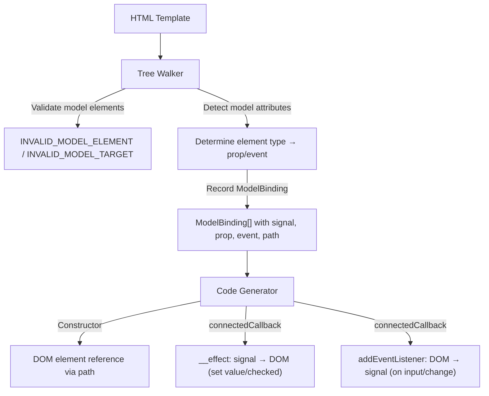

# Design Document — wcCompiler v2: model

## Overview

`model` extends the core compiler pipeline with two-way data binding between form elements and signals. Elements with `model="signalName"` are detected by the Tree Walker, which determines the element type (text input, checkbox, radio, select, textarea) to select the appropriate DOM property (`value` or `checked`) and event (`input` or `change`). The Code Generator produces an `__effect` in `connectedCallback` that syncs signal → DOM, and an event listener that syncs DOM → signal.

Unlike `show` which only reads reactive state, `model` both reads and writes — it creates a bidirectional link between a signal and a form element. Unlike `if`/`each` which manipulate DOM structure, `model` is self-contained: no anchors, no templates, no branch logic.

This feature reuses the v1 model detection logic from `lib/tree-walker.js` and the model codegen sections from `lib/codegen.js`.

### Key Design Decisions

1. **Signal name only** — The `model` value is always a bare signal name (valid identifier), not an arbitrary expression. This simplifies the binding: `model="name"` maps to `this._name`.
2. **Element type detection** — The Tree Walker inspects the element tag and `type` attribute to determine the correct DOM property and event. This is done at compile time, not runtime.
3. **One effect + one listener per binding** — Each ModelBinding generates exactly one `__effect` (signal → DOM) and one `addEventListener` (DOM → signal) in `connectedCallback`.
4. **Sequential naming** — ModelBindings are named `__model0`, `__model1`, ... in document order, matching the v1 convention (v1 uses `__m0`, `__m1`).
5. **Attribute removal** — The `model` attribute is removed from the processed template after extraction, so it doesn't appear in the rendered output.
6. **Validation-first** — Invalid element types and invalid signal names are detected during the tree-walk phase before code generation.
7. **Number coercion** — `<input type="number">` gets special treatment: the DOM → signal listener wraps the value in `Number()` to maintain type consistency.
8. **Radio value tracking** — `<input type="radio">` records the element's `value` attribute so the signal → DOM effect can compare against it.

## Architecture

### Integration with Core Pipeline



### Data Flow

```
Template:
  <input model="name" />
  <input type="checkbox" model="agreed" />
  <input type="radio" model="color" value="red" />
  <input type="number" model="age" />
  <select model="category">
    <option value="a">A</option>
  </select>
  <textarea model="description"></textarea>

Tree Walker:
  1. <input model="name"> → ModelBinding { varName: '__model0', signal: 'name', prop: 'value', event: 'input', coerce: false, radioValue: null, path: [...] }
  2. <input type="checkbox" model="agreed"> → ModelBinding { varName: '__model1', signal: 'agreed', prop: 'checked', event: 'change', coerce: false, radioValue: null, path: [...] }
  3. <input type="radio" model="color" value="red"> → ModelBinding { varName: '__model2', signal: 'color', prop: 'checked', event: 'change', coerce: false, radioValue: 'red', path: [...] }
  4. <input type="number" model="age"> → ModelBinding { varName: '__model3', signal: 'age', prop: 'value', event: 'input', coerce: true, radioValue: null, path: [...] }
  5. <select model="category"> → ModelBinding { varName: '__model4', signal: 'category', prop: 'value', event: 'change', coerce: false, radioValue: null, path: [...] }
  6. <textarea model="description"> → ModelBinding { varName: '__model5', signal: 'description', prop: 'value', event: 'input', coerce: false, radioValue: null, path: [...] }
  7. Remove model attributes from processed template

Code Generator:
  Constructor:
    const __root = __t_MyComponent.content.cloneNode(true);
    this.__model0 = __root.childNodes[0];  // <input> (text)
    this.__model1 = __root.childNodes[1];  // <input type="checkbox">
    this.__model2 = __root.childNodes[2];  // <input type="radio">
    this.__model3 = __root.childNodes[3];  // <input type="number">
    this.__model4 = __root.childNodes[4];  // <select>
    this.__model5 = __root.childNodes[5];  // <textarea>
    // ... other bindings ...
    this.appendChild(__root);

  connectedCallback:
    // Signal → DOM effects
    __effect(() => { this.__model0.value = this._name() ?? ''; });
    __effect(() => { this.__model1.checked = !!this._agreed(); });
    __effect(() => { this.__model2.checked = (this._color() === 'red'); });
    __effect(() => { this.__model3.value = this._age() ?? ''; });
    __effect(() => { this.__model4.value = this._category() ?? ''; });
    __effect(() => { this.__model5.value = this._description() ?? ''; });

    // DOM → Signal event listeners
    this.__model0.addEventListener('input', (e) => { this._name(e.target.value); });
    this.__model1.addEventListener('change', (e) => { this._agreed(e.target.checked); });
    this.__model2.addEventListener('change', (e) => { this._color(e.target.value); });
    this.__model3.addEventListener('input', (e) => { this._age(Number(e.target.value)); });
    this.__model4.addEventListener('change', (e) => { this._category(e.target.value); });
    this.__model5.addEventListener('input', (e) => { this._description(e.target.value); });
```

## Components and Interfaces

### 1. Tree Walker Extensions (`lib/tree-walker.js`)

The tree walker adds `model` attribute detection during the main DOM walk. This is integrated into the existing `walkTree()` function.

**Model detection within `walkTree`:**

```js
/**
 * During element node traversal, detect and process model attributes.
 *
 * For each element with a `model` attribute:
 * 1. Validate the element is a form element (input, textarea, select)
 * 2. Validate the model value is a valid identifier
 * 3. Determine element type → prop, event, coerce, radioValue
 * 4. Remove the `model` attribute from the element
 * 5. Record a ModelBinding with the current DOM path
 * 6. Assign sequential variable name (__model0, __model1, ...)
 */
```

**Detection algorithm (inside `walkTree` element processing):**

1. Check if element has `model` attribute
2. If yes:
   - Get attribute value (the signal name)
   - **Validate element**: tag must be `input`, `textarea`, or `select` → else throw `INVALID_MODEL_ELEMENT`
   - **Validate value**: must be non-empty and match `/^[a-zA-Z_$][\w$]*$/` → else throw `INVALID_MODEL_TARGET`
   - **Determine type**:
     - `<select>` → `{ prop: 'value', event: 'change', coerce: false, radioValue: null }`
     - `<textarea>` → `{ prop: 'value', event: 'input', coerce: false, radioValue: null }`
     - `<input type="checkbox">` → `{ prop: 'checked', event: 'change', coerce: false, radioValue: null }`
     - `<input type="radio">` → `{ prop: 'checked', event: 'change', coerce: false, radioValue: el.getAttribute('value') }`
     - `<input type="number">` → `{ prop: 'value', event: 'input', coerce: true, radioValue: null }`
     - `<input>` (all other types or no type) → `{ prop: 'value', event: 'input', coerce: false, radioValue: null }`
   - Remove `model` attribute from element
   - Record ModelBinding with current path, signal name, prop, event, coerce, radioValue, and sequential varName

**Validation errors:**

| Error Code | Condition | Message Pattern |
|---|---|---|
| `INVALID_MODEL_ELEMENT` | `model` on non-form element | `"model is only valid on <input>, <textarea>, or <select>, not on <{tag}>"` |
| `INVALID_MODEL_TARGET` | Empty or invalid identifier | `"model requires a valid signal name, received: '{value}'"` |

### 2. Code Generator Extensions (`lib/codegen.js`)

The code generator receives `modelBindings` from the ParseResult and generates three output sections.

**Constructor section** (per ModelBinding):

```js
// DOM element reference via path navigation
this.__model0 = __root.childNodes[0].childNodes[1];
```

The path is joined with `.` to navigate from `__root` to the target element. This reference is assigned before `this.appendChild(__root)` moves the nodes.

**connectedCallback — Signal → DOM effects** (per ModelBinding):

```js
// For value-based bindings (text, number, textarea, select):
__effect(() => {
  this.__model0.value = this._name() ?? '';
});

// For checkbox:
__effect(() => {
  this.__model1.checked = !!this._agreed();
});

// For radio:
__effect(() => {
  this.__model2.checked = (this._color() === 'red');
});
```

**connectedCallback — DOM → Signal event listeners** (per ModelBinding):

```js
// For text input / textarea:
this.__model0.addEventListener('input', (e) => { this._name(e.target.value); });

// For checkbox:
this.__model1.addEventListener('change', (e) => { this._agreed(e.target.checked); });

// For radio:
this.__model2.addEventListener('change', (e) => { this._color(e.target.value); });

// For number input (with coercion):
this.__model3.addEventListener('input', (e) => { this._age(Number(e.target.value)); });

// For select:
this.__model4.addEventListener('change', (e) => { this._category(e.target.value); });
```

**Code generation rules:**

| ModelBinding Kind | Signal → DOM Effect | DOM → Signal Listener |
|---|---|---|
| text/textarea/select | `el.value = this._signal() ?? ''` | `el.addEventListener(event, (e) => { this._signal(e.target.value); })` |
| number | `el.value = this._signal() ?? ''` | `el.addEventListener('input', (e) => { this._signal(Number(e.target.value)); })` |
| checkbox | `el.checked = !!this._signal()` | `el.addEventListener('change', (e) => { this._signal(e.target.checked); })` |
| radio | `el.checked = (this._signal() === 'radioValue')` | `el.addEventListener('change', (e) => { this._signal(e.target.value); })` |

### 3. Compiler Pipeline Update (`lib/compiler.js`)

Model bindings are discovered during `walkTree()` — no separate processing step is needed. The `walkTree()` function populates `modelBindings` in the result alongside `bindings`, `events`, and `showBindings`.

```js
// walkTree already returns modelBindings:
const { bindings, events, showBindings, modelBindings } = walkTree(rootEl, signalNames, computedNames);

// Merge into ParseResult:
parseResult.modelBindings = modelBindings;
```

## Data Models

### ModelBinding

```js
/**
 * @typedef {Object} ModelBinding
 * @property {string} varName      — Internal name: '__model0', '__model1', ...
 * @property {string} signal       — Signal name referenced by model (e.g., 'name', 'count')
 * @property {string} prop         — DOM property to bind: 'value' or 'checked'
 * @property {string} event        — Event to listen for: 'input' or 'change'
 * @property {boolean} coerce      — true if value requires Number() coercion (input type="number")
 * @property {string|null} radioValue — Value attribute for radio inputs, null for others
 * @property {string[]} path       — DOM path from root to the element
 */
```

### Extended ParseResult

```js
/**
 * @property {ModelBinding[]} modelBindings — Model bindings (empty array if none)
 */
```

### Error Codes

```js
/** @type {'INVALID_MODEL_ELEMENT'} — model on non-form element */
/** @type {'INVALID_MODEL_TARGET'} — empty or invalid signal name */
```

## Correctness Properties

*A property is a characteristic or behavior that should hold true across all valid executions of a system — essentially, a formal statement about what the system should do. Properties serve as the bridge between human-readable specifications and machine-verifiable correctness guarantees.*

### Property 1: Model Attribute Detection and ModelBinding Structure

*For any* valid HTML template containing one or more form elements with `model` attributes at various nesting depths, the Tree Walker SHALL produce one ModelBinding per `model` element, each with a sequential variable name (`__model0`, `__model1`, ...), the correct signal name, and a valid DOM path from the template root to the target element.

**Validates: Requirements 1.1, 1.2, 1.4, 1.5, 3.1, 3.2, 3.3, 9.1**

### Property 2: Element Type Detection Correctness

*For any* form element with a `model` attribute, the Tree Walker SHALL assign the correct `prop` and `event` based on the element tag and type attribute: checkbox/radio → `checked`/`change`, select → `value`/`change`, textarea/text inputs → `value`/`input`. Radio elements SHALL have `radioValue` set to the element's `value` attribute, and number inputs SHALL have `coerce` set to `true`.

**Validates: Requirements 2.1, 2.2, 2.3, 2.4, 2.5, 3.4, 3.5**

### Property 3: Model Attribute Removal

*For any* HTML template containing form elements with `model` attributes, the processed template returned by the Tree Walker SHALL NOT contain any `model` attributes.

**Validates: Requirements 1.3**

### Property 4: Codegen Signal-to-DOM Effect Structure

*For any* ParseResult containing ModelBindings, the generated JavaScript SHALL contain: a DOM element reference assignment per ModelBinding in the constructor (navigating from `__root` via the path), and an `__effect` per ModelBinding in `connectedCallback` that reads the signal and sets the appropriate DOM property (`value` or `checked`) based on the binding kind.

**Validates: Requirements 4.1, 4.2, 4.3, 6.1, 6.2, 6.3, 9.2, 9.4**

### Property 5: Codegen DOM-to-Signal Event Listener Structure

*For any* ParseResult containing ModelBindings, the generated JavaScript SHALL contain one `addEventListener` call per ModelBinding in `connectedCallback` with the correct event name (`input` or `change`), reading the appropriate DOM property (`e.target.value` or `e.target.checked`), and calling the signal setter. Number inputs SHALL wrap the value in `Number()`.

**Validates: Requirements 5.1, 5.2, 5.3, 5.4, 5.5, 9.3**

### Property 6: Invalid Model Element Error

*For any* element that has a `model` attribute but is not an `<input>`, `<textarea>`, or `<select>`, the Tree Walker SHALL throw an error with code `INVALID_MODEL_ELEMENT`.

**Validates: Requirements 7.1**

### Property 7: Invalid Model Target Error

*For any* element with a `model` attribute whose value is empty or does not match a valid JavaScript identifier pattern, the Tree Walker SHALL throw an error with code `INVALID_MODEL_TARGET`.

**Validates: Requirements 8.1, 8.2**

## Error Handling

### Tree Walker Errors

| Error Code | Condition | Message Pattern |
|---|---|---|
| `INVALID_MODEL_ELEMENT` | `model` on non-form element (e.g., `<div>`, `<span>`, `<p>`) | `"model is only valid on <input>, <textarea>, or <select>, not on <{tag}>"` |
| `INVALID_MODEL_TARGET` | Empty value or invalid identifier in `model` attribute | `"model requires a valid signal name, received: '{value}'"` |

### Error Propagation

Errors follow the same pattern as core and other directives: thrown with a `.code` property during tree-walk phase, propagated through the compiler pipeline, and formatted by the CLI for human-readable output.

## Testing Strategy

### Property-Based Testing (PBT)

The `model` feature is well-suited for PBT because the tree-walker detection and codegen are pure functions with clear input/output behavior, and the properties hold across a wide input space (arbitrary template structures, nesting depths, element types, signal names).

**Library**: `fast-check`
**Configuration**: Minimum 100 iterations per property test
**Tag format**: `Feature: model-directive, Property {number}: {property_text}`

### Test Organization

| Module | Property Tests | Unit Tests |
|---|---|---|
| `lib/tree-walker.js` | Model detection + structure (Property 1), Element type detection (Property 2), Attribute removal (Property 3), Invalid element error (Property 6), Invalid target error (Property 7) | Multiple model in same parent, deeply nested model elements, radio with value attribute |
| `lib/codegen.js` | Signal-to-DOM effect (Property 4), DOM-to-signal listener (Property 5) | Number coercion, radio checked comparison, multiple model effects ordering |
| `lib/compiler.js` | — | End-to-end: template with model → compiled output with correct two-way binding |

### Dual Testing Approach

- **Property tests** verify universal correctness across generated inputs (template structures, element types, signal names, nesting depths)
- **Unit tests** cover specific examples, edge cases, and integration verification (radio value comparison, number coercion, interaction with other bindings)
