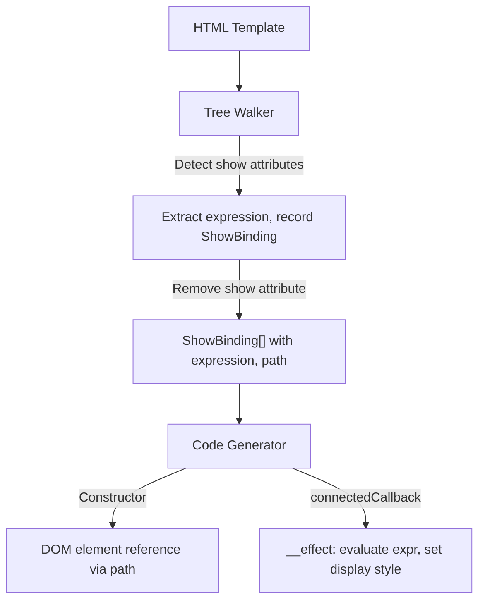

# Design Document — wcCompiler v2: show

## Overview

`show` extends the core compiler pipeline with visibility toggling. Elements with `show="expression"` are detected by the Tree Walker, the attribute is removed from the processed template, and a ShowBinding is recorded with the element's DOM path and expression. The Code Generator produces an `__effect` in `connectedCallback` that evaluates the expression and sets `element.style.display = expr ? '' : 'none'`.

Unlike `if` which removes/adds elements from the DOM, `show` keeps the element in place and only toggles its CSS `display` property. This makes it simpler — no anchors, no templates, no branch logic.

This feature reuses the v1 show detection logic from `lib/tree-walker.js` and the show codegen sections from `lib/codegen.js`.

### Key Design Decisions

1. **No anchor/template needed** — The element stays in the DOM at all times. Only its `display` style changes. This is fundamentally simpler than `if`/`each`.
2. **One effect per ShowBinding** — Each `show` directive gets its own `__effect` in `connectedCallback`. This keeps reactivity granular — only the relevant element updates when its expression changes.
3. **Attribute removal** — The `show` attribute is removed from the processed template after extraction, so it doesn't appear in the rendered output.
4. **Sequential naming** — ShowBindings are named `__show0`, `__show1`, ... in document order, matching the v1 convention.
5. **Validation-first** — `show` + `if` on the same element is detected during the tree-walk phase as a `CONFLICTING_DIRECTIVES` error (shared with the if-directive validation).
6. **Expression transformation** — Show expressions are transformed via `transformExpr()` identically to `if` expressions: signal `x` → `this._x()`, computed `y` → `this._c_y()`, prop `z` → `this._s_z()`.

## Architecture

### Integration with Core Pipeline



### Data Flow

```
Template:
  <div>
    <p show="isVisible">Visible content</p>
    <span show="count > 0">Has items</span>
  </div>

Tree Walker:
  1. Detect <p show="isVisible"> → ShowBinding { varName: '__show0', expression: 'isVisible', path: ['childNodes[0]', 'childNodes[0]'] }
  2. Detect <span show="count > 0"> → ShowBinding { varName: '__show1', expression: 'count > 0', path: ['childNodes[0]', 'childNodes[1]'] }
  3. Remove show attributes from processed template

Code Generator:
  Constructor:
    const __root = __t_MyComponent.content.cloneNode(true);
    this.__show0 = __root.childNodes[0].childNodes[0];  // <p>
    this.__show1 = __root.childNodes[0].childNodes[1];  // <span>
    // ... other bindings ...
    this.appendChild(__root);

  connectedCallback:
    __effect(() => {
      this.__show0.style.display = (this._isVisible()) ? '' : 'none';
    });
    __effect(() => {
      this.__show1.style.display = (this._count() > 0) ? '' : 'none';
    });
```

## Components and Interfaces

### 1. Tree Walker Extensions (`lib/tree-walker.js`)

The tree walker adds `show` attribute detection during the main DOM walk. This is integrated into the existing `walkTree()` function.

**Show detection within `walkTree`:**

```js
/**
 * During element node traversal, detect and process show attributes.
 *
 * For each element with a `show` attribute:
 * 1. Extract the expression value
 * 2. Remove the `show` attribute from the element
 * 3. Record a ShowBinding with the current DOM path
 * 4. Assign sequential variable name (__show0, __show1, ...)
 */
```

**Detection algorithm (inside `walkTree` element processing):**

1. Check if element has `show` attribute
2. If yes:
   - Get attribute value (the expression)
   - Remove `show` attribute from element
   - Record ShowBinding with current path, expression, and sequential varName
3. Continue walking child nodes

**Validation** (shared with if-directive, already in `processIfChains` validation pass):

- `show` + `if` on same element → `CONFLICTING_DIRECTIVES` error
- This validation is already handled by the if-directive spec's first-pass validation in `processIfChains`

### 2. Code Generator Extensions (`lib/codegen.js`)

The code generator receives `showBindings` from the ParseResult and generates two output sections.

**Constructor section** (per ShowBinding):

```js
// DOM element reference via path navigation
this.__show0 = __root.childNodes[0].childNodes[0];
this.__show1 = __root.childNodes[0].childNodes[1];
```

The path is joined with `.` to navigate from `__root` to the target element. This reference is assigned before `this.appendChild(__root)` moves the nodes.

**connectedCallback section** (per ShowBinding):

```js
__effect(() => {
  this.__show0.style.display = (transformedExpr) ? '' : 'none';
});
```

**Expression transformation:**

Show expressions are transformed via `transformExpr()`:
- Signal `isVisible` → `this._isVisible()`
- Computed `hasItems` → `this._c_hasItems()`
- Prop `visible` → `this._s_visible()`
- Complex expressions: `count > 0` → `this._count() > 0`

### 3. Compiler Pipeline Update (`lib/compiler.js`)

Show bindings are already discovered during `walkTree()` — no separate processing step is needed. The `walkTree()` function populates `showBindings` in the result alongside `bindings` and `events`.

```js
// walkTree already returns showBindings:
const { bindings, events, showBindings } = walkTree(rootEl, signalNames, computedNames);

// Merge into ParseResult:
parseResult.showBindings = showBindings;
```

## Data Models

### ShowBinding

```js
/**
 * @typedef {Object} ShowBinding
 * @property {string} varName     — Internal name: '__show0', '__show1', ...
 * @property {string} expression  — JS expression from show attribute value
 * @property {string[]} path      — DOM path from root to the element
 */
```

### Extended ParseResult

```js
/**
 * @property {ShowBinding[]} showBindings — Show bindings (empty array if none)
 */
```

### Error Codes

```js
/** @type {'CONFLICTING_DIRECTIVES'} — show + if on same element (shared with if-directive) */
```

## Correctness Properties

*A property is a characteristic or behavior that should hold true across all valid executions of a system — essentially, a formal statement about what the system should do. Properties serve as the bridge between human-readable specifications and machine-verifiable correctness guarantees.*

### Property 1: Show Attribute Detection and ShowBinding Structure

*For any* valid HTML template containing one or more elements with `show` attributes at various nesting depths, the Tree Walker SHALL produce one ShowBinding per `show` element, each with a sequential variable name (`__show0`, `__show1`, ...), the correct expression string, and a valid DOM path from the template root to the target element.

**Validates: Requirements 1.1, 1.2, 1.4, 1.5, 2.1, 2.2, 2.3, 7.1**

### Property 2: Show Attribute Removal

*For any* HTML template containing elements with `show` attributes, the processed template returned by the Tree Walker SHALL NOT contain any `show` attributes.

**Validates: Requirements 1.3**

### Property 3: Codegen Effect Structure

*For any* ParseResult containing ShowBindings, the generated JavaScript SHALL contain: a DOM element reference assignment per ShowBinding in the constructor (navigating from `__root` via the path), and an `__effect` per ShowBinding in `connectedCallback` that evaluates the expression (with `transformExpr`-applied transformation) and sets `element.style.display` to `''` or `'none'`.

**Validates: Requirements 3.1, 3.2, 3.3, 3.4, 5.1, 5.2, 5.3, 7.2, 7.3**

### Property 4: Expression Auto-Unwrap

*For any* `show` expression containing signal, computed, or prop references, the Code Generator SHALL transform signal `x` to `this._x()`, computed `y` to `this._c_y()`, and prop `z` to `this._s_z()` using `transformExpr`.

**Validates: Requirements 4.1, 4.2, 4.3**

### Property 5: Conflicting Directives Error

*For any* element that has both `show` and `if` attributes, the Tree Walker SHALL throw an error with code `CONFLICTING_DIRECTIVES`.

**Validates: Requirements 6.1**

## Error Handling

### Tree Walker Errors

| Error Code | Condition | Message Pattern |
|---|---|---|
| `CONFLICTING_DIRECTIVES` | `show` + `if` on same element | `"show y if no deben usarse en el mismo elemento"` |

### Error Propagation

Errors follow the same pattern as core and `if`: thrown with a `.code` property during tree-walk phase, propagated through the compiler pipeline, and formatted by the CLI for human-readable output. The `show` + `if` conflict is detected in the same validation pass as other conflicting directive checks.

## Testing Strategy

### Property-Based Testing (PBT)

The `show` feature is well-suited for PBT because the tree-walker detection and codegen are pure functions with clear input/output behavior, and the properties hold across a wide input space (arbitrary template structures, nesting depths, expression strings).

**Library**: `fast-check`
**Configuration**: Minimum 100 iterations per property test
**Tag format**: `Feature: show-directive, Property {number}: {property_text}`

### Test Organization

| Module | Property Tests | Unit Tests |
|---|---|---|
| `lib/tree-walker.js` | Show detection + structure (Property 1), Attribute removal (Property 2), Conflicting directives (Property 5) | Multiple show in same parent, deeply nested show elements |
| `lib/codegen.js` | Effect structure (Property 3), Expression auto-unwrap (Property 4) | Complex expressions, multiple show effects ordering |
| `lib/compiler.js` | — | End-to-end: template with show → compiled output with correct display toggle |

### Dual Testing Approach

- **Property tests** verify universal correctness across generated inputs (template structures, nesting depths, expression strings, signal/computed/prop combinations)
- **Unit tests** cover specific examples, edge cases, and integration verification (complex expressions with operators, multiple show directives ordering, interaction with other bindings)

