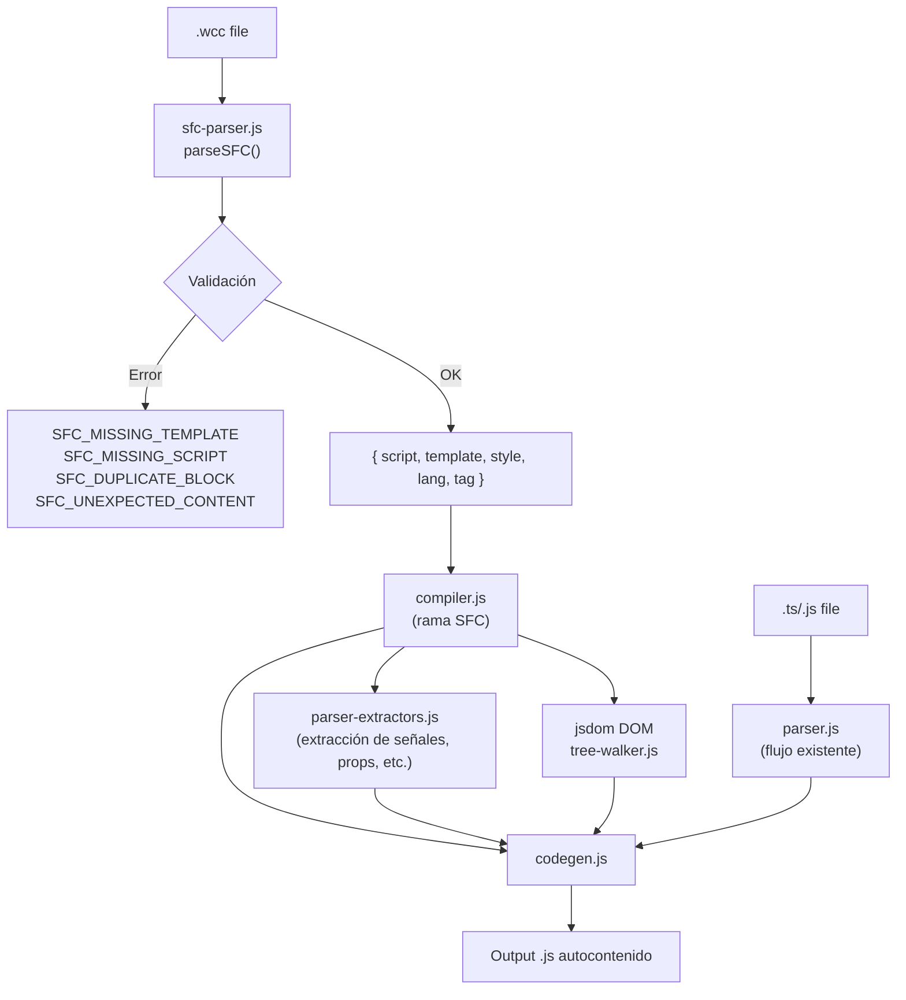

# Documento de Diseño — Single File Components (.wcc)

## Visión General

Este documento describe el diseño para agregar soporte de Single File Components (SFC) al compilador wcCompiler. Un archivo `.wcc` contiene bloques `<script>`, `<template>` y `<style>` en un único archivo, similar a los SFC de Vue.

La funcionalidad se implementa como una **capa delgada** sobre el pipeline existente: un nuevo módulo `sfc-parser.js` extrae los bloques del archivo `.wcc` y los inyecta en el pipeline existente como strings. Los módulos tree-walker, codegen y css-scoper no requieren cambios — operan sobre IR/DOM, agnósticos del formato de origen.

**Complejidad estimada:** ~200-300 líneas de código nuevo, ~10-15 líneas de modificaciones en módulos existentes.

## Arquitectura

### Pipeline actual (multi-archivo)

```
Source (.ts/.js) → parser.js → IR (ParseResult)
                                      ↓
Template (.html) → jsdom DOM → tree-walker.js → bindings, events, directives
                                      ↓
                                codegen.js → self-contained .js
```

### Pipeline con SFC

```
Source (.wcc) → sfc-parser.js → { script, template, style, lang, tag }
                                      ↓
                    compiler.js (detecta extensión .wcc)
                                      ↓
              Inyecta bloques en el pipeline existente:
              - script → parser-extractors.js (extracción de señales, props, etc.)
              - template → jsdom DOM → tree-walker.js
              - style → codegen.js (inyección CSS)
                                      ↓
                              codegen.js → self-contained .js
```



### Decisiones de diseño clave

1. **SFC parser es un text splitter** — No usa un parser HTML completo. Busca etiquetas de apertura/cierre conocidas (`<script>`, `<template>`, `<style>`) con regex y extrae el contenido entre ellas.

2. **`defineComponent()` en SFC solo necesita `{ tag }`** — No se permiten campos `template` ni `styles` porque el contenido ya está en el mismo archivo.

3. **`<style scoped>` es decorativo** — El CSS ya se scopa por tag name en el codegen. El atributo `scoped` se acepta pero no cambia el comportamiento.

4. **Orden de bloques es libre** — Como en Vue, los bloques pueden aparecer en cualquier orden.

5. **Extensión `.wcc`** — Elegida para ser específica del compilador y evitar conflictos con otros formatos.

6. **Reutilización máxima** — El compilador reutiliza `compileFromStrings` (browser) y las funciones de `parser-extractors.js` (server) para evitar duplicación.

## Componentes e Interfaces

### 1. `sfc-parser.js` (nuevo módulo)

Módulo puro sin dependencias de Node.js (usable en browser y server).

```javascript
/**
 * @typedef {Object} SFCDescriptor
 * @property {string} script   — Contenido del bloque <script>
 * @property {string} template — Contenido del bloque <template>
 * @property {string} style    — Contenido del bloque <style> ('' si ausente)
 * @property {string} lang     — 'ts' | 'js'
 * @property {string} tag      — Tag name extraído de defineComponent({ tag })
 */

/**
 * Parsea un archivo SFC y extrae sus bloques.
 * @param {string} source — Contenido completo del archivo .wcc
 * @param {string} [fileName] — Nombre del archivo (para mensajes de error)
 * @returns {SFCDescriptor}
 * @throws {Error} con códigos: SFC_MISSING_TEMPLATE, SFC_MISSING_SCRIPT,
 *                 SFC_DUPLICATE_BLOCK, SFC_UNEXPECTED_CONTENT,
 *                 SFC_INLINE_PATHS_FORBIDDEN, MISSING_DEFINE_COMPONENT
 */
export function parseSFC(source, fileName) { ... }

/**
 * Pretty-printer: reconstruye un string SFC a partir de un descriptor.
 * @param {SFCDescriptor} descriptor
 * @returns {string}
 */
export function printSFC(descriptor) { ... }
```

### 2. `compiler.js` (modificación)

Se agrega detección de extensión `.wcc` al inicio de `compile()`:

```javascript
export async function compile(filePath, config) {
  const ext = extname(filePath);
  
  if (ext === '.wcc') {
    // Leer archivo, parsear SFC, delegar a compileSFC()
    return compileSFC(filePath, config);
  }
  
  // Flujo existente sin cambios...
}
```

La función `compileSFC()` interna:
1. Lee el archivo `.wcc`
2. Llama a `parseSFC()` para extraer bloques
3. Reutiliza las funciones de `parser-extractors.js` para extraer señales, props, etc. del bloque script
4. Procesa template y style a través del pipeline existente (jsdom → tree-walker → codegen)

### 3. `compiler-browser.js` (modificación)

Se agrega la función `compileFromSFC()`:

```javascript
/**
 * Compila un componente SFC desde un string (browser-compatible).
 * @param {string} source — Contenido completo del archivo .wcc
 * @param {{ stripTypes?: (code: string) => Promise<string> }} [options]
 * @returns {Promise<string>} JavaScript compilado
 */
export async function compileFromSFC(source, options) {
  const descriptor = parseSFC(source);
  return compileFromStrings({
    script: descriptor.script,
    template: descriptor.template,
    style: descriptor.style,
    tag: descriptor.tag,
    lang: descriptor.lang,
    stripTypes: options?.stripTypes,
  });
}
```

### 4. `bin/wcc.js` (modificación)

Dos cambios menores:
- `discoverFiles()`: agregar `.wcc` a las extensiones aceptadas
- Watcher en modo `dev`: observar cambios en `.wcc` además de `.ts`/`.js`
- Output: reemplazar `.wcc` por `.js` en la ruta de salida

### 5. `compiler.js` — `resolveChildComponent()` (modificación)

Agregar `.wcc` a las extensiones buscadas, con prioridad sobre `.ts`/`.js`:

```javascript
// Extensiones a buscar, en orden de prioridad
const extensions = ['.wcc', '.js', '.ts'];
```

## Modelos de Datos

### SFCDescriptor

```javascript
/**
 * @typedef {Object} SFCDescriptor
 * @property {string} script   — Contenido del bloque <script> (sin las etiquetas)
 * @property {string} template — Contenido del bloque <template> (sin las etiquetas)
 * @property {string} style    — Contenido del bloque <style> ('' si ausente)
 * @property {string} lang     — Lenguaje del script: 'ts' | 'js'
 * @property {string} tag      — Tag name del componente (de defineComponent)
 */
```

### Algoritmo del SFC Parser

El parser opera en dos fases:

**Fase 1: Extracción de bloques**

```
Para cada tipo de bloque (script, template, style):
  1. Buscar regex: /<(script|template|style)(\s[^>]*)?>/ 
  2. Si se encuentra más de una ocurrencia → error SFC_DUPLICATE_BLOCK
  3. Encontrar la etiqueta de cierre correspondiente: </script|template|style>
  4. Extraer el contenido entre apertura y cierre
  5. Para <script>: extraer atributo lang si existe
```

**Fase 2: Validación**

```
1. Si no hay bloque <template> → error SFC_MISSING_TEMPLATE
2. Si no hay bloque <script> → error SFC_MISSING_SCRIPT
3. Verificar que no hay contenido no-whitespace fuera de los bloques
4. Extraer tag de defineComponent({ tag: '...' }) del script
5. Si defineComponent tiene campos template o styles → error SFC_INLINE_PATHS_FORBIDDEN
6. Si no hay defineComponent → error MISSING_DEFINE_COMPONENT
```

### Formato de archivo `.wcc`

```html
<script lang="ts">
import { defineComponent, signal, computed } from 'wcc'

export default defineComponent({
  tag: 'wcc-counter'
})

const count = signal(0)
const doubled = computed(() => count() * 2)

function increment() {
  count.set(count() + 1)
}
</script>

<template>
  <div class="counter">
    <span>{{count}} (x2: {{doubled}})</span>
    <button @click="increment">+1</button>
  </div>
</template>

<style>
.counter {
  display: flex;
  align-items: center;
  gap: 8px;
}
</style>
```

## Propiedades de Corrección

*Una propiedad es una característica o comportamiento que debe cumplirse en todas las ejecuciones válidas de un sistema — esencialmente, una declaración formal sobre lo que el sistema debe hacer. Las propiedades sirven como puente entre especificaciones legibles por humanos y garantías de corrección verificables por máquina.*

### Propiedad 1: Round-trip del SFC (parse → print → parse)

*Para todo* archivo SFC válido con bloques script, template y style arbitrarios, parsear con `parseSFC`, imprimir con `printSFC`, y volver a parsear con `parseSFC` SHALL producir un `SFCDescriptor` con campos `script`, `template`, `style` y `lang` equivalentes al descriptor original.

**Valida: Requisitos 1.1, 1.2, 1.5, 1.6, 1.7, 10.1, 10.2, 10.3, 10.4**

### Propiedad 2: Independencia del orden de bloques

*Para todo* conjunto de contenidos (script, template, style) y *para toda* permutación del orden de los bloques en el archivo SFC, `parseSFC` SHALL producir un `SFCDescriptor` con campos idénticos independientemente del orden.

**Valida: Requisito 1.3**

### Propiedad 3: Detección correcta de lenguaje

*Para todo* bloque `<script>` con atributo `lang="ts"`, `parseSFC` SHALL retornar `lang: 'ts'`; y *para todo* bloque `<script>` sin atributo `lang`, SHALL retornar `lang: 'js'`.

**Valida: Requisitos 1.4, 1.5**

### Propiedad 4: Error en bloques requeridos ausentes

*Para todo* string SFC que no contenga un bloque `<template>`, `parseSFC` SHALL lanzar un error con código `SFC_MISSING_TEMPLATE`; y *para todo* string SFC que no contenga un bloque `<script>`, SHALL lanzar un error con código `SFC_MISSING_SCRIPT`.

**Valida: Requisitos 2.1, 2.2**

### Propiedad 5: Error en bloques duplicados

*Para todo* string SFC que contenga más de un bloque del mismo tipo (script, template o style), `parseSFC` SHALL lanzar un error con código `SFC_DUPLICATE_BLOCK`.

**Valida: Requisitos 2.3, 2.4, 2.5**

### Propiedad 6: Error en contenido inesperado

*Para todo* string SFC que contenga texto no-whitespace fuera de los bloques reconocidos (`<script>`, `<template>`, `<style>`), `parseSFC` SHALL lanzar un error con código `SFC_UNEXPECTED_CONTENT`.

**Valida: Requisito 2.6**

### Propiedad 7: Error en rutas inline en modo SFC

*Para todo* bloque `<script>` en un SFC que contenga `defineComponent()` con un campo `template` o `styles`, `parseSFC` SHALL lanzar un error con código `SFC_INLINE_PATHS_FORBIDDEN`.

**Valida: Requisito 3.2**

### Propiedad 8: Equivalencia de output SFC vs multi-archivo

*Para todo* componente definido tanto en formato SFC como en formato multi-archivo con la misma lógica, template y estilos, `compile()` SHALL producir output JavaScript idéntico para ambos formatos.

**Valida: Requisitos 4.1, 4.3**

## Manejo de Errores

### Códigos de error nuevos

| Código | Condición | Mensaje |
|---|---|---|
| `SFC_MISSING_TEMPLATE` | Archivo `.wcc` sin bloque `<template>` | `SFC file '{file}' is missing a <template> block` |
| `SFC_MISSING_SCRIPT` | Archivo `.wcc` sin bloque `<script>` | `SFC file '{file}' is missing a <script> block` |
| `SFC_DUPLICATE_BLOCK` | Más de un bloque del mismo tipo | `SFC file '{file}' contains duplicate <{block}> blocks` |
| `SFC_UNEXPECTED_CONTENT` | Texto no-whitespace fuera de bloques | `SFC file '{file}' contains unexpected content outside blocks` |
| `SFC_INLINE_PATHS_FORBIDDEN` | `defineComponent` con `template`/`styles` en SFC | `SFC file '{file}': template/styles paths are not allowed in SFC mode (content is inline)` |

### Códigos de error existentes reutilizados

| Código | Condición en contexto SFC |
|---|---|
| `MISSING_DEFINE_COMPONENT` | Bloque `<script>` sin `defineComponent()` |
| `TS_SYNTAX_ERROR` | Error de sintaxis TypeScript en bloque `<script lang="ts">` |

### Estrategia de errores

- Todos los errores del SFC parser se lanzan como `Error` con propiedad `.code` (patrón existente del proyecto).
- Los errores de validación del SFC se verifican **antes** de pasar al pipeline existente, para dar mensajes claros y específicos del formato SFC.
- Los errores del pipeline existente (REF_NOT_FOUND, MODEL_READONLY, etc.) se propagan sin modificación.

## Estrategia de Testing

### Tests de propiedades (fast-check)

Se usará **fast-check** (ya instalado como devDependency) para property-based testing. Cada propiedad del diseño se implementa como un test con mínimo 100 iteraciones.

| Propiedad | Archivo de test | Generador |
|---|---|---|
| P1: Round-trip | `lib/sfc-parser.test.js` | Genera strings arbitrarios para script/template/style, ensambla SFC |
| P2: Orden de bloques | `lib/sfc-parser.test.js` | Genera contenido + permutaciones de orden |
| P3: Detección de lang | `lib/sfc-parser.test.js` | Genera script con/sin `lang="ts"` |
| P4: Bloques ausentes | `lib/sfc-parser.test.js` | Genera SFC sin template o sin script |
| P5: Bloques duplicados | `lib/sfc-parser.test.js` | Genera SFC con bloques duplicados |
| P6: Contenido inesperado | `lib/sfc-parser.test.js` | Genera SFC con texto fuera de bloques |
| P7: Rutas inline | `lib/sfc-parser.test.js` | Genera defineComponent con template/styles |
| P8: Equivalencia output | `lib/compiler.sfc.test.js` | Genera componentes, compila en ambos formatos |

**Configuración de cada test de propiedad:**
- Mínimo 100 iteraciones (`{ numRuns: 100 }`)
- Comentario de tag: `Feature: single-file-components, Property {N}: {título}`

### Tests unitarios (ejemplos y edge cases)

| Test | Archivo | Descripción |
|---|---|---|
| Parseo básico con 3 bloques | `lib/sfc-parser.test.js` | Ejemplo concreto con contenido conocido |
| Style vacío | `lib/sfc-parser.test.js` | SFC sin bloque `<style>` |
| `<style scoped>` | `lib/sfc-parser.test.js` | Atributo scoped se acepta sin error |
| defineComponent solo con tag | `lib/sfc-parser.test.js` | Modo SFC acepta `{ tag: 'x-y' }` |
| Compilación end-to-end SFC | `lib/compiler.sfc.test.js` | Compila .wcc y verifica output |
| TypeScript en SFC | `lib/compiler.sfc.test.js` | `<script lang="ts">` con tipos |
| `compileFromSFC` browser | `lib/compiler-browser.sfc.test.js` | Compilación SFC en modo browser |
| CLI descubre .wcc | `lib/cli.sfc.test.js` | `discoverFiles` incluye .wcc |
| Resolución de hijos .wcc | `lib/compiler.sfc.test.js` | Componente hijo en formato .wcc |

### Balance de tests

- **Property tests** cubren la corrección universal del parser y la equivalencia de output.
- **Unit tests** cubren ejemplos concretos, integración end-to-end, y edge cases específicos.
- Se evita duplicar cobertura: los property tests manejan la variación de inputs, los unit tests verifican comportamientos específicos.
