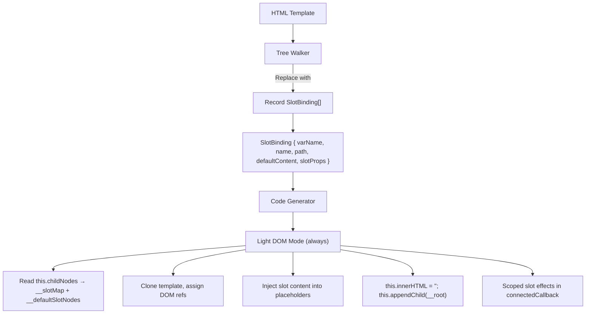

# Design Document — wcCompiler v2: Scoped Slots (Light DOM)

## Overview

`<slot>` content distribution in v2 uses the same **light DOM scoped slot** approach as v1. The Tree Walker detects `<slot>` elements, replaces them with `<span data-slot="...">` placeholders, and records `SlotBinding` metadata (including `:prop="expr"` slot props). The Code Generator produces runtime slot resolution code: reading consumer `childNodes` before template injection, building a slot map from `<template #name>` children, and injecting content into placeholders. For scoped slots (slots with `:prop` attributes), reactive effects in `connectedCallback` resolve `{{propName}}` interpolations in the consumer's template content.

**No Shadow DOM is used.** All components render in light DOM. CSS scoping always uses the tag-name prefix strategy via `scopeCSS()`.

This feature reuses the v1 slot resolution pattern from `lib/codegen.js` and the slot replacement logic from `lib/tree-walker.js`.

### Key Design Decisions

1. **Replacement in Tree Walker** — The tree walker replaces `<slot>` elements with `<span data-slot="name">` placeholders and records SlotBinding metadata. This is similar to how `if` replaces elements with comment anchors.
2. **Light DOM always** — No Shadow DOM. The presence of slots does NOT change the rendering strategy. All components use `this.innerHTML = ''; this.appendChild(__root)`.
3. **CSS strategy unchanged** — CSS is always scoped via tag-name prefix and injected into `document.head`. No special handling for slots.
4. **Runtime slot resolution** — The constructor reads `this.childNodes` before clearing innerHTML, builds a slot map, and injects content into placeholders. This is the same pattern as v1.
5. **Scoped slot props** — For slots with `:prop="expr"` attributes, reactive effects in `connectedCallback` resolve `{{propName}}` patterns in the consumer's template content using the component's reactive state.
6. **Consumer API** — `<template #name>` for named slots, `<template #name="{ prop }">` for scoped slots, plain children for default slot.

## Architecture

### Integration with Core Pipeline



### Data Flow

```
Template:
  <div class="card">
    <slot name="header">Default Header</slot>
    <div class="body">
      <slot>Default content</slot>
    </div>
    <slot name="data" :item="currentItem" :index="currentIndex"></slot>
  </div>

Tree Walker:
  1. Find <slot name="header"> → replace with <span data-slot="header">Default Header</span>
     Record SlotBinding: { varName: '__s0', name: 'header', path: [...], defaultContent: 'Default Header', slotProps: [] }
  2. Find <slot> → replace with <span data-slot="default">Default content</span>
     Record SlotBinding: { varName: '__s1', name: '', path: [...], defaultContent: 'Default content', slotProps: [] }
  3. Find <slot name="data" :item="currentItem" :index="currentIndex"> → replace with <span data-slot="data"></span>
     Record SlotBinding: { varName: '__s2', name: 'data', path: [...], defaultContent: '', slotProps: [{prop:'item', source:'currentItem'}, {prop:'index', source:'currentIndex'}] }

Code Generator (Constructor):
  // 1. Read childNodes BEFORE clearing innerHTML
  const __slotMap = {};
  const __defaultSlotNodes = [];
  for (const child of Array.from(this.childNodes)) {
    if (child.nodeName === 'TEMPLATE') {
      for (const attr of child.attributes) {
        if (attr.name.startsWith('#')) {
          const slotName = attr.name.slice(1);
          __slotMap[slotName] = { content: child.innerHTML, propsExpr: attr.value };
        }
      }
    } else if (child.nodeType === 1 || (child.nodeType === 3 && child.textContent.trim())) {
      __defaultSlotNodes.push(child);
    }
  }

  // 2. Clone template (contains <span data-slot="..."> placeholders)
  const __root = __t_WccCard.content.cloneNode(true);

  // 3. Assign DOM refs (including slot placeholders)
  this.__s0 = __root.childNodes[0].childNodes[0]; // header slot span
  this.__s1 = __root.childNodes[0].childNodes[1].childNodes[0]; // default slot span
  this.__s2 = __root.childNodes[0].childNodes[2]; // data slot span

  // 4. Clear and append (light DOM, always)
  this.innerHTML = '';
  this.appendChild(__root);

  // 5. Static slot injection
  if (__slotMap['header']) { this.__s0.innerHTML = __slotMap['header'].content; }
  if (__defaultSlotNodes.length) { this.__s1.textContent = ''; __defaultSlotNodes.forEach(n => this.__s1.appendChild(n.cloneNode(true))); }
  if (__slotMap['data']) { this.__slotTpl_data = __slotMap['data'].content; }

Code Generator (connectedCallback):
  // Scoped slot effect for 'data' slot
  if (this.__slotTpl_data) {
    __effect(() => {
      const __props = { item: this._currentItem(), index: this._currentIndex() };
      let __html = this.__slotTpl_data;
      for (const [k, v] of Object.entries(__props)) {
        __html = __html.replace(new RegExp('\\{\\{\\s*' + k + '\\s*\\}\\}', 'g'), v ?? '');
      }
      this.__s2.innerHTML = __html;
    });
  }
```

### Consumer Usage

```html
<!-- Named slots -->
<wcc-card>
  <template #header>Custom Header</template>
  <p>Default slot content</p>
  <template #footer>Custom Footer</template>
</wcc-card>

<!-- Scoped slots -->
<wcc-card>
  <template #data="{ item, index }">
    <p>Item {{index}}: {{item}}</p>
  </template>
</wcc-card>

<!-- Fallback content (no children) -->
<wcc-card></wcc-card>
```

## Components and Interfaces

### 1. Tree Walker Extensions (`lib/tree-walker.js`)

The tree walker processes `<slot>` elements during the main `walkTree()` walk. When a `<slot>` is encountered, it is replaced with a `<span data-slot="...">` placeholder and a SlotBinding is recorded.

**Slot processing in `walk()` function:**

```js
// Inside walk(), when node is an element:
if (el.tagName === 'SLOT') {
  const slotName = el.getAttribute('name') || '';
  const varName = `__s${slotIdx++}`;
  const defaultContent = el.innerHTML.trim();

  // Collect :prop="expr" attributes
  const slotProps = [];
  for (const attr of Array.from(el.attributes)) {
    if (attr.name.startsWith(':')) {
      slotProps.push({ prop: attr.name.slice(1), source: attr.value });
    }
  }

  slots.push({ varName, name: slotName, path: [...pathParts], defaultContent, slotProps });

  // Replace <slot> with <span data-slot="name">
  const placeholder = doc.createElement('span');
  placeholder.setAttribute('data-slot', slotName || 'default');
  if (defaultContent) placeholder.innerHTML = defaultContent;
  el.parentNode.replaceChild(placeholder, el);
  return; // Don't recurse into the replaced element
}
```

**Key characteristic:** This function modifies the DOM — it replaces `<slot>` elements with `<span>` placeholders. The `detectSlots()` function is removed since slot processing now happens inline during `walkTree()`.

### 2. Code Generator Extensions (`lib/codegen.js`)

The code generator receives `slots` (SlotBinding[]) from the ParseResult and generates slot resolution code.

**Constructor section (when slots are present):**

```js
// BEFORE cloning template: read childNodes
const __slotMap = {};
const __defaultSlotNodes = [];
for (const child of Array.from(this.childNodes)) {
  if (child.nodeName === 'TEMPLATE') {
    for (const attr of child.attributes) {
      if (attr.name.startsWith('#')) {
        const slotName = attr.name.slice(1);
        __slotMap[slotName] = { content: child.innerHTML, propsExpr: attr.value };
      }
    }
  } else if (child.nodeType === 1 || (child.nodeType === 3 && child.textContent.trim())) {
    __defaultSlotNodes.push(child);
  }
}

// Clone template (contains <span data-slot="..."> placeholders)
const __root = __t_ClassName.content.cloneNode(true);

// Assign DOM refs for slot placeholders
this.__s0 = pathExpr(slot.path, '__root');

// Light DOM (always)
this.innerHTML = '';
this.appendChild(__root);

// Static slot injection
if (__slotMap['header']) { this.__s0.innerHTML = __slotMap['header'].content; }
if (__defaultSlotNodes.length) { this.__s1.textContent = ''; __defaultSlotNodes.forEach(n => this.__s1.appendChild(n.cloneNode(true))); }
if (__slotMap['data']) { this.__slotTpl_data = __slotMap['data'].content; }
```

**connectedCallback section (scoped slot effects):**

```js
// For each scoped slot (slot with slotProps):
if (this.__slotTpl_data) {
  __effect(() => {
    const __props = { item: this._currentItem(), index: this._currentIndex() };
    let __html = this.__slotTpl_data;
    for (const [k, v] of Object.entries(__props)) {
      __html = __html.replace(new RegExp('\\{\\{\\s*' + k + '\\s*\\}\\}', 'g'), v ?? '');
    }
    this.__s2.innerHTML = __html;
  });
}
```

### 3. Compiler Pipeline Update (`lib/compiler.js`)

The `detectSlots()` call is removed. Instead, `walkTree()` now returns `slots` alongside bindings, events, etc. The compiler merges `slots` into the ParseResult.

```js
// walkTree now returns slots
const { bindings, events, showBindings, modelBindings, attrBindings, slots } = walkTree(rootEl, signalNames, computedNames, propNames);

// Merge into ParseResult
parseResult.slots = slots;
```

## Data Models

### SlotProp

```js
/**
 * @typedef {Object} SlotProp
 * @property {string} prop    — Prop name (attribute name without ':'), e.g. 'item'
 * @property {string} source  — Source expression (attribute value), e.g. 'currentItem'
 */
```

### SlotBinding

```js
/**
 * @typedef {Object} SlotBinding
 * @property {string} varName        — Internal name (e.g., '__s0')
 * @property {string} name           — Slot name (empty string for default slot)
 * @property {string[]} path         — DOM path from root to the replacement span
 * @property {string} defaultContent — Fallback content from original <slot> element
 * @property {SlotProp[]} slotProps  — Array of :prop="expr" bindings
 */
```

### Extended ParseResult

```js
/**
 * @property {SlotBinding[]} slots — Slot bindings (empty array if no slots)
 */
```

The `SlotInfo` type is removed. The presence of slots is determined by `slots.length > 0`.

## Correctness Properties

### Property 1: Slot Replacement Completeness

*For any* valid HTML template containing zero or more `<slot>` elements (named and/or unnamed, with or without `:prop` attributes) at any nesting depth, the `walkTree` function SHALL replace each `<slot>` with a `<span data-slot="...">` placeholder and return a SlotBinding for each, where the SlotBinding's `name` matches the slot's `name` attribute (or empty string for default), `defaultContent` matches the slot's innerHTML, and `slotProps` contains all `:prop="expr"` attributes.

**Validates: Requirements 1.1, 1.2, 1.3, 1.4, 1.5, 1.6, 2.1, 2.2, 2.3, 2.4**

### Property 2: Light DOM Always

*For any* ParseResult with or without slots, the generated JavaScript SHALL contain `this.innerHTML = ''; this.appendChild(__root)` and SHALL NOT contain `this.attachShadow` or `this.shadowRoot`.

**Validates: Requirements 3.1, 3.2**

### Property 3: CSS Scoping Always

*For any* ParseResult with styles (with or without slots), the generated JavaScript SHALL inject scoped CSS into `document.head` using the tag-name prefix strategy.

**Validates: Requirement 3.3**

### Property 4: Slot Resolution Code Generation

*For any* ParseResult with one or more slots, the generated JavaScript SHALL contain `__slotMap` construction code in the constructor, and for each named slot without slotProps, SHALL contain injection code `__slotMap['name']`. For each default slot, SHALL contain `__defaultSlotNodes` injection code. For each scoped slot, SHALL contain a reactive `__effect` in connectedCallback.

**Validates: Requirements 4.1, 4.2, 4.3, 4.4, 4.5, 4.6, 5.1, 5.2, 5.3, 5.4**

## Error Handling

### Edge Cases (non-error)

- Template with no `<slot>` elements → `slots` is empty array, no slot resolution code generated
- Template with only named slots (no default slot) → no `__defaultSlotNodes` injection code
- Template with only default slot → no `__slotMap` named slot injection code
- Template with scoped slot but consumer provides no template → fallback content displayed
- Template with `<slot>` inside an `if` branch → processed during if-chain extraction, not during main walkTree

## Testing Strategy

### Test Organization

| Module | Tests |
|---|---|
| `lib/tree-walker.js` | Slot replacement completeness (Property 1), slot props extraction, fallback content preservation |
| `lib/codegen.js` | Light DOM always (Property 2), CSS scoping always (Property 3), slot resolution code (Property 4), scoped slot effects |
| `lib/compiler.js` | End-to-end: template with slots → compiled output with slot resolution code |

### Approach

- **Property tests** verify universal correctness across generated inputs
- **Unit tests** cover specific examples, edge cases, and integration verification
