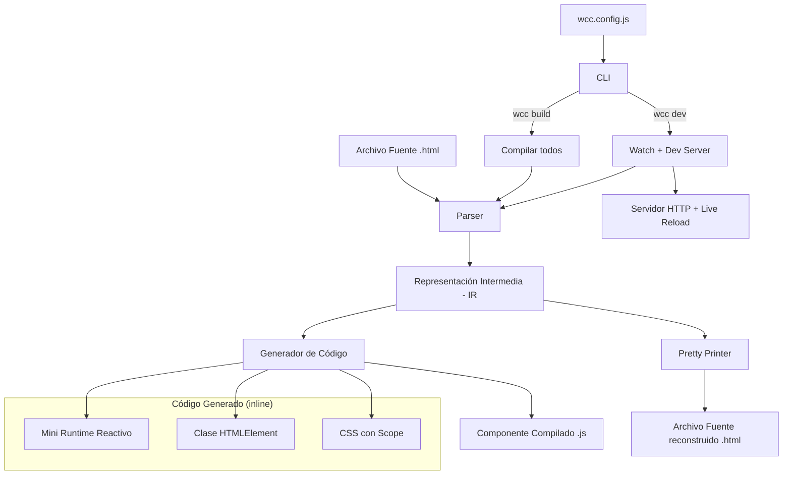
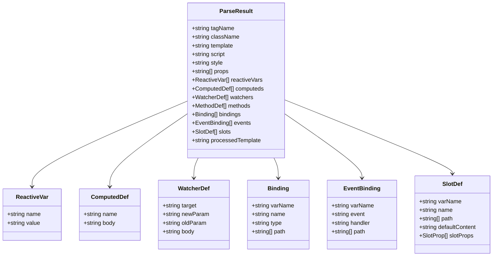

# Documento de Diseño — wcCompiler (spr-compiler-library)

## Resumen

wcCompiler es una librería npm que compila archivos `.html` con sintaxis declarativa (bloques `<template>`, `<script>`, `<style>`) a web components 100% nativos sin dependencias externas. El compilador usa jsdom para parsear templates, genera referencias DOM por rutas `childNodes[n]` (sin IDs), aplica CSS con scope usando el tag name del componente como prefijo, y produce archivos `.js` completamente autocontenidos.

La restricción fundamental del diseño es que el output compilado debe tener **cero imports y cero dependencias externas**. Esto significa que el sistema de reactividad (signals, computeds, effects) debe ser inlineado como parte del código generado, no importado de una librería externa como `alien-signals`.

El CLI expone dos comandos: `wcc build` (compilación única) y `wcc dev` (watch + servidor local con live-reload). La configuración se gestiona mediante `wcc.config.js`.

## Arquitectura



### Decisión Clave: Reactividad Inline

El prototipo actual importa `signal`, `computed` y `effect` de `alien-signals` vía CDN. Esto viola el requisito de output autocontenido (Requisito 13). La solución es que el Generador de Código inline un **mini runtime reactivo** (~40 líneas) al inicio de cada componente compilado. Este runtime implementa:

- `__signal(initialValue)`: retorna una función getter/setter. Sin argumentos lee, con argumento escribe y notifica.
- `__computed(fn)`: retorna una función getter que cachea el resultado y se invalida cuando sus dependencias cambian.
- `__effect(fn)`: ejecuta `fn` inmediatamente y la re-ejecuta cuando cualquier signal/computed leído dentro de ella cambie.

El tracking de dependencias usa un patrón de stack global: cuando un `effect` o `computed` se ejecuta, se registra como "listener activo" y cada `signal` leída durante esa ejecución se agrega a sus dependencias.

**Justificación**: Inline ~40 líneas por componente es aceptable porque:
1. Cada componente es un módulo ES independiente y autocontenido.
2. En proyectos con múltiples componentes, un paso de optimización futuro podría extraer el runtime a un módulo compartido, pero eso queda fuera del alcance actual.
3. El tamaño es mínimo (~1KB sin minificar) comparado con el código del componente.

## Componentes e Interfaces

### 1. Parser (`parser.js`)

Responsable de leer un archivo fuente `.html` y producir la Representación Intermedia.

```typescript
interface ParseResult {
  tagName: string;           // nombre del componente (ej: "wcc-button")
  className: string;         // PascalCase (ej: "WccButton")
  template: string;          // contenido del bloque <template>
  script: string;            // contenido del bloque <script>
  style: string;             // contenido del bloque <style>
  props: string[];           // nombres de props de defineProps
  reactiveVars: ReactiveVar[];
  computeds: ComputedDef[];
  watchers: WatcherDef[];
  methods: MethodDef[];
  bindings: Binding[];       // bindings de texto del tree walker
  events: EventBinding[];    // bindings de eventos del tree walker
  slots: SlotDef[];          // definiciones de slots
  processedTemplate: string; // HTML del template después del tree walking
}

interface ReactiveVar {
  name: string;
  value: string;  // valor literal como string
}

interface ComputedDef {
  name: string;
  body: string;   // cuerpo de la expresión
}

interface WatcherDef {
  target: string;
  newParam: string;
  oldParam: string;
  body: string;
}

interface MethodDef {
  name: string;
  params: string;
  body: string;
}

interface Binding {
  varName: string;       // identificador interno (ej: "__b0")
  name: string;          // nombre de la variable referenciada
  type: 'prop' | 'computed' | 'internal';
  path: string[];        // ruta childNodes[n] desde la raíz
}

interface EventBinding {
  varName: string;
  event: string;
  handler: string;
  path: string[];
}

interface SlotDef {
  varName: string;
  name: string;          // nombre del slot ("" para default)
  path: string[];
  defaultContent: string;
  slotProps: SlotProp[];
}

interface SlotProp {
  prop: string;
  source: string;
}
```

**Submódulos del Parser:**

- **Extractor de bloques**: Extrae `<template>`, `<script>`, `<style>` con regex.
- **Extractor de script**: Analiza el bloque `<script>` para extraer `defineProps`, variables reactivas, computeds, watchers y funciones.
- **Tree Walker**: Recorre el DOM (vía jsdom) para descubrir bindings, eventos y slots.

### 2. Generador de Código (`codegen.js`)

Toma un `ParseResult` y produce el string JavaScript del componente compilado.

```typescript
interface CodegenOptions {
  tagName: string;
  parseResult: ParseResult;
}

function generateComponent(options: CodegenOptions): string;
```

El output generado tiene esta estructura:

```javascript
// --- Mini Runtime Reactivo (inline) ---
const __signal = (v) => { /* ... */ };
const __computed = (fn) => { /* ... */ };
const __effect = (fn) => { /* ... */ };

// --- CSS con Scope ---
const __css = document.createElement('style');
__css.textContent = `wcc-button .class { ... }`;
document.head.appendChild(__css);

// --- Template ---
const __tpl = document.createElement('template');
__tpl.innerHTML = `...`;

// --- Clase del Componente ---
class WccButton extends HTMLElement {
  static get observedAttributes() { return [...]; }
  constructor() { /* signals, refs, slots */ }
  connectedCallback() { /* effects, events */ }
  attributeChangedCallback(name, old, val) { /* update signals */ }
  // getters/setters, _emit, métodos del usuario
}
customElements.define('wcc-button', WccButton);
```

### 3. Pretty Printer (`printer.js`)

Toma un `ParseResult` y lo formatea de vuelta a la sintaxis fuente `.html`.

```typescript
function prettyPrint(ir: ParseResult): string;
```

El Pretty Printer reconstruye:
- Bloque `<template>` con bindings `{{var}}`, atributos `@event="handler"` y elementos `<slot>`.
- Bloque `<script>` con `defineProps`, variables, computeds, watchers y funciones.
- Bloque `<style>` con el CSS original (sin scope).

### 4. CSS Scoper (`css-scoper.js`)

```typescript
function scopeCSS(css: string, tagName: string): string;
```

Prefija cada selector CSS con el tag name del componente. Preserva at-rules (`@media`, `@keyframes`) sin prefijar.

### 5. CLI (`cli.js`)

```typescript
interface WccConfig {
  port: number;    // default: 4100
  input: string;   // default: "src"
  output: string;  // default: "dist"
}
```

Comandos:
- `wcc build`: Lee config → compila todos los `.html` de `input/` → escribe `.js` en `output/`.
- `wcc dev`: Lo mismo que build + watch en `input/` + servidor HTTP con WebSocket para live-reload.

### 6. Servidor Dev (`dev-server.js`)

Servidor HTTP estático que sirve archivos del proyecto. Inyecta un snippet de WebSocket en las respuestas HTML para live-reload. Cuando detecta cambios en `output/`, envía un mensaje de recarga al navegador.

## Modelos de Datos

### Representación Intermedia (IR)

La IR es el modelo central que conecta Parser, Generador de Código y Pretty Printer:



### Mini Runtime Reactivo (Diseño del código inline)

El runtime inline que se inyecta en cada componente compilado:

```javascript
// Tracking global de dependencias
let __currentEffect = null;

function __signal(initial) {
  let _value = initial;
  const _subs = new Set();
  const accessor = (newVal) => {
    if (arguments.length === 0) {
      // Lectura: registrar dependencia
      if (__currentEffect) _subs.add(__currentEffect);
      return _value;
    }
    // Escritura: actualizar y notificar
    if (_value !== newVal) {
      _value = newVal;
      for (const fn of _subs) fn();
    }
  };
  // Usar un wrapper para manejar arguments correctamente
  return (...args) => {
    if (args.length === 0) {
      if (__currentEffect) _subs.add(__currentEffect);
      return _value;
    }
    const old = _value;
    _value = args[0];
    if (old !== _value) {
      for (const fn of [..._subs]) fn();
    }
  };
}

function __computed(fn) {
  let _cached, _dirty = true;
  const _subs = new Set();
  const recompute = () => { _dirty = true; for (const fn of [..._subs]) fn(); };
  return () => {
    if (__currentEffect) _subs.add(__currentEffect);
    if (_dirty) {
      const prev = __currentEffect;
      __currentEffect = recompute;
      _cached = fn();
      __currentEffect = prev;
      _dirty = false;
    }
    return _cached;
  };
}

function __effect(fn) {
  const run = () => {
    const prev = __currentEffect;
    __currentEffect = run;
    fn();
    __currentEffect = prev;
  };
  run();
}
```

### Configuración (`wcc.config.js`)

```javascript
// wcc.config.js (ejemplo del usuario)
export default {
  port: 4100,
  input: 'src',
  output: 'dist'
};
```

### Estructura de Archivos del Proyecto

```
wccompiler/
├── bin/
│   └── wcc.js              # Entry point del CLI
├── lib/
│   ├── parser.js            # Parser de archivos fuente
│   ├── codegen.js           # Generador de código
│   ├── printer.js           # Pretty printer
│   ├── css-scoper.js        # CSS scoping
│   ├── tree-walker.js       # Tree walking del template
│   ├── reactive-runtime.js  # Template string del mini runtime
│   ├── dev-server.js        # Servidor dev con live-reload
│   └── config.js            # Lectura y validación de wcc.config.js
├── package.json
└── README.md
```


## Propiedades de Correctitud

*Una propiedad es una característica o comportamiento que debe cumplirse en todas las ejecuciones válidas de un sistema — esencialmente, una declaración formal sobre lo que el sistema debe hacer. Las propiedades sirven como puente entre especificaciones legibles por humanos y garantías de correctitud verificables por máquinas.*

### Propiedad 1: Round-trip Parser ↔ Pretty Printer

*Para toda* Representación Intermedia (IR) válida, si se formatea con el Pretty Printer a HTML y luego se vuelve a parsear, la IR resultante SHALL ser equivalente a la original.

Es decir: `parse(prettyPrint(ir)) ≡ ir`

Esta es la propiedad más importante del sistema. Garantiza que el Parser y el Pretty Printer son inversos fieles, lo cual valida la fidelidad de ambos componentes simultáneamente.

**Valida: Requisitos 1.5, 14.2, 14.3**

### Propiedad 2: Extracción de bloques del archivo fuente

*Para todo* archivo fuente válido con contenido arbitrario en los bloques `<template>`, `<script>` y `<style>`, el Parser SHALL extraer cada bloque como una cadena independiente cuyo contenido coincida exactamente con el contenido original del bloque.

**Valida: Requisito 1.1**

### Propiedad 3: Extracción de props con detección de duplicados

*Para toda* lista de nombres de props válidos embebida en una llamada `defineProps([...])`, el Parser SHALL extraer exactamente esa lista. Además, *para toda* lista que contenga al menos un nombre duplicado, el Parser SHALL retornar un error que mencione los nombres duplicados.

**Valida: Requisitos 2.1, 2.3**

### Propiedad 4: Extracción de variables reactivas (solo raíz, excluyendo computed/watch)

*Para todo* bloque `<script>` que contenga declaraciones de variables a nivel raíz y dentro de ámbitos anidados (funciones, condicionales), el Parser SHALL extraer únicamente las declaraciones a nivel raíz. Además, las asignaciones que usen `computed(...)` o `watch(...)` SHALL ser excluidas de las variables reactivas.

**Valida: Requisitos 3.1, 3.2, 3.3**

### Propiedad 5: Extracción de propiedades computadas

*Para toda* declaración `const name = computed(() => expr)` en el bloque `<script>`, el Parser SHALL extraer el nombre y el cuerpo de la expresión correctamente.

**Valida: Requisito 4.1**

### Propiedad 6: Extracción de watchers

*Para toda* llamada `watch('target', (newParam, oldParam) => { body })` en el bloque `<script>`, el Parser SHALL extraer el target, los nombres de parámetros y el cuerpo de la función correctamente.

**Valida: Requisito 5.1**

### Propiedad 7: Tree walker — bindings de texto (incluyendo interpolaciones mixtas)

*Para todo* template que contenga nodos de texto con interpolaciones `{{var}}` (solas o mezcladas con texto estático), el Tree Walker SHALL registrar un binding para cada interpolación con la ruta de nodos correcta y el nombre de variable correcto. Cuando un nodo contiene múltiples interpolaciones, SHALL dividirlo en elementos `<span>` individuales.

**Valida: Requisitos 6.1, 6.2**

### Propiedad 8: Tree walker — bindings de eventos

*Para todo* template que contenga elementos con atributos `@event="handler"`, el Tree Walker SHALL registrar un binding de evento con el nombre del evento, el handler y la ruta correcta, y SHALL eliminar el atributo `@event` del template procesado.

**Valida: Requisito 6.3**

### Propiedad 9: Tree walker — descubrimiento y reemplazo de slots

*Para todo* template que contenga elementos `<slot>` (con nombre, por defecto, o con slotProps), el Tree Walker SHALL registrar cada slot con su nombre, ruta, contenido por defecto y slotProps, y SHALL reemplazar cada `<slot>` por un `<span data-slot="name">` en el template procesado.

**Valida: Requisitos 6.4, 6.5, 6.6**

### Propiedad 10: Codegen — estructura del componente

*Para toda* IR válida, el Generador de Código SHALL producir un archivo `.js` que contenga: una clase que extienda `HTMLElement`, un `customElements.define` con el tag name correcto, el nombre de clase en PascalCase derivado del tag name, un `observedAttributes` que retorne las props, y un `attributeChangedCallback` que actualice las signals correspondientes.

**Valida: Requisitos 7.1, 7.2, 7.3, 7.4, 7.5**

### Propiedad 11: Codegen — reactividad

*Para toda* IR válida con props, variables reactivas, computeds y bindings, el Generador de Código SHALL crear: una signal inicializada a `null` por cada prop, una signal con valor literal por cada variable reactiva, un computed con referencias transformadas por cada propiedad computada, un effect que actualice `textContent` por cada binding, y getters/setters públicos por cada prop.

**Valida: Requisitos 8.1, 8.2, 8.3, 8.4, 8.5**

### Propiedad 12: Codegen — watchers con tracking de valor previo

*Para toda* IR válida con watchers, el Generador de Código SHALL inicializar `__prev_{target}` como `undefined`, generar un effect que lea el valor actual, ejecute el cuerpo solo cuando el previo no sea `undefined`, y actualice el previo. Las referencias a variables en el cuerpo SHALL ser transformadas a llamadas de signal.

**Valida: Requisitos 9.1, 9.2, 9.3**

### Propiedad 13: Codegen — eventos y emit

*Para toda* IR válida con bindings de eventos, el Generador de Código SHALL generar `addEventListener` en `connectedCallback` para cada evento. Además, *para toda* llamada `emit(...)` en el script, SHALL ser transformada a `this._emit(...)` en el código generado.

**Valida: Requisitos 10.1, 10.3**

### Propiedad 14: Codegen — slots

*Para toda* IR válida con slots (con nombre, por defecto, o con slotProps), el Generador de Código SHALL generar código en el constructor que resuelva slots leyendo `childNodes`, inyecte contenido de slots con nombre, reemplace contenido de slots por defecto, y genere effects reactivos para slots con slotProps.

**Valida: Requisitos 11.1, 11.2, 11.4**

### Propiedad 15: CSS scoping preserva at-rules

*Para todo* bloque CSS con selectores regulares y at-rules (`@media`, `@keyframes`), la función de scoping SHALL prefijar cada selector regular con el tag name del componente y SHALL preservar las at-rules sin prefijar.

**Valida: Requisitos 12.1, 12.4**

### Propiedad 16: Output sin imports externos

*Para toda* IR válida, el Componente Compilado generado SHALL contener cero sentencias `import` y cero referencias a módulos externos. Toda la lógica de reactividad SHALL estar inline en el archivo generado.

**Valida: Requisito 13.1**

### Propiedad 17: Validación de configuración

*Para todo* archivo `wcc.config.js` con propiedades válidas (`port` numérico, `input` y `output` como strings no vacíos), el módulo de configuración SHALL extraer los valores correctamente. *Para todo* archivo con valores inválidos, SHALL retornar un error descriptivo indicando la propiedad y el problema.

**Valida: Requisitos 17.1, 17.3**

### Propiedad 18: Pretty Printer produce fuente válida

*Para toda* IR válida, el Pretty Printer SHALL producir un string que contenga bloques `<template>`, `<script>` y `<style>` bien formados y parseables.

**Valida: Requisito 14.1**

## Manejo de Errores

### Errores del Parser

| Error | Causa | Mensaje |
|-------|-------|---------|
| `MISSING_TEMPLATE` | Archivo fuente sin bloque `<template>` | `"Error en '{archivo}': el bloque <template> es obligatorio"` |
| `DUPLICATE_PROPS` | Props duplicados en `defineProps` | `"Error en '{archivo}': props duplicados: {nombres}"` |
| `INVALID_SYNTAX` | Sintaxis no reconocida en `<script>` | `"Error en '{archivo}': sintaxis no válida en <script>: {detalle}"` |

### Errores del CLI

| Error | Causa | Mensaje |
|-------|-------|---------|
| `INVALID_CONFIG` | Valor inválido en `wcc.config.js` | `"Error en wcc.config.js: la propiedad '{prop}' {problema}"` |
| `COMPILE_ERROR` | Fallo al compilar un archivo | `"Error compilando '{archivo}': {mensaje}"` |
| `NO_INPUT_DIR` | Carpeta de entrada no existe | `"Error: la carpeta de entrada '{path}' no existe"` |

### Estrategia General

- Los errores de compilación de archivos individuales NO detienen el proceso completo (`wcc build` continúa con los demás archivos).
- Los errores de configuración SÍ detienen la ejecución inmediatamente.
- Todos los errores se reportan a `stderr` con el nombre del archivo y un mensaje descriptivo.
- El CLI retorna código de salida `1` si hubo al menos un error, `0` si todo fue exitoso.

## Estrategia de Testing

### Enfoque Dual

El proyecto usa un enfoque dual de testing:

1. **Tests unitarios (example-based)**: Para escenarios específicos, edge cases y condiciones de error.
2. **Tests de propiedades (property-based)**: Para verificar propiedades universales con inputs generados aleatoriamente.

### Librería de Property-Based Testing

Se usará **fast-check** (`fc`) como librería de PBT para Node.js. Es la librería más madura del ecosistema JavaScript para property-based testing.

### Configuración de PBT

- Mínimo **100 iteraciones** por test de propiedad.
- Cada test de propiedad debe referenciar su propiedad del documento de diseño.
- Formato de tag: `Feature: spr-compiler-library, Property {N}: {título}`

### Tests Unitarios (Example-Based)

Cubren los criterios clasificados como EXAMPLE, EDGE_CASE y SMOKE:

- **Parser**: Archivo sin `<template>` (1.2), sin `<script>` (1.3), sin `<style>` (1.4), sin `defineProps` (2.2).
- **Codegen**: Método `_emit` genera CustomEvent correcto (10.2), CSS injection presente/ausente (12.2, 12.3), slot por defecto (11.3).
- **CLI**: Carpeta de salida creada automáticamente (15.3), reporte de conteo (15.4), defaults de config (17.2).
- **Packaging**: Campo `bin` en package.json (18.1), jsdom en dependencies (18.3).

### Tests de Integración

Cubren los criterios clasificados como INTEGRATION:

- **CLI build**: Compilación de múltiples archivos con errores parciales (15.1, 15.2).
- **CLI dev**: Compilación inicial, watch, recompilación (16.1, 16.2).
- **Dev Server**: Servidor HTTP en puerto configurado (16.3), live-reload vía WebSocket (16.4).
- **Browser**: Componente compilado funciona en navegador (13.2).

### Tests de Propiedades

Cada propiedad del documento de diseño (P1-P18) se implementa como un test de propiedad con fast-check:

- **P1 (Round-trip)**: Generador de IRs válidas → `print` → `parse` → comparar con original.
- **P2 (Bloques)**: Generador de contenido HTML → `parse` → verificar extracción.
- **P3 (Props)**: Generador de listas de props → verificar extracción y detección de duplicados.
- **P4 (Vars reactivas)**: Generador de scripts con vars a distintos niveles → verificar filtrado.
- **P5 (Computeds)**: Generador de declaraciones computed → verificar extracción.
- **P6 (Watchers)**: Generador de declaraciones watch → verificar extracción.
- **P7 (Bindings texto)**: Generador de templates con interpolaciones → verificar bindings.
- **P8 (Bindings eventos)**: Generador de templates con @event → verificar bindings y remoción.
- **P9 (Slots)**: Generador de templates con slots → verificar descubrimiento y reemplazo.
- **P10 (Estructura)**: Generador de IRs → codegen → verificar estructura de clase.
- **P11 (Reactividad)**: Generador de IRs con props/vars/computeds → codegen → verificar signals/effects.
- **P12 (Watchers codegen)**: Generador de IRs con watchers → codegen → verificar effects con prev.
- **P13 (Eventos codegen)**: Generador de IRs con eventos → codegen → verificar addEventListener y emit.
- **P14 (Slots codegen)**: Generador de IRs con slots → codegen → verificar resolución de slots.
- **P15 (CSS scoping)**: Generador de CSS con selectores y at-rules → verificar prefijado.
- **P16 (Zero imports)**: Generador de IRs → compilación completa → verificar cero imports.
- **P17 (Config)**: Generador de configs válidas/inválidas → verificar lectura y validación.
- **P18 (Pretty Printer)**: Generador de IRs → print → verificar estructura HTML válida.
