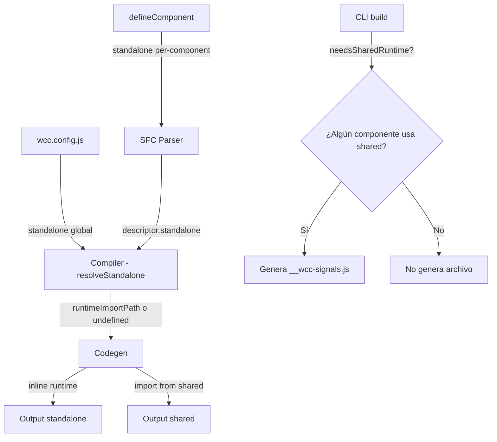

# Documento de Diseño: standalone-mode

## Resumen

Esta feature agrega una opción `standalone` al pipeline de compilación de wcCompiler que controla si el runtime reactivo se inlinea en cada componente (autocontenido) o se importa desde un módulo compartido (`__wcc-signals.js`).

La infraestructura base ya existe en `lib/codegen.js`: cuando `options.runtimeImportPath` está definido, genera un `import`; cuando no, inlinea el runtime. Lo que falta es el "plumbing" de la opción desde el usuario hasta el codegen:

1. **SFC Parser** → extraer `standalone` de `defineComponent()`
2. **Config Loader** → soportar `standalone` en `wcc.config.js`
3. **Compiler** → resolver la precedencia (componente > global) y mapear a `runtimeImportPath`
4. **CLI** → generar `__wcc-signals.js` solo cuando es necesario

**Decisión clave**: `standalone: false` es el default porque el caso común en proyectos con múltiples componentes es compartir el runtime para reducir tamaño total.

## Arquitectura



### Flujo de datos

1. El CLI carga `wcc.config.js` → obtiene `config.standalone` (default: `false`)
2. Para cada componente `.wcc`:
   - El SFC Parser extrae `descriptor.standalone` (puede ser `true`, `false`, o `undefined`)
   - El Compiler resuelve: `component.standalone ?? config.standalone` → valor final
   - Si final es `true` → pasa `runtimeImportPath: undefined` al Codegen
   - Si final es `false` → calcula la ruta relativa a `__wcc-signals.js` y la pasa como `runtimeImportPath`
3. El CLI determina si al menos un componente resolvió `standalone: false` → genera `__wcc-signals.js`

## Componentes e Interfaces

### 1. SFC Parser (`lib/sfc-parser.js`)

**Cambios**: Extraer la propiedad `standalone` del body de `defineComponent()`.

```typescript
// SFCDescriptor actualizado
interface SFCDescriptor {
  script: string;
  template: string;
  style: string;
  lang: 'ts' | 'js';
  tag: string;
  standalone: boolean | undefined; // NUEVO
}
```

**Lógica de extracción**:
- Regex sobre el body de `defineComponent({...})` para encontrar `standalone: true|false`
- Si no está presente → `undefined`
- Si el valor no es un literal booleano (`true`/`false`) → throw con código `INVALID_STANDALONE_OPTION`

**Función nueva** (interna):
```javascript
function extractStandaloneOption(body, fileName) → boolean | undefined
```

### 2. Config Loader (`lib/config.js`)

**Cambios**: Agregar `standalone` al typedef `WccConfig` y validarlo.

```typescript
interface WccConfig {
  port: number;
  input: string;
  output: string;
  standalone: boolean; // NUEVO — default: false
}
```

**Validación**: Si `standalone` está presente y no es booleano → throw con código `INVALID_CONFIG`.

### 3. Compiler (`lib/compiler.js`)

**Cambios**: Resolver la opción `standalone` y mapearla a `runtimeImportPath`.

**Función nueva** (exportada para testing):
```javascript
/**
 * Resuelve el valor final de standalone.
 * Componente tiene prioridad sobre global.
 */
export function resolveStandalone(componentValue, globalValue) → boolean
```

Reglas:
- Si `componentValue` es `true` o `false` → usar ese valor
- Si `componentValue` es `undefined` → usar `globalValue`

**Integración en `compileSFC`**:
- Después de parsear el SFC, obtener `descriptor.standalone`
- Llamar `resolveStandalone(descriptor.standalone, config.standalone)`
- Si resultado es `true` → `genOptions.runtimeImportPath = undefined`
- Si resultado es `false` → `genOptions.runtimeImportPath = <ruta calculada>`

El cálculo de la ruta se mueve del CLI al Compiler (o se pasa como parte del config).

### 4. CLI (`bin/wcc.js`)

**Cambios**:
- Compilar todos los componentes primero (o en dos pasadas)
- Determinar si algún componente necesita el runtime compartido
- Generar `__wcc-signals.js` solo si es necesario

**Estrategia**: El CLI pasa `config.standalone` y la ruta del output dir al compiler. El compiler retorna metadata indicando si el componente usó modo compartido. El CLI acumula esta info y decide si generar el archivo.

```javascript
// Retorno extendido del compiler
interface CompileResult {
  code: string;
  usesSharedRuntime: boolean;
}
```

Alternativa más simple: el CLI pre-calcula `needsSharedRuntime` basándose en el config global y luego ajusta por componente. Dado que el CLI ya tiene acceso al SFC parser, puede hacer una pasada rápida para detectar overrides.

**Decisión**: Usar la estrategia simple — siempre generar `__wcc-signals.js` si `config.standalone === false`, y solo omitirlo si `config.standalone === true` Y ningún componente hace override a `false`. Para esto, el compile retorna `{ code, usesSharedRuntime }`.

## Modelos de Datos

### SFCDescriptor (actualizado)

| Campo | Tipo | Descripción |
|-------|------|-------------|
| script | string | Contenido del bloque `<script>` |
| template | string | Contenido del bloque `<template>` |
| style | string | Contenido del bloque `<style>` |
| lang | 'ts' \| 'js' | Lenguaje del script |
| tag | string | Tag name del componente |
| **standalone** | boolean \| undefined | **NUEVO** — opción standalone per-component |

### WccConfig (actualizado)

| Campo | Tipo | Default | Descripción |
|-------|------|---------|-------------|
| port | number | 4100 | Puerto del dev server |
| input | string | 'src' | Directorio fuente |
| output | string | 'dist' | Directorio de salida |
| **standalone** | boolean | false | **NUEVO** — modo standalone global |

### CompileResult (nuevo)

| Campo | Tipo | Descripción |
|-------|------|-------------|
| code | string | Código JavaScript generado |
| usesSharedRuntime | boolean | Si el componente importa del runtime compartido |

## Propiedades de Correctitud

*Una propiedad es una característica o comportamiento que debe mantenerse verdadero en todas las ejecuciones válidas de un sistema — esencialmente, una declaración formal sobre lo que el sistema debe hacer. Las propiedades sirven como puente entre especificaciones legibles por humanos y garantías de correctitud verificables por máquina.*

### Propiedad 1: Extracción round-trip de standalone en el parser

*Para cualquier* valor booleano de `standalone` (`true` o `false`) incluido en `defineComponent()` de un SFC válido, el parser SHALL extraerlo correctamente y retornarlo en el descriptor con el mismo valor.

**Valida: Requisitos 1.1, 1.2**

### Propiedad 2: Rechazo de valores no-booleanos de standalone

*Para cualquier* valor no-booleano de `standalone` en `defineComponent()` (strings, números, objetos, arrays, null), el SFC Parser SHALL lanzar un error con código `INVALID_STANDALONE_OPTION`. Análogamente, *para cualquier* valor no-booleano de `standalone` en `wcc.config.js`, el Config Loader SHALL lanzar un error con código `INVALID_CONFIG`.

**Valida: Requisitos 1.4, 2.4**

### Propiedad 3: Resolución de precedencia standalone

*Para cualquier* combinación de valor standalone a nivel de componente (`true`, `false`, o `undefined`) y valor standalone global (`true` o `false`), la función de resolución SHALL retornar el valor del componente cuando está definido, o el valor global cuando el componente no lo especifica. Formalmente: `resolve(componentVal, globalVal) === (componentVal !== undefined ? componentVal : globalVal)`.

**Valida: Requisitos 3.1, 3.2, 3.3, 7.1**

### Propiedad 4: Modo standalone produce output autocontenido

*Para cualquier* componente `.wcc` válido compilado con standalone resuelto a `true`, el output generado SHALL contener las definiciones del runtime reactivo inline (`__signal`, `__effect`, etc.) y SHALL NOT contener ningún `import` de `__wcc-signals.js` u otro módulo de runtime.

**Valida: Requisitos 4.1, 4.2, 4.3**

### Propiedad 5: Modo compartido produce imports con tree-shaking

*Para cualquier* componente `.wcc` válido compilado con standalone resuelto a `false`, el output generado SHALL contener un `import { ... } from '<runtimePath>'` con exactamente las funciones de runtime utilizadas por el componente, y SHALL NOT contener las definiciones inline del runtime.

**Valida: Requisitos 5.1, 5.2, 5.3**

## Manejo de Errores

| Situación | Código de Error | Mensaje |
|-----------|----------------|---------|
| `standalone` en defineComponent no es booleano | `INVALID_STANDALONE_OPTION` | `Error en '<file>': standalone debe ser true o false` |
| `standalone` en wcc.config.js no es booleano | `INVALID_CONFIG` | `Error en wcc.config.js: standalone debe ser un booleano` |

Los errores siguen la convención existente del proyecto: objetos `Error` con propiedad `.code` para manejo programático.

## Estrategia de Testing

### Tests unitarios (vitest)

- **SFC Parser**: Tests para extracción de `standalone: true`, `standalone: false`, ausencia de standalone, y valores inválidos.
- **Config Loader**: Tests para carga con standalone presente, ausente, y valores inválidos.
- **resolveStandalone**: Tests para todas las combinaciones de precedencia.
- **Compiler integration**: Tests end-to-end que verifican que un componente con standalone: true produce output inline y standalone: false produce imports.

### Tests de propiedad (fast-check + vitest)

La librería de property-based testing es **fast-check** (ya instalada en el proyecto).

Configuración:
- Mínimo 100 iteraciones por test de propiedad
- Cada test referencia su propiedad del documento de diseño

Tests de propiedad a implementar:

1. **Feature: standalone-mode, Property 1**: Generar SFCs válidos con `standalone: true|false` aleatorio, verificar extracción correcta.
2. **Feature: standalone-mode, Property 2**: Generar valores no-booleanos aleatorios, verificar que el parser y config loader lanzan los errores correctos.
3. **Feature: standalone-mode, Property 3**: Generar todas las combinaciones de (componentStandalone, globalStandalone), verificar resolución correcta.
4. **Feature: standalone-mode, Property 4**: Generar componentes válidos, compilar con standalone: true, verificar output autocontenido.
5. **Feature: standalone-mode, Property 5**: Generar componentes válidos, compilar con standalone: false, verificar imports correctos sin runtime inline.

### Tests de integración (CLI)

- Build con `standalone: false` global → verificar que `__wcc-signals.js` se genera.
- Build con `standalone: true` global sin overrides → verificar que `__wcc-signals.js` NO se genera.
- Build con `standalone: true` global pero un componente con `standalone: false` → verificar que `__wcc-signals.js` se genera.
