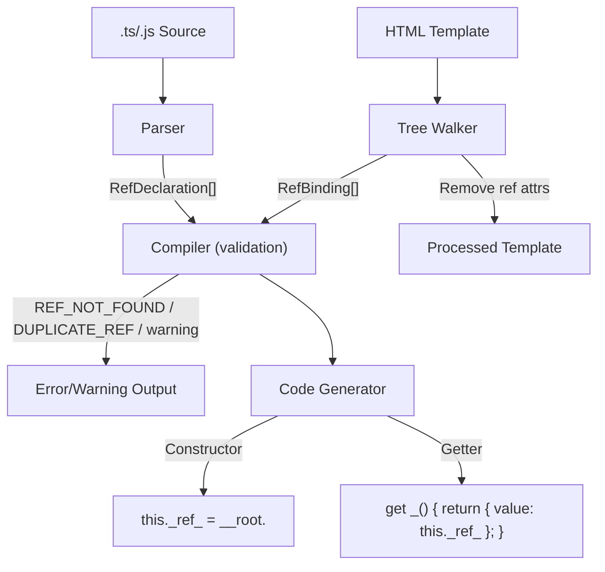

# Design Document — wcCompiler v2: template-refs

## Overview

Template refs (`templateRef`) extend the core compiler pipeline with direct DOM element references. The Parser detects `templateRef('name')` calls in the component source and extracts `RefDeclaration` metadata. The Tree Walker detects `ref="name"` attributes on template elements, records `RefBinding` metadata with the DOM path, and removes the `ref` attribute from the processed template. The Code Generator produces a `this._ref_<name>` assignment in the constructor (using the DOM path) and a getter property on the class that returns a `{ value: element }` object, providing the `ref.value` access pattern. The Compiler validates that all `templateRef` declarations have matching `ref` attributes in the template.

This feature reuses the v1 ref detection patterns from `lib/parser.js` and `lib/tree-walker.js`, and the ref codegen sections from `lib/codegen.js`.

### Key Design Decisions

1. **Getter-based access pattern** — Instead of storing a plain object, the code generator produces a getter method (`get _varName()`) that returns `{ value: this._ref_name }`. This provides the `ref.value` access pattern consistent with other frameworks while keeping the implementation simple.
2. **Constructor-time assignment** — Ref DOM references are assigned in the constructor during template cloning (before `appendChild` moves nodes). This ensures refs are available in `onMount`, effects, and methods without lifecycle timing issues.
3. **Attribute removal** — The `ref` attribute is removed from the processed template to keep the rendered DOM clean. It is a compile-time directive, not a runtime attribute.
4. **Validation at compile time** — Mismatched refs (`REF_NOT_FOUND`), duplicate refs (`DUPLICATE_REF`), and unused refs (warning) are all detected during compilation, not at runtime.
5. **Regex-based parsing** — The parser uses a targeted regex to extract `templateRef('name')` calls, consistent with the core parser approach for `signal()`, `computed()`, etc.

## Architecture

### Integration with Core Pipeline



### Data Flow

```
Source:
  const canvas = templateRef('canvas')
  const input = templateRef('input')

Template:
  <canvas ref="canvas"></canvas>
  <input ref="input" />

Parser:
  RefDeclarations: [
    { varName: 'canvas', refName: 'canvas' },
    { varName: 'input', refName: 'input' }
  ]

Tree Walker:
  RefBindings: [
    { refName: 'canvas', path: ['childNodes[0]'] },
    { refName: 'input', path: ['childNodes[1]'] }
  ]
  Processed template: <canvas></canvas><input />  (ref attrs removed)

Compiler Validation:
  ✓ All RefDeclarations have matching RefBindings
  ✓ No duplicate ref names

Code Generator:
  Constructor:
    this._ref_canvas = __root.childNodes[0];
    this._ref_input = __root.childNodes[1];

  Getter methods:
    get _canvas() { return { value: this._ref_canvas }; }
    get _input() { return { value: this._ref_input }; }

Usage in onMount/effects:
  // this._canvas.value === the <canvas> DOM element
  // this._input.value === the <input> DOM element
```

## Components and Interfaces

### 1. Parser Extensions (`lib/parser.js`)

The parser adds `templateRef` extraction alongside existing `signal`, `computed`, `effect` extraction.

**New extraction function:**

```js
/**
 * Extract templateRef('name') declarations from component source.
 *
 * @param {string} source — Stripped source code
 * @returns {RefDeclaration[]}
 */
function extractRefs(source) { ... }
```

**Regex pattern:**

```js
// templateRef declarations: const/let/var varName = templateRef('refName') or templateRef("refName")
/(?:const|let|var)\s+([$\w]+)\s*=\s*templateRef\(\s*['"]([^'"]+)['"]\s*\)/g
```

**Integration:** Called inside `parse()` after `extractSignals`, `extractComputeds`, etc. Results stored in `parseResult.refs`.

### 2. Tree Walker Extensions (`lib/tree-walker.js`)

The tree walker adds ref attribute detection during DOM traversal.

**New exported function:**

```js
/**
 * Detect ref="name" attributes on elements in the DOM tree.
 * Removes the ref attribute from each element after recording.
 *
 * @param {Element} rootEl — jsdom DOM element (parsed template root)
 * @returns {RefBinding[]}
 * @throws {Error} with code DUPLICATE_REF if same ref name appears on multiple elements
 */
export function detectRefs(rootEl) { ... }
```

**Detection algorithm:**

1. Use `rootEl.querySelectorAll('[ref]')` to find all elements with `ref` attribute at any depth
2. For each element:
   a. Get the `ref` attribute value (the ref name)
   b. Check for duplicates — if the ref name was already seen, throw `DUPLICATE_REF` error
   c. Compute the DOM path from `rootEl` to the element
   d. Remove the `ref` attribute from the element
   e. Record `{ refName, path }` in the result array
3. Return the array of RefBindings in document order

**Path computation:** Reuses the existing `computePath(rootEl, targetEl)` helper from the tree walker (same as used for bindings and events).

### 3. Code Generator Extensions (`lib/codegen.js`)

The code generator receives `refs` (RefDeclaration[]) and `refBindings` (RefBinding[]) from the ParseResult and generates two output sections.

**Constructor section** (per RefBinding with matching RefDeclaration):

```js
// DOM reference assignment (before appendChild)
this._ref_canvas = __root.childNodes[0];
this._ref_input = __root.childNodes[1];
```

**Getter methods** (per RefDeclaration):

```js
get _canvas() { return { value: this._ref_canvas }; }
get _input() { return { value: this._ref_input }; }
```

**Method body transformation:**

The existing `transformMethodBody` function is extended to rewrite `varName.value` references in user methods and effects:
- `canvas.value` → `this._canvas.value` (which invokes the getter)

Since the getter returns `{ value: this._ref_canvas }`, accessing `this._canvas.value` resolves to the DOM element.

### 4. Compiler Pipeline Update (`lib/compiler.js`)

After `walkTree()` and `detectRefs()`, the compiler performs validation:

```js
// After walkTree and detectRefs:
const refBindings = detectRefs(rootEl);
const refs = parseResult.refs; // from parser

// Validation: REF_NOT_FOUND
for (const decl of refs) {
  if (!refBindings.find(b => b.refName === decl.refName)) {
    throw Object.assign(new Error(`templateRef('${decl.refName}') has no matching ref="${decl.refName}" in template`), { code: 'REF_NOT_FOUND' });
  }
}

// Validation: Unused ref warning
for (const binding of refBindings) {
  if (!refs.find(d => d.refName === binding.refName)) {
    console.warn(`Warning: ref="${binding.refName}" in template has no matching templateRef('${binding.refName}') in script`);
  }
}

// Merge into ParseResult
parseResult.refBindings = refBindings;
```

Note: `DUPLICATE_REF` is detected inside `detectRefs()` during tree walking.

## Data Models

### RefDeclaration

```js
/**
 * @typedef {Object} RefDeclaration
 * @property {string} varName  — Variable name from script (e.g., 'canvas')
 * @property {string} refName  — Ref name from templateRef argument (e.g., 'canvas')
 */
```

### RefBinding

```js
/**
 * @typedef {Object} RefBinding
 * @property {string} refName  — Ref name from ref attribute (e.g., 'canvas')
 * @property {string[]} path   — DOM path from root to the element (e.g., ['childNodes[0]'])
 */
```

### Extended ParseResult

```js
/**
 * @property {RefDeclaration[]} refs        — templateRef declarations from script
 * @property {RefBinding[]} refBindings     — ref attribute bindings from template
 */
```

### Error Codes

```js
/** @type {'REF_NOT_FOUND'} — templateRef('name') with no matching ref="name" in template */
/** @type {'DUPLICATE_REF'} — Multiple elements with the same ref="name" value */
```

## Correctness Properties

*A property is a characteristic or behavior that should hold true across all valid executions of a system — essentially, a formal statement about what the system should do. Properties serve as the bridge between human-readable specifications and machine-verifiable correctness guarantees.*

### Property 1: Parser templateRef Round-Trip

*For any* component source containing one or more `templateRef('name')` declarations with valid variable names and ref names, the Parser SHALL extract all RefDeclarations with the correct variable name and ref name, preserving source order.

**Validates: Requirements 1.1, 1.2, 1.3, 1.4**

### Property 2: Tree Walker ref Detection and Removal

*For any* HTML template containing one or more `ref="name"` attributes at various nesting depths, the Tree Walker SHALL record a RefBinding for each with the correct ref name and a valid DOM path, AND the processed template SHALL contain zero `ref` attributes.

**Validates: Requirements 2.1, 2.2, 2.3, 2.4**

### Property 3: Codegen Constructor and Getter Structure

*For any* ParseResult containing matched RefDeclarations and RefBindings, the generated JavaScript SHALL contain: a `this._ref_<refName> = __root.<path>` assignment in the constructor for each RefBinding, and a `get _<varName>()` getter method returning `{ value: this._ref_<refName> }` for each RefDeclaration.

**Validates: Requirements 3.1, 3.2, 4.1, 4.2, 8.1**

### Property 4: Duplicate Ref Error

*For any* HTML template containing two or more elements with the same `ref` attribute value, the Tree Walker SHALL throw an error with code `DUPLICATE_REF`.

**Validates: Requirements 6.1**

### Property 5: Ref Not Found Error

*For any* component where a RefDeclaration references a ref name that has no matching RefBinding in the template, the Compiler SHALL throw an error with code `REF_NOT_FOUND`.

**Validates: Requirements 5.1**

## Error Handling

### Tree Walker Errors

| Error Code | Condition | Message Pattern |
|---|---|---|
| `DUPLICATE_REF` | Multiple elements with the same `ref` attribute value | `"Duplicate ref name '${refName}' — each ref must be unique"` |

### Compiler Errors

| Error Code | Condition | Message Pattern |
|---|---|---|
| `REF_NOT_FOUND` | `templateRef('name')` with no matching `ref="name"` in template | `"templateRef('${refName}') has no matching ref=\"${refName}\" in template"` |

### Compiler Warnings

| Condition | Message Pattern |
|---|---|
| `ref="name"` in template with no matching `templateRef('name')` in script | `"Warning: ref=\"${refName}\" in template has no matching templateRef('${refName}') in script"` |

### Error Propagation

Errors follow the same pattern as core: thrown with a `.code` property, propagated through the compiler pipeline, and formatted by the CLI for human-readable output.

## Testing Strategy

### Property-Based Testing (PBT)

The template-refs feature is well-suited for PBT because the parser, tree-walker, and codegen are pure functions with clear input/output behavior, and the properties hold across a wide input space (arbitrary ref names, variable names, nesting depths, element types).

**Library**: `fast-check`
**Configuration**: Minimum 100 iterations per property test
**Tag format**: `Feature: template-refs, Property {number}: {property_text}`

### Test Organization

| Module | Property Tests | Unit Tests |
|---|---|---|
| `lib/parser.js` | templateRef extraction (Property 1) | Single/double quotes, let/var declarations |
| `lib/tree-walker.js` | ref detection + removal (Property 2), Duplicate ref (Property 4) | Deeply nested refs, refs alongside other directives |
| `lib/codegen.js` | Constructor + getter structure (Property 3) | Ref assignment ordering, getter return shape |
| `lib/compiler.js` | REF_NOT_FOUND (Property 5) | Unused ref warning, end-to-end integration |

### Dual Testing Approach

- **Property tests** verify universal correctness across generated inputs (ref names, variable names, template structures, nesting depths)
- **Unit tests** cover specific examples, edge cases, error conditions, and integration points
