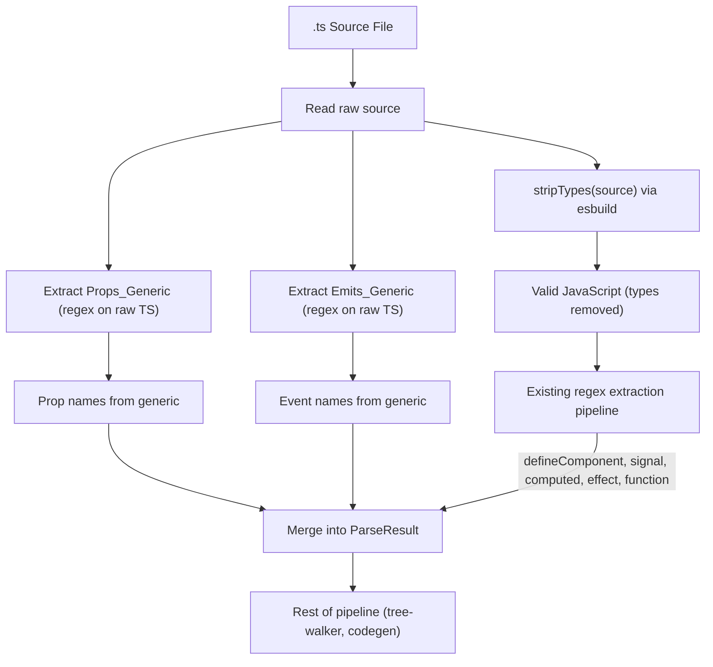

# Design Document — wcCompiler v2: TypeScript Support

## Overview

TypeScript support enables component authors to write `.ts` source files with full type annotations, generics, interfaces, type imports, enums, type assertions, `as const`, `satisfies`, decorators, and module augmentation. The compiler uses esbuild's `transform()` API to strip all type annotations before regex-based parsing, producing valid JavaScript that the existing pipeline processes unchanged.

The critical addition is PRE-STRIP extraction of type information from `defineProps<T>()` and `defineEmits<T>()` generics. After esbuild strips types, the generic type parameters are lost — so the parser must extract prop names and event names from the raw TypeScript source BEFORE calling `stripTypes()`.

### Key Design Decisions

1. **esbuild for type stripping** — esbuild's `transform()` with `loader: 'ts'` is extremely fast (~1ms per file) and handles all TypeScript syntax including enums, decorators, `satisfies`, and `as const`. No need for the full TypeScript compiler.
2. **Pre-strip generic extraction** — `defineProps<{ label: string }>()` and `defineEmits<{ (e: 'change'): void }>()` generics are parsed with targeted regex BEFORE type stripping. This is the only TypeScript-aware step in the parser.
3. **No source maps** — Consistent with the zero-runtime philosophy. Output is simple enough to debug directly.
4. **Transparent .js handling** — esbuild handles plain JavaScript transparently, so `.js` files go through the same pipeline without special-casing.
5. **Round-trip via JavaScript** — The pretty-printer emits JavaScript (post-strip) format. TypeScript type information is not preserved in the IR — only the extracted prop/event names survive.
6. **Enum transformation** — esbuild transforms TypeScript enums to runtime JavaScript objects (IIFEs). These pass through the parser as regular code since they don't match any extraction regex.

## Architecture

### Integration with Core Pipeline



### Parser Flow (Updated)

```
1. Read raw .ts/.js source
2. PRE-STRIP: Extract defineProps<T>() generic → prop names
3. PRE-STRIP: Extract defineEmits<T>() generic → event names
4. STRIP: esbuild.transform(source, { loader: 'ts' }) → JavaScript
5. POST-STRIP: stripMacroImport(js) → remove wcc imports
6. POST-STRIP: extractDefineComponent(js) → tag, template, styles
7. POST-STRIP: extractSignals(js) → signals
8. POST-STRIP: extractComputeds(js) → computeds
9. POST-STRIP: extractEffects(js) → effects
10. POST-STRIP: extractFunctions(js) → methods
11. POST-STRIP: extractOnMountHooks(js) → mount hooks
12. POST-STRIP: extractOnDestroyHooks(js) → destroy hooks
13. Merge pre-strip prop/event names into ParseResult
14. Resolve template and styles files
15. Return ParseResult
```

## Components and Interfaces

### 1. Parser Extensions (`lib/parser.js`)

The parser adds two pre-strip extraction functions and updates the `parse()` flow.

**New internal functions:**

| Function | Signature | Purpose |
|---|---|---|
| `extractPropsGeneric(rawSource)` | `(string) → string[] \| null` | Extract prop names from `defineProps<{ name: type, ... }>()` generic |
| `extractEmitsGeneric(rawSource)` | `(string) → string[] \| null` | Extract event names from `defineEmits<{ (e: 'name', ...): void }>()` generic |

**Updated function:**

| Function | Signature | Change |
|---|---|---|
| `stripTypes(source)` | `(string) → Promise<string>` | Already exists in core. Ensure `sourcemap: false` is set. |
| `parse(filePath)` | `(string) → Promise<ParseResult>` | Add pre-strip extraction calls before `stripTypes()` |

**`extractPropsGeneric` implementation:**

```js
/**
 * Extract prop names from defineProps<{ name: type, ... }>() generic.
 * Must be called on raw TypeScript source BEFORE type stripping.
 *
 * @param {string} rawSource — Raw TypeScript source
 * @returns {string[] | null} Array of prop names, or null if no generic found
 */
function extractPropsGeneric(rawSource) {
  // Match defineProps<{ ... }>
  const match = rawSource.match(/defineProps\s*<\s*\{([^}]*)\}\s*>/);
  if (!match) return null;

  const body = match[1];
  // Extract property names: "label: string" → "label", "count?: number" → "count"
  const propNames = [];
  const propRegex = /(\w+)\s*\??:/g;
  let m;
  while ((m = propRegex.exec(body)) !== null) {
    propNames.push(m[1]);
  }
  return propNames.length > 0 ? propNames : null;
}
```

**`extractEmitsGeneric` implementation:**

```js
/**
 * Extract event names from defineEmits<{ (e: 'name', ...): void }>() generic.
 * Must be called on raw TypeScript source BEFORE type stripping.
 *
 * @param {string} rawSource — Raw TypeScript source
 * @returns {string[] | null} Array of event names, or null if no generic found
 */
function extractEmitsGeneric(rawSource) {
  // Match defineEmits<{ ... }>
  const match = rawSource.match(/defineEmits\s*<\s*\{([\s\S]*?)\}\s*>/);
  if (!match) return null;

  const body = match[1];
  // Extract event names from call signatures: (e: 'eventName', ...) → 'eventName'
  const eventNames = [];
  const eventRegex = /\(\s*e\s*:\s*['"](\w+)['"]/g;
  let m;
  while ((m = eventRegex.exec(body)) !== null) {
    eventNames.push(m[1]);
  }
  return eventNames.length > 0 ? eventNames : null;
}
```

**Updated `stripTypes` (ensure no source maps):**

```js
/**
 * Strip TypeScript type annotations via esbuild.
 *
 * @param {string} tsCode — TypeScript source code
 * @returns {Promise<string>} JavaScript with types removed
 * @throws {Error} with code TS_SYNTAX_ERROR on syntax errors
 */
async function stripTypes(tsCode) {
  try {
    const result = await esbuild.transform(tsCode, {
      loader: 'ts',
      sourcemap: false,
    });
    return result.code;
  } catch (err) {
    const error = new Error(`TypeScript syntax error: ${err.message}`);
    error.code = 'TS_SYNTAX_ERROR';
    throw error;
  }
}
```

**Updated `parse()` flow:**

```js
export async function parse(filePath) {
  const rawSource = await fs.readFile(filePath, 'utf-8');

  // PRE-STRIP: Extract generic type info before esbuild removes it
  const propsFromGeneric = extractPropsGeneric(rawSource);
  const emitsFromGeneric = extractEmitsGeneric(rawSource);

  // STRIP: Remove all TypeScript type annotations
  const jsSource = await stripTypes(rawSource);

  // POST-STRIP: Standard regex extraction on clean JavaScript
  const strippedSource = stripMacroImport(jsSource);
  const { tag, template, styles } = extractDefineComponent(strippedSource);
  const signals = extractSignals(strippedSource);
  const computeds = extractComputeds(strippedSource);
  const effects = extractEffects(strippedSource);
  const methods = extractFunctions(strippedSource);
  // ... other extractions (props from runtime, emits, hooks, etc.)

  // Merge: generic-extracted props take priority over runtime-extracted props
  const propNames = propsFromGeneric ?? propsFromRuntime;
  const eventNames = emitsFromGeneric ?? emitsFromRuntime;

  // ... resolve template, styles, build ParseResult
}
```

### 2. Config Loader (`lib/config.js`)

Already handles `*.{ts,js}` globs in core spec. This spec confirms the exclusion patterns.

**Glob patterns:**

```js
const sourceGlob = `${config.input}/**/*.{ts,js}`;
const excludePatterns = ['**/*.test.*', '**/*.d.ts'];
```

### 3. Pretty Printer (`lib/printer.js`)

The pretty-printer emits JavaScript format (post-strip). When props came from a generic, it emits them as a runtime `defineProps({...})` call since the generic type is not preserved in the IR.

**Updated behavior:**

```js
// When props exist (regardless of source — generic or runtime):
// Emit as: const props = defineProps({ label: undefined, count: undefined })
// The undefined values indicate "no default" — the prop name is what matters

function printDefineProps(propNames, defaults) {
  if (!propNames || propNames.length === 0) return '';
  const entries = propNames.map(name => {
    const defaultVal = defaults?.[name] ?? 'undefined';
    return `  ${name}: ${defaultVal}`;
  });
  return `const props = defineProps({\n${entries.join(',\n')}\n})`;
}
```

## Data Models

### No New Data Structures

TypeScript support is transparent to the IR. After type stripping, the existing ParseResult works unchanged. The only additions are:

1. **Pre-strip prop names** — merged into the existing `props` field of ParseResult
2. **Pre-strip event names** — merged into the existing `emits` field of ParseResult

### Error Codes

```js
/** @type {'TS_SYNTAX_ERROR'} — esbuild failed to parse TypeScript source */
/** @type {'TS_UNSUPPORTED_FEATURE'} — esbuild encountered unsupported TS feature */
```

## Correctness Properties

*A property is a characteristic or behavior that should hold true across all valid executions of a system — essentially, a formal statement about what the system should do. Properties serve as the bridge between human-readable specifications and machine-verifiable correctness guarantees.*

### Property 1: Type Stripping Produces Valid JavaScript

*For any* valid TypeScript source containing type annotations, interfaces, type aliases, generics, type assertions, `as const`, `satisfies`, and type-only imports, the Type_Stripper SHALL produce output that contains no TypeScript-specific syntax (no `:` type annotations, no `interface`, no `type` aliases, no angle-bracket generics on function calls, no `as Type`, no `satisfies Type`) and SHALL preserve all runtime expressions unchanged.

**Validates: Requirements 1.1, 1.2, 1.3, 1.5, 1.6, 1.7, 1.8, 2.1, 2.3, 2.4**

### Property 2: Type-Only Import Complete Removal

*For any* TypeScript source containing `import type { ... } from '...'` statements and `export type { ... }` statements, the Type_Stripper SHALL produce output that contains zero `import type` or `export type` statements. For inline type imports (`import { type Foo, Bar } from '...'`), only the non-type specifiers SHALL remain.

**Validates: Requirements 2.1, 2.2, 2.3, 2.4**

### Property 3: defineProps Generic Extraction

*For any* TypeScript source containing `defineProps<{ prop1: type1, prop2?: type2, ... }>()` with one or more properties in the generic, the Parser SHALL extract all property names (without `?` markers) BEFORE type stripping, and the resulting ParseResult SHALL contain those prop names.

**Validates: Requirements 3.1, 3.2, 3.3, 3.4, 3.6, 5.1**

### Property 4: defineEmits Generic Extraction

*For any* TypeScript source containing `defineEmits<{ (e: 'event1', ...): void; (e: 'event2', ...): void }>()` with one or more call signatures, the Parser SHALL extract all event names BEFORE type stripping, and the resulting ParseResult SHALL contain those event names.

**Validates: Requirements 4.1, 4.2, 4.4, 5.2**

### Property 5: Parser Round-Trip (TypeScript Sources)

*For any* valid TypeScript Component_Source containing `defineComponent()`, `signal()`, `computed()`, `effect()`, `function`, `defineProps<T>()`, and `defineEmits<T>()` declarations, parsing the source into an IR, printing the IR to JavaScript, and parsing the JavaScript output SHALL produce an equivalent IR (same tag, signals, computeds, effects, methods, prop names, event names).

**Validates: Requirements 10.1, 10.2, 10.3**

### Property 6: No Source Map in Output

*For any* TypeScript source processed by the Type_Stripper, the output SHALL NOT contain `//# sourceMappingURL` comments or any source map references.

**Validates: Requirements 11.1, 11.2**

### Property 7: Enum Transformation to Runtime Object

*For any* TypeScript source containing `enum` declarations, the Type_Stripper SHALL produce JavaScript that contains a runtime representation of the enum (an IIFE or object assignment) and SHALL NOT contain the `enum` keyword.

**Validates: Requirements 1.4**

### Property 8: TypeScript Syntax Error Reporting

*For any* source containing invalid TypeScript syntax (unclosed generics, malformed type annotations, invalid decorator placement), the Parser SHALL throw an error with code `TS_SYNTAX_ERROR` containing a descriptive message from esbuild.

**Validates: Requirements 9.1, 9.2**

## Error Handling

### Parser Errors

| Error Code | Condition | Message Pattern |
|---|---|---|
| `TS_SYNTAX_ERROR` | esbuild fails to parse TypeScript source | `"TypeScript syntax error: {esbuild_message}"` |
| `TS_UNSUPPORTED_FEATURE` | esbuild encounters unsupported TS feature | `"Unsupported TypeScript feature: {details}"` |

### Error Propagation

Errors follow the same pattern as core: thrown with a `.code` property during the parse phase, propagated through the compiler pipeline, and formatted by the CLI for human-readable output. TypeScript errors are detected early (before any regex extraction) since `stripTypes()` is called before the extraction pipeline.

### Graceful Degradation

- `.js` files pass through esbuild transparently (no error even without TS syntax)
- Missing generics on `defineProps`/`defineEmits` fall back to runtime extraction (core behavior)
- Decorators are handled by esbuild's default behavior (currently stripped)

## Testing Strategy

### Property-Based Testing (PBT)

TypeScript support is well-suited for PBT because the type stripping and generic extraction are pure functions with clear input/output behavior, and the properties hold across a wide input space (arbitrary type annotations, generic shapes, import patterns).

**Library**: `fast-check`
**Configuration**: Minimum 100 iterations per property test
**Tag format**: `Feature: typescript-support, Property {number}: {property_text}`

### Test Organization

| Module | Property Tests | Unit Tests |
|---|---|---|
| `lib/parser.js` | Type stripping (Property 1), Type-only imports (Property 2), Props generic (Property 3), Emits generic (Property 4), Round-trip (Property 5), No source maps (Property 6), Enum transformation (Property 7), Syntax errors (Property 8) | Decorator handling (7.1), module augmentation (8.1, 8.2), `as const` (1.6), `satisfies` (1.7), inline type imports (2.2), generic with defaults (3.4), no-generic fallback (3.5, 4.3) |

### Dual Testing Approach

- **Property tests** verify universal correctness across generated inputs (arbitrary TS type annotations, generic shapes, import patterns, enum declarations)
- **Unit tests** cover specific examples, edge cases, error conditions, and integration points (decorator edge cases, module augmentation, combined generic + defaults)

