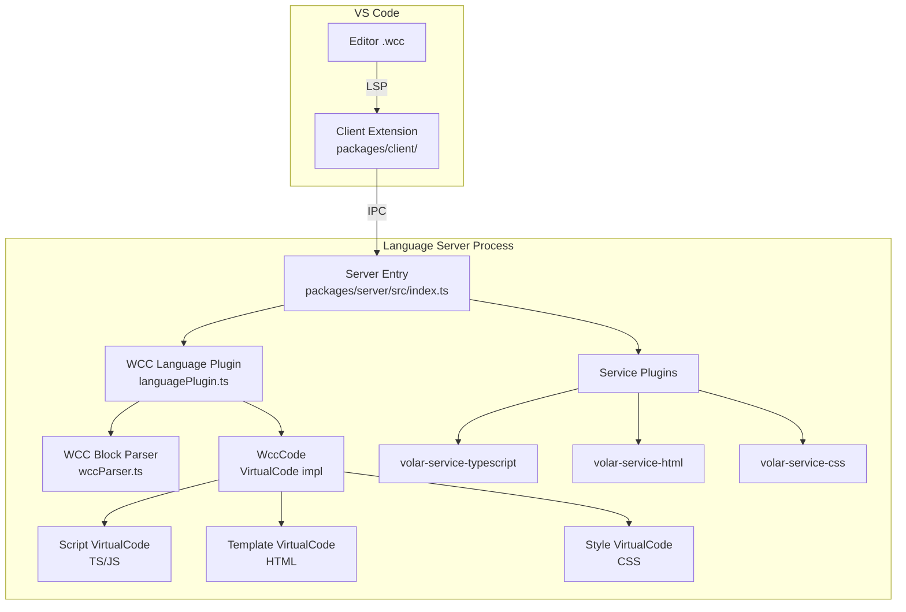
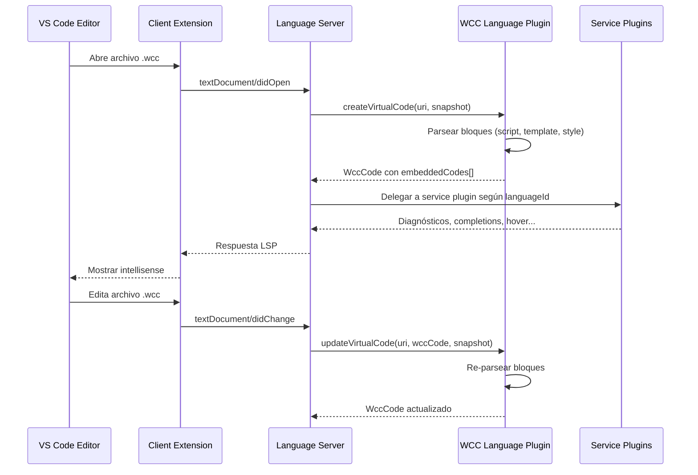

# Documento de Diseño — Volar Language Server para `.wcc`

## Visión General

Este documento describe el diseño técnico para integrar un Language Server basado en [Volar.js](https://volarjs.dev/) en la extensión VS Code existente (`vscode-wcc/`). El objetivo es proporcionar intellisense completo (tipos, hover, autocompletado, diagnósticos, go-to-definition) dentro de los bloques `<script>`, `<template>` y `<style>` de archivos `.wcc` Single File Component.

La arquitectura sigue el patrón recomendado por Volar.js: un monorepo con un paquete **cliente** (extensión VS Code) y un paquete **servidor** (Language Server). El servidor utiliza un **Language Plugin** personalizado que parsea archivos `.wcc`, extrae los bloques embebidos y genera objetos `VirtualCode` con mapeos de posición precisos. Los **Service Plugins** de primera parte de Volar (`volar-service-html`, `volar-service-css`, `volar-service-typescript`) proporcionan el intellisense real para cada lenguaje embebido.

### Decisiones de Diseño Clave

1. **Parser nuevo en lugar de reutilizar `lib/sfc-parser.js`**: El parser existente no rastrea offsets de posición de los bloques, que son críticos para los mapeos de Volar. Se implementará un parser ligero dentro del paquete servidor que extraiga posiciones (start/end) de cada bloque. Esto evita acoplar el servidor al compilador y mantiene la dependencia mínima.

2. **Monorepo con workspaces**: Se usa la estructura `packages/client/` + `packages/server/` dentro de `vscode-wcc/`, siguiendo la convención de Volar.js. El `package.json` raíz de `vscode-wcc/` define los workspaces.

3. **TypeScript para el servidor y cliente**: Ambos paquetes se escriben en TypeScript y se compilan a JavaScript. Esto permite usar los tipos de `@volar/language-core` y `@volar/language-server` directamente.

4. **Service Plugins de primera parte**: Se usan `volar-service-typescript`, `volar-service-html` y `volar-service-css` en lugar de implementaciones propias. Esto reduce el esfuerzo de mantenimiento y garantiza compatibilidad con las últimas versiones de cada lenguaje.

## Arquitectura

### Diagrama de Componentes



### Flujo de Datos



### Estructura del Monorepo

```
vscode-wcc/
├── package.json                    ← Raíz: workspaces, scripts de build
├── tsconfig.base.json              ← Config TS compartida
├── .vscode/
│   └── launch.json                 ← Task para debug de extensión
├── packages/
│   ├── client/                     ← Extensión VS Code
│   │   ├── package.json            ← Manifest de extensión (contributes, activationEvents)
│   │   ├── tsconfig.json
│   │   ├── src/
│   │   │   └── extension.ts        ← Punto de entrada: inicia LanguageClient
│   │   ├── syntaxes/
│   │   │   └── wcc.tmLanguage.json ← Gramática TextMate (existente)
│   │   ├── language-configuration.json ← Config de lenguaje (existente)
│   │   └── icons/                  ← Iconos (existentes)
│   │       ├── wcc-file.svg
│   │       └── wcc-icon.svg
│   └── server/                     ← Language Server
│       ├── package.json
│       ├── tsconfig.json
│       ├── bin/
│       │   └── server.js           ← Entry point del binario
│       └── src/
│           ├── index.ts            ← createServer + createConnection
│           ├── languagePlugin.ts   ← WCC Language Plugin (getLanguageId, create/updateVirtualCode)
│           └── wccParser.ts        ← Parser de bloques con posiciones
```

## Componentes e Interfaces

### 1. WCC Block Parser (`wccParser.ts`)

Parser ligero que extrae bloques de un archivo `.wcc` con sus posiciones exactas. No valida semántica (eso lo hace el compilador); solo localiza bloques para generar mapeos.

```typescript
/** Bloque extraído de un archivo .wcc */
export interface WccBlock {
  /** Tipo de bloque */
  type: 'script' | 'template' | 'style';
  /** Contenido interno del bloque (sin las etiquetas) */
  content: string;
  /** Offset del primer carácter del contenido en el archivo fuente */
  startOffset: number;
  /** Offset después del último carácter del contenido */
  endOffset: number;
  /** Atributos de la etiqueta de apertura (ej: 'lang="ts"') */
  attrs: string;
}

/** Resultado del parseo de un archivo .wcc */
export interface WccParseResult {
  script: WccBlock | null;
  template: WccBlock | null;
  style: WccBlock | null;
}

/**
 * Parsea un archivo .wcc y extrae los bloques con sus posiciones.
 * No lanza errores — bloques ausentes se representan como null.
 */
export function parseWccBlocks(source: string): WccParseResult;
```

**Decisión de diseño**: El parser no lanza errores por bloques faltantes. En un Language Server, el usuario puede estar escribiendo el archivo y aún no haber completado todos los bloques. El parser debe ser tolerante.

### 2. WCC Language Plugin (`languagePlugin.ts`)

Implementa la interfaz `LanguagePlugin<URI>` de `@volar/language-core`. Es el puente entre Volar y los archivos `.wcc`.

```typescript
import type { LanguagePlugin, VirtualCode } from '@volar/language-core';
import type { URI } from 'vscode-uri';
import type * as ts from 'typescript';

/** Language Plugin para archivos .wcc */
export const wccLanguagePlugin: LanguagePlugin<URI> = {
  getLanguageId(uri: URI): string | undefined;
  createVirtualCode(uri: URI, languageId: string, snapshot: ts.IScriptSnapshot): WccCode | undefined;
  updateVirtualCode(uri: URI, languageCode: WccCode, snapshot: ts.IScriptSnapshot): WccCode;
};
```

### 3. WccCode (VirtualCode Implementation)

Clase que implementa `VirtualCode` de Volar. Representa un archivo `.wcc` completo y contiene los `embeddedCodes` para cada bloque.

```typescript
export class WccCode implements VirtualCode {
  id = 'root';
  languageId = 'wcc';
  snapshot: ts.IScriptSnapshot;
  mappings: CodeMapping[];
  embeddedCodes: VirtualCode[];

  constructor(snapshot: ts.IScriptSnapshot);
  update(snapshot: ts.IScriptSnapshot): void;
}
```

Cada `embeddedCode` en `embeddedCodes[]` tiene:
- `id`: Identificador único (ej: `"script_0"`, `"template_0"`, `"style_0"`)
- `languageId`: `"typescript"` | `"javascript"` | `"html"` | `"css"`
- `snapshot`: Snapshot del contenido del bloque
- `mappings`: Array de `CodeMapping` que mapea posiciones del bloque virtual al archivo `.wcc` fuente

### 4. Client Extension (`extension.ts`)

Punto de entrada de la extensión VS Code. Crea y gestiona el `LanguageClient`.

```typescript
import * as serverProtocol from '@volar/language-server/protocol';
import { activateAutoInsertion, createLabsInfo } from '@volar/vscode';
import * as vscode from 'vscode';
import * as lsp from 'vscode-languageclient/node';

export async function activate(context: vscode.ExtensionContext): Promise<any>;
export function deactivate(): Thenable<any> | undefined;
```

**Responsabilidades**:
- Localizar el módulo del servidor (`../server/bin/server.js`)
- Configurar `ServerOptions` con transporte IPC
- Configurar `ClientOptions` con `documentSelector: [{ language: 'wcc' }]`
- Iniciar el `LanguageClient`
- Activar auto-inserción de etiquetas de cierre
- Detener el cliente al desactivar la extensión

### 5. Server Entry (`index.ts`)

Punto de entrada del Language Server. Configura la conexión, registra plugins y arranca el servidor.

```typescript
import { createServer, createConnection, createSimpleProject } from '@volar/language-server/node';
import { create as createTsService } from 'volar-service-typescript';
import { create as createHtmlService } from 'volar-service-html';
import { create as createCssService } from 'volar-service-css';
import { wccLanguagePlugin } from './languagePlugin';
```

**Responsabilidades**:
- Crear conexión LSP (`createConnection`)
- Crear servidor Volar (`createServer`)
- En `onInitialize`: registrar `wccLanguagePlugin` y los tres service plugins
- Manejar `onInitialized` y `onShutdown`

## Modelos de Datos

### CodeMapping (Mapeo de Posiciones)

El modelo central para la traducción de posiciones entre el archivo `.wcc` y los documentos virtuales. Volar usa `CodeMapping` de `@volar/language-core`:

```typescript
interface CodeMapping {
  /** Rango en el documento fuente (.wcc) */
  sourceOffsets: number[];
  /** Rango en el documento generado (virtual) */
  generatedOffsets: number[];
  /** Longitudes de cada segmento mapeado */
  lengths: number[];
  /** Datos adicionales sobre capacidades del mapeo */
  data: CodeInformation;
}
```

Para cada bloque `.wcc`, se crea un mapeo 1:1 donde:
- `sourceOffsets[0]` = offset del inicio del contenido del bloque en el archivo `.wcc`
- `generatedOffsets[0]` = `0` (inicio del documento virtual)
- `lengths[0]` = longitud del contenido del bloque

### WccBlock

```typescript
interface WccBlock {
  type: 'script' | 'template' | 'style';
  content: string;
  startOffset: number;  // Offset del primer carácter del contenido
  endOffset: number;    // Offset después del último carácter
  attrs: string;        // Atributos de la etiqueta (ej: ' lang="ts"')
}
```

### WccParseResult

```typescript
interface WccParseResult {
  script: WccBlock | null;
  template: WccBlock | null;
  style: WccBlock | null;
}
```

### Ejemplo de Mapeo

Para un archivo `.wcc`:
```
<script lang="ts">          ← offset 0
const x: number = 42;       ← offset 20 (contenido empieza aquí)
</script>                    ← offset 42 (contenido termina antes)

<template>                   ← offset 52
  <div>Hello</div>           ← offset 63 (contenido empieza aquí)
</template>                  ← offset 82

<style>                      ← offset 94
.foo { color: red; }         ← offset 102 (contenido empieza aquí)
</style>                     ← offset 123
```

Los mapeos serían:
- **Script VirtualCode**: `sourceOffsets: [20]`, `generatedOffsets: [0]`, `lengths: [22]`
- **Template VirtualCode**: `sourceOffsets: [63]`, `generatedOffsets: [0]`, `lengths: [19]`
- **Style VirtualCode**: `sourceOffsets: [102]`, `generatedOffsets: [0]`, `lengths: [21]`

Esto permite que cuando Volar reporta un error en la posición 5 del documento virtual de TypeScript, se traduzca a la posición 25 (20 + 5) en el archivo `.wcc` original.


## Propiedades de Correctitud

*Una propiedad es una característica o comportamiento que debe mantenerse verdadero en todas las ejecuciones válidas de un sistema — esencialmente, una declaración formal sobre lo que el sistema debe hacer. Las propiedades sirven como puente entre especificaciones legibles por humanos y garantías de correctitud verificables por máquina.*

### Propiedad 1: Asignación correcta de languageId

*Para cualquier* archivo `.wcc` válido que contenga bloques `<script>`, `<template>` y/o `<style>`, el Language Plugin SHALL generar un VirtualCode para cada bloque presente con el `languageId` correcto: `"typescript"` para `<script lang="ts">`, `"javascript"` para `<script>` o `<script lang="js">`, `"html"` para `<template>`, y `"css"` para `<style>`.

**Valida: Requisitos 2.1, 2.2, 2.3, 2.4**

### Propiedad 2: Round-trip de mapeo de posiciones

*Para cualquier* archivo `.wcc` y *para cualquier* posición (offset) dentro del contenido de un bloque, mapear esa posición del archivo fuente al documento virtual y luego de vuelta al archivo fuente SHALL producir la posición original. Es decir: `sourceToVirtual(virtualToSource(offset)) == offset` y `virtualToSource(sourceToVirtual(offset)) == offset`.

**Valida: Requisitos 2.5, 7.1, 7.2, 7.3, 7.4**

### Propiedad 3: Tolerancia a bloques ausentes

*Para cualquier* archivo `.wcc` que contenga cualquier subconjunto de bloques (solo script+template, solo template+style, solo template, etc.), el parser SHALL retornar `null` para los bloques ausentes sin lanzar errores, y SHALL generar VirtualCode únicamente para los bloques presentes.

**Valida: Requisito 2.6**

### Propiedad 4: Consistencia de actualización de contenido

*Para cualquier* archivo `.wcc` y *para cualquier* modificación de su contenido, después de llamar a `updateVirtualCode` con el nuevo snapshot, los objetos VirtualCode SHALL reflejar el contenido actualizado — es decir, el contenido de cada VirtualCode embebido SHALL coincidir exactamente con el contenido del bloque correspondiente en el nuevo archivo fuente.

**Valida: Requisito 2.7**

### Propiedad 5: Extracción correcta de contenido

*Para cualquier* archivo `.wcc` con bloques, el contenido de cada VirtualCode embebido SHALL ser exactamente igual al texto entre las etiquetas de apertura y cierre del bloque correspondiente en el archivo fuente. Es decir, si el archivo contiene `<script lang="ts">CONTENIDO</script>`, el snapshot del VirtualCode de script SHALL contener exactamente `CONTENIDO`.

**Valida: Requisitos 2.1, 2.2, 2.3, 2.4, 2.5**

## Manejo de Errores

### Parser de Bloques (`wccParser.ts`)

| Escenario | Comportamiento |
|---|---|
| Bloque `<script>` ausente | `script: null` en el resultado — sin error |
| Bloque `<template>` ausente | `template: null` en el resultado — sin error |
| Bloque `<style>` ausente | `style: null` en el resultado — sin error |
| Etiqueta de apertura sin cierre | Bloque ignorado (no se incluye en resultado) |
| Archivo vacío | Todos los bloques `null` — sin error |
| Contenido fuera de bloques | Ignorado por el parser (no es su responsabilidad validar) |

**Decisión**: El parser del Language Server es intencionalmente más permisivo que el parser del compilador (`lib/sfc-parser.js`). El compilador necesita validar estrictamente; el Language Server necesita funcionar mientras el usuario escribe código incompleto.

### Language Plugin

| Escenario | Comportamiento |
|---|---|
| `getLanguageId` recibe URI sin extensión `.wcc` | Retorna `undefined` — Volar ignora el archivo |
| `createVirtualCode` recibe `languageId` distinto de `"wcc"` | Retorna `undefined` |
| Snapshot vacío | Retorna `WccCode` con `embeddedCodes: []` |
| Error inesperado en el parser | Se captura y se retorna `WccCode` con `embeddedCodes: []` |

### Client Extension

| Escenario | Comportamiento |
|---|---|
| Servidor no encontrado en ruta esperada | `LanguageClient` falla al iniciar — VS Code muestra error en Output Channel |
| Servidor termina inesperadamente | `LanguageClient` detecta la desconexión y muestra mensaje de error al usuario |
| Desactivación de extensión | `client.stop()` envía shutdown al servidor y espera respuesta |

## Estrategia de Testing

### Enfoque Dual

La estrategia combina **tests unitarios** para ejemplos específicos y casos borde, con **tests basados en propiedades** (PBT) para verificar propiedades universales con entradas generadas.

### Tests Basados en Propiedades (PBT)

**Librería**: `fast-check` (ya presente como devDependency en el proyecto raíz)
**Framework**: `vitest` (ya configurado en el proyecto)
**Configuración**: Mínimo 100 iteraciones por propiedad

Cada test de propiedad debe:
- Ejecutar mínimo 100 iteraciones
- Referenciar la propiedad del documento de diseño
- Usar el formato de tag: `Feature: volar-language-server, Property {N}: {texto}`

#### Generadores Necesarios

1. **Generador de contenido de bloque**: Genera strings aleatorios que simulan contenido válido de script/template/style (evitando `</script>`, `</template>`, `</style>` dentro del contenido).
2. **Generador de archivos `.wcc`**: Combina bloques generados en un archivo `.wcc` completo con orden aleatorio y whitespace variable entre bloques.
3. **Generador de posiciones**: Dado un bloque, genera offsets aleatorios dentro del rango válido del contenido.

#### Tests de Propiedad a Implementar

| Propiedad | Descripción | Valida |
|---|---|---|
| P1 | Para cualquier .wcc, cada bloque genera VirtualCode con languageId correcto | Req 2.1-2.4 |
| P2 | Para cualquier posición en un bloque, round-trip de mapeo es identidad | Req 2.5, 7.1-7.4 |
| P3 | Para cualquier subconjunto de bloques, parser retorna null sin errores | Req 2.6 |
| P4 | Para cualquier modificación, updateVirtualCode refleja contenido nuevo | Req 2.7 |
| P5 | Para cualquier .wcc, contenido de VirtualCode = contenido entre etiquetas | Req 2.1-2.5 |

### Tests Unitarios (Ejemplos)

| Test | Descripción | Valida |
|---|---|---|
| U1 | Archivo .wcc con los tres bloques genera tres embeddedCodes | Req 2.1-2.4 |
| U2 | Archivo .wcc sin `<style>` genera dos embeddedCodes | Req 2.6 |
| U3 | `<script lang="ts">` produce languageId "typescript" | Req 2.1 |
| U4 | `<script>` sin lang produce languageId "javascript" | Req 2.2 |
| U5 | `<script lang="js">` produce languageId "javascript" | Req 2.2 |
| U6 | Archivo vacío produce embeddedCodes vacío | Edge case |
| U7 | Etiqueta sin cierre es ignorada | Edge case |

### Tests de Integración

Los tests de integración verifican el funcionamiento end-to-end del Language Server con VS Code. Estos tests requieren un entorno de extensión y no son candidatos para PBT.

| Test | Descripción | Valida |
|---|---|---|
| I1 | Abrir .wcc con error TS muestra diagnóstico en posición correcta | Req 3.1, 7.1 |
| I2 | Autocompletado TS funciona dentro de `<script>` | Req 3.2 |
| I3 | Hover muestra tipo en `<script lang="ts">` | Req 3.3 |
| I4 | Go-to-definition funciona en `<script>` | Req 3.4 |
| I5 | Autocompletado HTML funciona dentro de `<template>` | Req 4.1, 4.2 |
| I6 | Autocompletado CSS funciona dentro de `<style>` | Req 5.1, 5.2 |
| I7 | Servidor se inicia al abrir archivo .wcc | Req 6.1 |
| I8 | Servidor se detiene al cerrar VS Code | Req 6.4 |

### Tests de Smoke

| Test | Descripción | Valida |
|---|---|---|
| S1 | Estructura de monorepo tiene packages/client/ y packages/server/ | Req 1.1 |
| S2 | Archivos existentes (TextMate, icons, language-config) están en packages/client/ | Req 1.2, 8.1-8.3 |
| S3 | Root package.json define workspaces | Req 1.3 |
| S4 | Build compila ambos paquetes sin errores | Req 1.4 |
