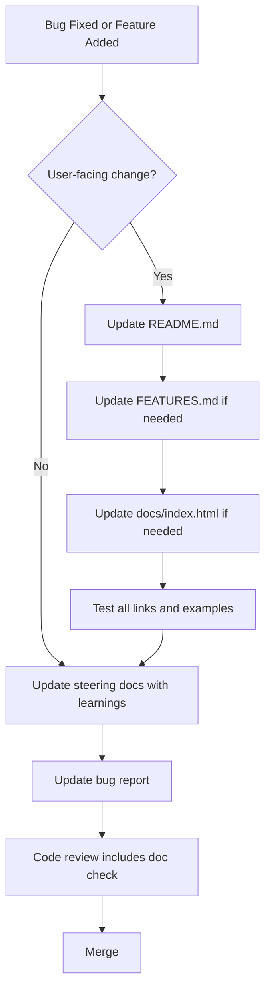

# Development Workflow & Bug Fixing Process

## Overview

This document outlines the development workflow for wcCompiler, including how to set up the environment, run tests, debug issues, and follow the bug fixing process.

## Environment Setup

### Prerequisites
- Node.js 18+ 
- Yarn (Classic or Berry)
- Git

### Initial Setup
```bash
cd c:\projects\sprlab-wccompiler
yarn install
```

### Verify Installation
```bash
yarn test          # Should pass all 431 tests
yarn typecheck     # Should have no TypeScript errors
```

---

## Project Structure for Development

```
sprlab-wccompiler/
├── lib/                    # Core compiler code
│   ├── sfc-parser.js       # SFC parsing
│   ├── parser-extractors.js # AST extraction
│   ├── tree-walker.js      # Template processing
│   ├── codegen.js          # Code generation
│   ├── compiler.js         # Pipeline orchestration
│   └── *.test.js           # Unit tests
├── bin/
│   └── wcc.js              # CLI implementation
├── example/                # Example project
│   ├── src/                # .wcc source files
│   └── dist/               # Compiled output
├── integrations/           # Framework plugins
├── adapters/               # Framework adapters
├── types/                  # TypeScript definitions
└── .lingma/                # Development organization
    ├── bug-fixing/         # Bug reports & fixes
    └── steering/           # Knowledge documentation
```

---

## Development Commands

### Testing
```bash
yarn test                   # Run all tests
yarn test lib/parser        # Run specific test file
yarn test --watch          # Watch mode
yarn test --coverage       # Coverage report
```

### Type Checking
```bash
yarn typecheck             # Check TypeScript types
```

### Building
```bash
yarn build                 # Build the compiler package
```

### Example Project
```bash
cd example
yarn use:local             # Link to local compiler
yarn dev                   # Start dev server (localhost:4200)
yarn build                 # Build example components
```

---

## Debugging Strategies

### 1. Compiler Output Inspection

When debugging compilation issues, examine the generated code:

```bash
# Compile a single component
node bin/wcc.js build --input example/src/wcc-counter.wcc --output /tmp/test

# View generated code
cat /tmp/test/wcc-counter.js
```

**What to look for**:
- Are signals properly transformed to `this._signalName()`?
- Are event handlers correctly bound?
- Is the template rendering as expected?
- Are imports resolved correctly?

### 2. Runtime Debugging

Add console logs in the generated component:

```javascript
// In codegen.js, add debug output
lines.push(`console.log('Component initialized:', this.tagName);`);
```

Or use browser DevTools:
1. Open `http://localhost:4200`
2. Open DevTools → Sources tab
3. Find the compiled `.js` file
4. Set breakpoints in component lifecycle methods

### 3. Template Processing Debug

Debug template walking by logging the DOM structure:

```javascript
// In tree-walker.js
console.log('Processing element:', el.tagName, el.attributes);
```

### 4. Signal System Debugging

Monitor signal reads/writes:

```javascript
// In reactive-runtime.js
function __signal(initial) {
  let _value = initial;
  const _subs = new Set();
  return (...args) => {
    if (args.length === 0) {
      console.log('[signal] Read:', _value);
      if (__currentEffect) _subs.add(__currentEffect);
      return _value;
    }
    console.log('[signal] Write:', args[0]);
    // ... rest of implementation
  };
}
```

### 5. Error Overlay

The dev server shows an error overlay when compilation fails:
- Red overlay with error message
- Stack trace for debugging
- Auto-hides when fixed

---

## Bug Fixing Process

### Phase 1: Receipt & Triage

When QA reports a bug:

1. **Create bug report file** in `.lingma/bug-fixing/`:
   ```bash
   cp .lingma/bug-fixing/TEMPLATE.md .lingma/bug-fixing/NNNN-open-description.md
   ```
   
   Use next sequential number and appropriate status:
   - `open` - New bug, pending analysis
   - `investigating` - Currently being investigated
   - `confirmed` - Bug confirmed, ready for fix
   - `fixing` - Fix in progress
   - `testing` - Fix complete, in QA testing

2. **Document initial information**:
   - Reported by: [QA member name]
   - Date reported: [YYYY-MM-DD]
   - Severity: Critical / High / Medium / Low
   - Component affected: [component name]
   - Brief description

3. **Initial assessment**:
   - Can we reproduce it?
   - Is it actually a bug or expected behavior?
   - What's the impact?

### Phase 2: Investigation

#### Step 1: Reproduce the Issue

```bash
# Navigate to example project
cd example

# Start dev server
yarn dev

# Navigate to affected component
# Try to reproduce the exact steps from QA report
```

**Document reproduction steps**:
```markdown
## Reproduction Steps
1. Open http://localhost:4200
2. Click on "Counter" section
3. Click "+" button 5 times
4. Observe: Counter shows 4 instead of 5
```

#### Step 2: Analyze Existing Code

Examine relevant source files:

```bash
# Read the .wcc component
code example/src/wcc-counter.wcc

# Read generated output
code example/dist/wcc-counter.js

# Read compiler code that handles this feature
code lib/codegen.js
```

**Questions to answer**:
- What should happen according to spec?
- What is actually happening?
- Where in the pipeline does it go wrong?
- Is it a parser issue, extractor issue, or codegen issue?

#### Step 3: Review QA Analysis

QA may provide:
- Screenshots/videos
- Console errors
- Expected vs actual behavior
- Test cases

Evaluate their analysis:
- ✅ Correctly identified root cause?
- ✅ Provided sufficient evidence?
- ❌ Missing critical information?

#### Step 4: Determine if It's a Bug

**It IS a bug if**:
- Behavior contradicts documented spec
- Feature doesn't work as intended
- Regression from previous version
- Security vulnerability

**It is NOT a bug if**:
- Working as designed
- User error / misuse
- Browser limitation (documented)
- Feature request (not implemented yet)

### Phase 3: Bug Report Creation

If confirmed as a bug, create detailed report:

```markdown
# BUG-XXX: [Brief Title]

## Metadata
- **Reported by**: [Name]
- **Date**: YYYY-MM-DD
- **Severity**: Critical/High/Medium/Low
- **Status**: Investigating/Fixing/Fixed/Rejected
- **Component**: [affected component/module]

## Description
Clear, concise description of the bug.

## Reproduction Steps
1. Step one
2. Step two
3. Step three

## Expected Behavior
What should happen.

## Actual Behavior
What actually happens.

## Root Cause Analysis
Technical explanation of why this occurs.

Example:
"The codegen transforms `count()` to `this._count()`, but 
when used inside an arrow function in a template expression, 
the transformation regex doesn't match because it expects 
word boundaries that don't exist in arrow function context."

## Affected Files
- `lib/codegen.js` (line 1234-1256)
- `lib/parser-extractors.js` (line 789)

## Proposed Solution
How to fix it:
1. Update regex pattern in transformBindings()
2. Add test case for arrow function context
3. Verify existing tests still pass

## Test Plan
- [ ] Add unit test for this scenario
- [ ] Run full test suite
- [ ] Manual testing in example project
- [ ] Verify no regressions

## Additional Context
Screenshots, logs, related issues, etc.
```

### Phase 4: Implementation

#### Step 1: Create Branch
```bash
git checkout -b fix/BUG-XXX-short-description
```

#### Step 2: Implement Fix

Make minimal, focused changes:

```javascript
// Before (buggy)
const regex = /\b(\w+)\(\)/g;

// After (fixed)
const regex = /(\w+)\(\)/g;  // Removed word boundary
```

**Best practices**:
- One logical change per commit
- Clear commit messages
- Reference bug number: `fix(codegen): handle arrow functions in templates (#BUG-XXX)`

#### Step 3: Add Tests

Create test case that reproduces the bug:

```javascript
// lib/codegen.arrow-function.test.js
import { describe, it, expect } from 'vitest'
import { compileSFC } from './compiler.js'

describe('codegen: arrow functions in templates', () => {
  it('should transform signals inside arrow functions', async () => {
    const source = `
      <script>
      import { defineComponent, signal } from 'wcc'
      export default defineComponent({ tag: 'test-comp' })
      const count = signal(0)
      </script>
      
      <template>
      <button @click="() => count.set(count() + 1)">+</button>
      </template>
    `
    
    const result = await compileSFC(source)
    
    // Should transform count() to this._count()
    expect(result.code).toContain('this._count()')
    expect(result.code).toContain('this._count(this._count() + 1)')
  })
})
```

Run tests:
```bash
yarn test lib/codegen.arrow-function.test.js
```

#### Step 4: Verify Fix

```bash
# Run all tests
yarn test

# Check types
yarn typecheck

# Test in example project
cd example
yarn dev
# Manually verify the fix works
```

### Phase 5: Documentation

**⚠️ CRITICAL: Update External Documentation for Consumers**

When fixing bugs or adding features, you MUST update the external documentation files that library consumers rely on:

#### Priority 1: External Documentation (Consumer-Facing)
These files are published and used by library consumers - they MUST be kept in sync:

1. **README.md** (Primary consumer documentation)
   - Update API changes
   - Add new feature examples
   - Update CLI commands if changed
   - Modify framework integration examples
   - Update configuration options

2. **FEATURES.md** (Feature reference)
   - Add new features to tables
   - Update error codes if new validations added
   - Update output characteristics if changed
   - Add new CLI flags

3. **docs/index.html** (Landing page - GitHub Pages)
   - Update comparison table if relevant
   - Modify quick start steps if flow changed
   - Add new feature cards if major feature
   - Update ecosystem section if new tools

#### Priority 2: Internal Documentation (Team Knowledge)
After updating external docs, also update internal steering docs:

4. **Steering documents** (`.lingma/steering/`)
   - Document technical learnings from the fix
   - Update deep-dive sections if internals changed
   - Add patterns discovered during debugging
   - Update quick reference with new syntax

5. **Bug report** (`.lingma/bug-fixing/BUG-XXX.md`)
   - Note which docs were updated
   - Link to relevant documentation sections
   - Document any documentation gaps found

```markdown
## Resolution

**Fixed in**: Commit abc123  
**PR**: #123  
**Released in**: v0.13.1

### Archive the Bug

Move the bug file to the archive folder with date:
```bash
mv .lingma/bug-fixing/0001-fixed-description.md \
   .lingma/bug-fixing/archivados/0001-fixed-description-2026-05-14.md
```

This keeps the active bugs directory clean while preserving history.

### Changes Made
1. Updated regex in `transformBindings()` to handle arrow functions
2. Added comprehensive test coverage
3. Updated documentation for template expressions

### Verification
- ✅ All 431 tests passing
- ✅ Manual testing confirms fix
- ✅ No regressions detected
- ✅ TypeScript compilation successful

### Notes for Future
This pattern should be considered when adding new template transformations.
```

### Phase 6: Merge & Release

```bash
# Push branch
git push origin fix/BUG-XXX-short-description

# Create PR
# Wait for review
# Merge to main

# Update version
npm version patch  # or minor/major

# Publish
npm publish
```

---

## Common Bug Categories

### 1. Parser Bugs
**Symptoms**: Compilation errors, missing blocks  
**Files**: `lib/sfc-parser.js`  
**Examples**:
- Regex doesn't handle nested tags
- Fails on certain whitespace patterns
- Doesn't recognize valid syntax

**Fix approach**:
- Improve regex patterns
- Add edge case handling
- Better error messages

### 2. Extractor Bugs
**Symptoms**: Missing signals, incorrect props  
**Files**: `lib/parser-extractors.js`  
**Examples**:
- Doesn't extract signals in certain contexts
- Misidentifies variable names
- Fails on complex TypeScript generics

**Fix approach**:
- Enhance pattern matching
- Handle more TypeScript syntax
- Better validation

### 3. Codegen Bugs
**Symptoms**: Runtime errors, broken reactivity  
**Files**: `lib/codegen.js`  
**Examples**:
- Incorrect variable transformation
- Missing effect registration
- Wrong event handler binding

**Fix approach**:
- Fix transformation logic
- Ensure proper scoping
- Test edge cases

### 4. Template Walker Bugs
**Symptoms**: Missing bindings, broken directives  
**Files**: `lib/tree-walker.js`  
**Examples**:
- Doesn't detect nested directives
- Misses certain attribute patterns
- Incorrect slot detection

**Fix approach**:
- Improve DOM traversal
- Handle more directive combinations
- Better error reporting

### 5. Integration Bugs
**Symptoms**: Framework-specific issues  
**Files**: `integrations/*.js`, `adapters/*.js`  
**Examples**:
- Vue plugin doesn't transform v-model correctly
- Angular directive fails with dynamic content
- React plugin has prop naming issues

**Fix approach**:
- Update framework-specific transformations
- Test with framework examples
- Verify type definitions

---

## Testing Strategy

### Unit Tests
- Test individual functions in isolation
- Cover edge cases and error conditions
- Use property-based testing where applicable

```javascript
// Example: Property-based test for signal names
import fc from 'fast-check'
import { extractSignals } from './parser-extractors.js'

describe('extractSignals', () => {
  it('should handle any valid identifier', () => {
    fc.assert(
      fc.property(fc.stringMatching(/[a-zA-Z_][a-zA-Z0-9_]*/), (name) => {
        const source = `const ${name} = signal(0)`
        const result = extractSignals(source)
        expect(result[0].name).toBe(name)
      })
    )
  })
})
```

### Integration Tests
- Test full compilation pipeline
- Verify output works in browsers
- Test framework integrations

### E2E Tests
- Use Playwright for browser testing
- Test interactive scenarios
- Verify visual output

```javascript
// e2e/counter.spec.js
import { test, expect } from '@playwright/test'

test('counter increments correctly', async ({ page }) => {
  await page.goto('http://localhost:4200')
  
  const counter = page.locator('wcc-counter')
  const value = counter.locator('.value')
  
  await expect(value).toHaveText('0')
  
  await counter.locator('button').first().click()
  await expect(value).toHaveText('1')
  
  await counter.locator('button').first().click()
  await expect(value).toHaveText('2')
})
```

---

## Performance Testing

### Benchmark Compilation Time

```javascript
// scripts/benchmark.js
import { compileSFC } from '../lib/compiler.js'
import { readFileSync } from 'fs'

const source = readFileSync('example/src/wcc-counter.wcc', 'utf-8')

const start = performance.now()
await compileSFC(source)
const end = performance.now()

console.log(`Compilation time: ${end - start}ms`)
```

### Monitor Bundle Size

```bash
# Check output size
ls -lh example/dist/*.js

# Should be < 5KB per component (without runtime)
```

---

## Code Review Checklist

Before merging a bug fix:

- [ ] Bug is reproducible
- [ ] Root cause identified
- [ ] Fix is minimal and focused
- [ ] Tests added for the bug
- [ ] All existing tests pass
- [ ] No TypeScript errors
- [ ] Manual testing completed
- [ ] No performance regression
- [ ] **External documentation updated** (README.md, FEATURES.md, docs/index.html)
- [ ] Internal steering docs updated with learnings
- [ ] Commit message follows convention
- [ ] Bug report updated with resolution
- [ ] Documentation changes reviewed for accuracy

---

## Documentation Priority: External vs Internal

### ⚠️ CRITICAL: External Documentation Comes First

**External documentation files are what library consumers see and rely on:**

```
README.md          → npm package page, GitHub repo main page
FEATURES.md        → Feature reference for developers  
docs/index.html    → Published landing page (GitHub Pages)
```

These files MUST be updated when:
- Adding new features
- Changing API behavior
- Modifying CLI commands
- Updating configuration options
- Changing framework integration patterns
- Adding/removing error codes

**Internal steering docs are for team knowledge:**

```
.lingma/steering/  → Deep technical knowledge, debugging guides
.lingma/bug-fixing/ → Bug reports and fix documentation
```

These are updated AFTER external docs to capture learnings.

### Documentation Update Workflow



### Why External Docs Matter

1. **First Impression**: Consumers judge the library by its docs
2. **Adoption Barrier**: Poor docs = fewer users
3. **Support Burden**: Good docs reduce support questions
4. **Professional Image**: Updated docs show active maintenance
5. **SEO & Discovery**: Well-documented features rank better

### Common Documentation Mistakes

❌ **Don't**:
- Merge code without updating README.md
- Add features only documented in steering docs
- Let docs/index.html become outdated
- Forget to update error codes in FEATURES.md
- Assume "internal docs are enough"

✅ **Do**:
- Update external docs BEFORE merging
- Test all code examples in README.md
- Verify links in docs/index.html work
- Keep FEATURES.md in sync with actual features
- Use steering docs to supplement, not replace, external docs

### Documentation Review Questions

Before marking docs as complete, ask:

1. **README.md**: 
   - Would a new user understand this change?
   - Are code examples correct and tested?
   - Is the API clearly explained?

2. **FEATURES.md**:
   - Is the feature listed in the tables?
   - Are error codes documented?
   - Is the syntax correct?

3. **docs/index.html**:
   - Does the landing page reflect this change?
   - Are comparison tables still accurate?
   - Do all links work?

4. **Steering docs**:
   - Did we capture the technical learnings?
   - Will this help debug similar issues?
   - Is the deep-dive accurate?

---

## Communication Guidelines

### With QA Team
- Acknowledge bug reports within 24 hours
- Provide regular updates on progress
- Explain technical details in accessible language
- Request clarification when needed

### With Team Members
- Document decisions in bug reports
- Share learnings from complex bugs
- Update steering docs with new insights
- Review each other's fixes

### With Users
- Provide clear release notes
- Document breaking changes
- Offer migration guides when needed
- Respond to issues promptly

---

## Continuous Improvement

### After Each Bug Fix
1. **Retrospective**: What could have caught this earlier?
2. **Test Coverage**: Add tests to prevent regression
3. **Documentation**: 
   - ✅ Update README.md if API/behavior changed
   - ✅ Update FEATURES.md if new feature/error code
   - ✅ Update docs/index.html if user-facing change
   - ✅ Update steering docs with technical learnings
4. **Tooling**: Improve error messages or debugging tools

### Monthly Review
- Analyze bug trends
- Identify common patterns
- Improve compiler validations
- Update best practices

---

## Resources

### Internal
- `.lingma/steering/` - Technical documentation
- `lib/*.test.js` - Test examples
- `example/` - Working examples
- `.kiro/specs/` - Feature specifications

### External
- [Web Components Spec](https://webcomponents.github.io/)
- [Custom Elements Spec](https://html.spec.whatwg.org/multipage/custom-elements.html)
- [Vitest Docs](https://vitest.dev/)
- [Playwright Docs](https://playwright.dev/)

---

## Quick Reference

### Finding Bugs
```bash
# Search for TODO comments
grep -r "TODO" lib/

# Search for error handling
grep -r "throw new Error" lib/

# Check test coverage
yarn test --coverage
```

### Running Specific Tests
```bash
# By file
yarn test lib/codegen.test.js

# By pattern
yarn test -t "arrow function"

# Watch mode
yarn test --watch
```

### Debugging Tips
```javascript
// Add temporary logging
console.log('DEBUG:', JSON.stringify(obj, null, 2))

// Inspect generated code
console.log('Generated code:', code.substring(0, 500))

// Check template parsing
console.log('Template nodes:', document.querySelectorAll('*').length)
```

---

## Emergency Procedures

### Critical Bug in Production

1. **Stop**: Don't make hasty changes
2. **Assess**: How severe is the impact?
3. **Reproduce**: Can you trigger it reliably?
4. **Isolate**: What's the minimal reproduction?
5. **Fix**: Implement targeted solution
6. **Test**: Verify fix thoroughly
7. **Release**: Patch release ASAP
8. **Post-mortem**: Document what happened

### Rollback Procedure

```bash
# Revert to previous version
git revert <commit-hash>

# Or checkout previous tag
git checkout v0.12.0

# Republish
npm publish
```

---

## Success Metrics

Track these metrics to measure improvement:

- **Bug frequency**: Bugs per release
- **Time to fix**: Average hours from report to resolution
- **Test coverage**: Percentage of code covered
- **Regression rate**: Bugs that reappear
- **User satisfaction**: Issues closed vs opened

Target goals:
- < 5 bugs per release
- < 24 hours average fix time
- > 90% test coverage
- < 5% regression rate
- > 95% issue closure rate
